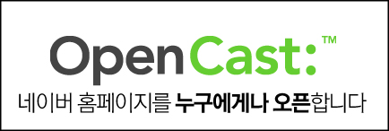

<!-- truncate -->

  

네이버가 첫화면을 사용자들에게 열다니! 이건 정말 대단한 발전이야. 이렇게 차근차근 열리는 거야. 나도 슬슬 나만의 캐스트를 해볼까?  

네이버에서 가능성을 보고 싶어하는 블로거 A

일반 뉴스가 영양가가 없어지니까 결국 사용자들이 만든 컨텐츠로 메인을 채우겠다는 거지? 결국 컨텐츠의 질은 높이면서 컨텐츠 생산자 혹은 수집가에게는 수익을 돌려주지 않겠다는 거야? 역시 X이버.  
  

네이버의 폐쇄성을 싫어하는 블로거 B

  

모자 하나 주고, 머그컵 하나 주고 베스트 어쩌고 칭찬해주면 좋아라할 만한 사람들이 널린 것도 사실이잖아? 쳇. 이런 유통구조라면 결국 네이버가 다 먹는 거라고.  
  

컨텐츠 유통에서 수익모델을 찾는 블로거 C

  

네이버 계정을 가진 블로거들이 적극 참여한다고 볼 때, 말이 오픈캐스트이지 결국 '네이버 첫화면 = 네이버 블로그의 글'이 될 확률이 높을 거 같아.  
  

컨텐츠 유통에 관심이 많은 기획자 D

  

자신의 블로그로 방문객을 유치하려고 하는 블로거가 많다면 결국 펌글 위주의 글들이 오픈캐스트에서 유통될 것 같은데...  
  

펌블로그를 싫어하는 블로거 E

  

그렇다면, 펌글들이 공식적으로 네이버 메인에 노출된다는 거야? 네이버 기획자 머리 좋은데?  
  

열심히 검색엔진을 만들던 프로그래머 F

  

그렇다고 네이버가 펌글을 발행하지 말라는, 구독하지 말라는 지침을 세울리도 없잖아. 최종 책임은 발행자에게. 야... 정말 머리 좋은데?  
  

옆에서 덩달아 감탄하는 기획자 G

  

이거 마이크로탑텐하고 왠지 모르게 비슷한데? 자신의 의견을 적을 공간이 없고, 네이버 메인에서 유통된다는 것만 빼면 말야. 이참에 나도 펌블로그 하나 만들어서 오픈캐스트로 옮길까?  
  

마이크로탑텐 사용자 H

  

OpenCast:™ 에서 제일 재치있는 부분은 : 인 것 같아. 프로토콜 같은 느낌이 팍팍 들잖아. 유통된다는 느낌도 나고 말이지. 아예 OpenCast://™ 라고 하지 않았기 때문에 절제된 센스도 느껴져.  

IT덕후 I
