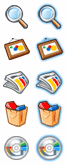
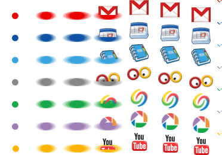

네이버가 이번 리뉴얼의 테마를 오픈, open 으로 잡았나봐요. 기존 신문기사 대신 블로거들 참여시키는 시스템 이름도 오픈캐스트이고, 테스트 도메인도 [open.www.naver.com](http://open.www.naver.com/) 이고 말이죠. (진짜 open의 개념은 언제쯤 이루어지게 될지 문득 궁금-\_-)  

<!-- truncate -->

어쨌든 지금 버전의 초기 화면에서는 소극적으로 쓰였던 CSS sprite 기법이 이번에는 준비를 더 했는지 보다 적극적으로 사용을 하려나 봅니다.  
  
  
현재 버전은 이 정도라고 할 때,  
  

숫자 불릿 - <http://imgshopping.naver.com/w3/2007sb/ic_n1.gif>  
각종 기타 불릿 - <http://static.naver.com/w8/bu.gif>  
박스배경#2 - <http://static.naver.com/disaster/bg_box2.gif>  
박스배경 - <http://static.naver.com/w8/bg_box.gif>  
  
(조금 더 있지만 비슷비슷해요. 중복되는 것도 있고)

  
  
지금 테스트 중인 [오픈.따따따.네이버.컴](http://open.www.naver.com/)에서 사용되는 이미지들은 조금 더 잘 모았네요.  
  

각종 숫자, 요일 불릿 - <http://wstatic.naver.com/w9/num_v2.gif>  
기타 각종 불릿 - <http://wstatic.naver.com/w9/bu_v4.gif>  
오픈캐스트 배경 - <http://wstatic.naver.com/w9/bg_cast.gif>  
오픈캐스트 셀렉트박스 - <http://wstatic.naver.com/w9/bg_cast_cate_h_v2.gif>  
각종 카테고리 제목들 - <http://wstatic.naver.com/w9/h_nvc_cate_v3.gif>  
각종 메뉴 제목들 - <http://wstatic.naver.com/w9/mn_s_v2.gif>

  
  
참고로 구글 코리아 첫번째 페이지의 스프라이트 이미지는 다음과 같죠.  
  

  

  

관련 링크  
  
[▶ 미남이의 이러쿵저러쿵 - HTTP 요청 횟수를 줄여줄 수 있는 CSS Sprites 기법](http://appletree.or.kr/blog/web-development/css/http-%EC%9A%94%EC%B2%AD-%ED%9A%9F%EC%88%98%EB%A5%BC-%EC%A4%84%EC%97%AC%EC%A4%84-%EC%88%98-%EC%9E%88%EB%8A%94-css-sprites-%EA%B8%B0%EB%B2%95/)  
[▶ HOONS 닷넷 - 넥슨 사이트의 성능튜닝 - #3 HTTP 요청 줄이기](http://hoons.kr/Lecture/LectureView.aspx?BoardIdx=355&kind=42)  
[▶ Rsef.net - HTTP request을 줄이기 위한 image background 처리](http://rsef.net/44)  
[▶ 준성 아빠 - CSS Sprite & Image Map](http://junsfa.com/131)  
[▶ 우리집 다락방 - 웹서비스 속도를 향상 시켜BoA Yo! [Yahoo! releases new performance best practices]](http://sakura.zzabu.net/tt/128)  
  
[▶ A List Apart - CSS Sprites: Image Slicing’s Kiss of Death](http://www.alistapart.com/articles/sprites) (영어)  
[▶ A List Apart - CSS Sprites2 - It's JavaScript Time](http://www.alistapart.com/articles/sprites2) (영어)  
[▶ CSS-Tricks - CSS Sprites: What They Are, Why They’re Cool, and How To Use Them](http://css-tricks.com/css-sprites-what-they-are-why-theyre-cool-and-how-to-use-them/) (영어)  
[▶ Web Site Optimization - CSS Sprites: How Yahoo.com and AOL.com Improve Web Performance](http://www.websiteoptimization.com/speed/tweak/css-sprites/) (영어)  
  
[▶ CSS Sprites Generator](http://www.csssprites.com/) (스프라이트 이미지 제너레이터 서비스)
