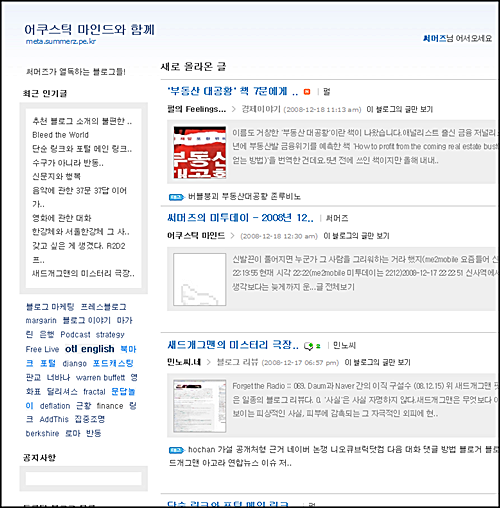

제가 평상시 관심있게 읽는 블로그( 중의 일부)의 피드를 메타로 모아봤습니다. 아, 제 피드도 슬쩍 함께 끼웠습니다. -\_-)a  

<!-- truncate -->

도메인은 촌스럽게도 [meta.summerz.pe.kr](http://meta.summerz.pe.kr/), 제목도 역시 촌스럽게 [어쿠스틱 마인드와 함께](http://meta.summerz.pe.kr/).  
  

  
사실 많은 분들에게 소개를 하고 싶은 이유 ... 라기 보다는 제가 편하게 보겠다는 지극히 개인적인 이유가 메타를 만든 가장 큰 이유였습니다;  
  
다만 처음에 일부만 등록한 이유는 등록하지 않은 다른 블로그들은 성향이 상당히 달라서 함께 묶어 보기는 좀 뭐해서 말이죠. 피드들은 계속 추가가 되겠지만, 성향이 다른 블로그들의 경우에는 다른 도메인을 따서 성향(?)에 따라 메타블로그를 계속 만들까 생각 중입니다. ^^  
  
  

그리고 #1  
  
참고로 말씀드리면 [라지엘 스튜디오](http://www.laziel.com/)의 설치형 메타블로그툴인 [날개](http://www.wingz.kr/s1/)로 만들었습니다. 왠지 스킨 제작을 해야 할 것 같은 압박에 시달렸지만 저부터 일단 [rss 피드](http://feeds.feedburner.com/summerz_meta) 위주로 활용할 것이기 때문에 스킨 생각은 머리 속에서 잠시 지웠습니다. ^^

  

그리고 #2  
  
생각해 보니 [믹시](http://www.mixsh.com/)나 [HanRSS](http://www.hanrss.com/) 같은데서 이런 식으로 개인들이 원하는 피드만 따로 만들게/받아보게 할 수 있는 서비스를 하면 어떨까 싶은 생각이 드네요. UI만 잘 나오면 좋은 피드군들이 많이 생길 것 같은데 말이죠.  
  
이런 식의 소규모 메타들이 블로그 간의 연대 혹은 컨텐츠의 집중도를 더 강화시킬 수 있지 않을까 합니다. (그렇다고 [어쿠스틱 마인드와 함께](http://meta.summerz.pe.kr/) 메타가 그런 기능을 한다는 건 아니고요. -\_-)
