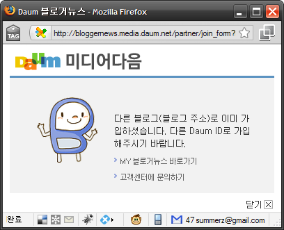
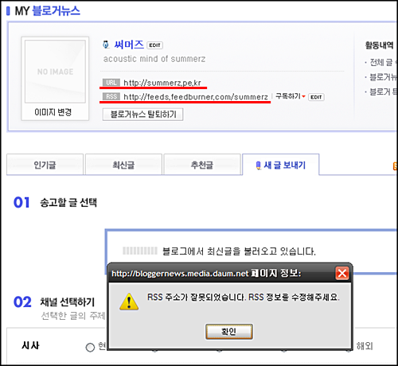

현재 제 블로그는 [텍스트큐브닷컴](http://www.textcube.com/)에 입주해 있습니다.  

<!-- truncate -->

텍스트큐브닷컴에서 [이번에 업데이트된 항목](http://blog.textcube.com/54)에 Daum 블로거뉴스 글 보내기 기능 추가가 있는데 이게 연동이 제대로 안됩니다.  
  
오류는 크게 2가지입니다.  
  

오류#1  
  
텍스트큐브닷컴에 업데이트 된 Daum 블로거뉴스 글 보내기 기능 추가를 사용하려고 환경설정에서 인증을 시도했는데 아래와 같이 다른 블로그로 이미 가입했다고 나옵니다.  
  
기능 오류라기 보다는 한번 등록한 블로그 주소를 수정할 수 없는 프로세스가 서비스 에러(불편사항)라고나 할까요;;; '수정하시겠습니까?'도 아니고 '다른 Daum ID로 가입해 달라'니 조금 당황스러웠습니다;  
  

  

오류#2  
  
그래도 기존 등록된 블로그 정보는 제대로 작동하겠지 싶어서 송고할 글을 선택하려고 했는데 RSS 주소가 잘못되었다고 나옵니다. 현재 사용 중인 텍스트큐브닷컴 블로그 자체의 RSS를 사용하지 않더라도 피드버너를 사용한 RSS는 여전히 유효한데, 여기서 제 글이 선택할 수 없다니 좀 이상하더군요.  
  

  
이거 어떻게 수정이 안되나요? 이것 때문에 다른 아이디로 새로 가입을 할 수도 없고 말이죠. -\_-)a
