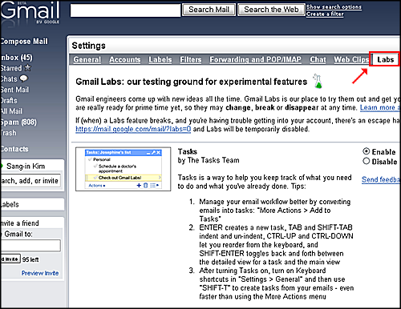
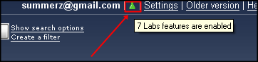
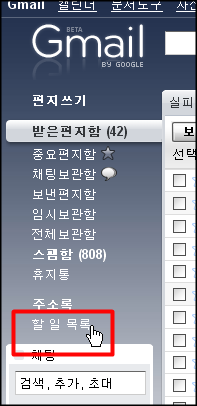
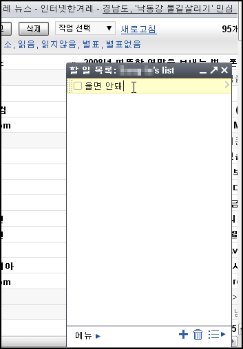
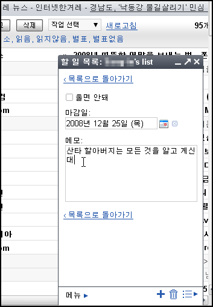
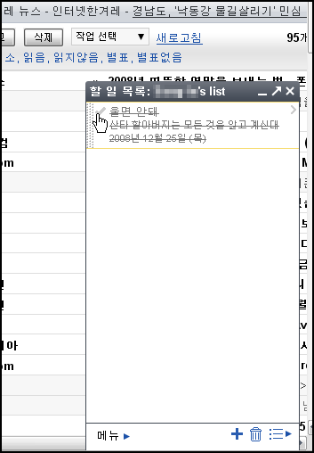
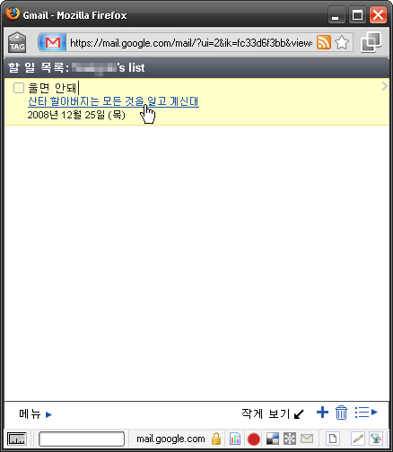
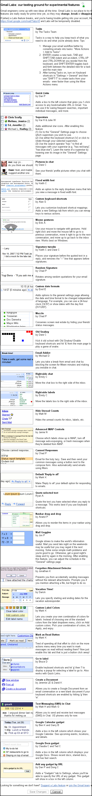

지메일에 할 일 목록이라는 기능이 생겼군요.  

<!-- truncate -->

엄밀히 말하면 테스트 중인 기능입니다. 다들 아시겠지만 구글은 테스트할 때 구글 랩스에서 인큐베이팅 하다가 쓸만 해지면 정식(?) 서비스로 변경하잖아요.  
  
할 일 목록 기능도 마찬가지입니다. 그런데, 영어로 해야 나오네요. 간단하게 살펴보겠습니다.  
  

자, 우선은 환경설정에 가서 언어를 영어로 바꾸고 나면 환경설정 항목 중에 Labs 라는 메뉴가 생깁니다. 아직은 영문사용자들 위주의 테스트를 하나 봅니다. 그럼 제일 처음 나오는 신규 기능이 바로 Tasks (할 일) 군요.  
  
사용한다고 체크를 합니다. (Enable에 체크)  
  

  

구글 랩스에서 제공하는 각종 신규 기능을 선택하고 나면 녹색의 실험 비커 모양이 생깁니다. 저 같은 경우는 이것저것 해서 7가지를 사용한다고 체크 (Enable에 체크) 했습니다.  
  

  

그러고 나면 메일함 목록 아래 쪽에 할 일 목록이라는 항목이 생깁니다. 클릭을 하면...  
  

  

화면 우측 하단에 다음과 같은 조그만 플로팅 창이 뜹니다. 할 일 목록을 적을 수 있습니다.  
  

  

세부 내용도 적을 수 있고, 마감일까지 적을 수 있습니다.  
  

  

할 일을 끝냈으면 다 했다고 체크를 할 수도 있겠죠.  
  

  

만약 할 일 목록이 메일 리스트를 가려서 걸리적 거리면 새창으로 띄울 수도 있습니다.  
  

  
메일 확인과 더불어 꼭 해야 할 일이 있으면 할 일 목록에 기록해 두면 되겠군요. 나름대로 유용하게 사용할 수 있을 것 같습니다. :)  
  
  

그리고  
  
현재 지메일에서 추가할 수 있는 신규 기능은 총 32가지나 되는군요. 다들 짬짬히 만들어서 붙였나 봅니다. 사내 공모전 같은 걸까요? ^^  
  
영문으로 제목만 뽑아보면 다음과 같습니다.  
  
Tasks  
Quick Links  
Superstars  
Pictures in chat  
Fixed width font  
Custom keyboard shortcuts  
Mouse gestures  
Signature tweaks  
Random Signature  
Custom date formats  
Muzzle  
Old Snakey  
Email Addict  
Right-side chat  
Right-side labels  
Hide Unread Counts  
Advanced IMAP Controls  
Canned Responses  
Default 'Reply to all'  
Quote selected text  
Navbar drag and drop  
Mail Goggles  
Forgotten Attachment Detector  
Vacation Time!  
Custom Label Colors  
Mark as Read Button  
Go to label  
Create a Document  
Text Messaging (SMS) in Chat  
Google Calendar gadget  
Google Docs gadget  
Add any gadget by URL  
  
이미지로 확인하려면 클릭하세요.

