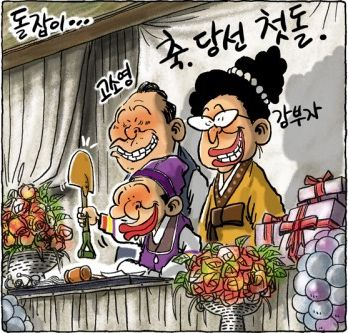
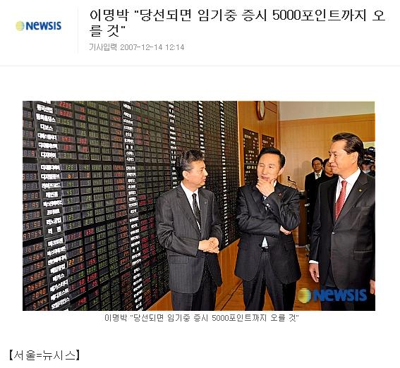
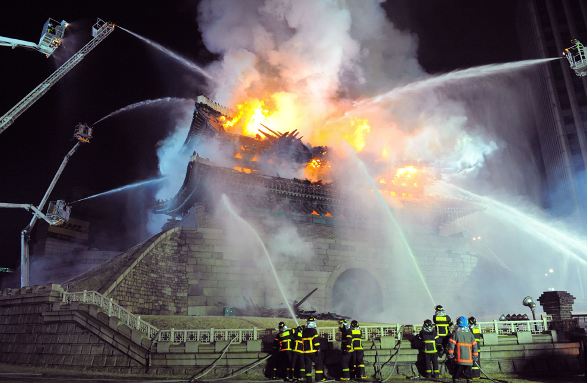
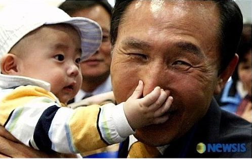
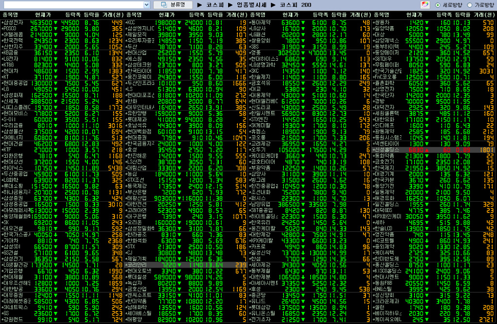
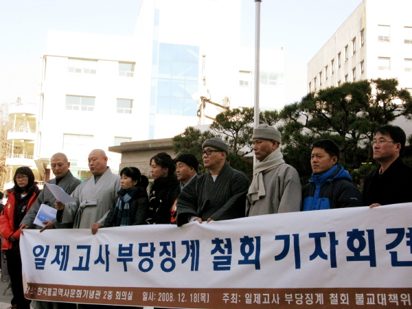
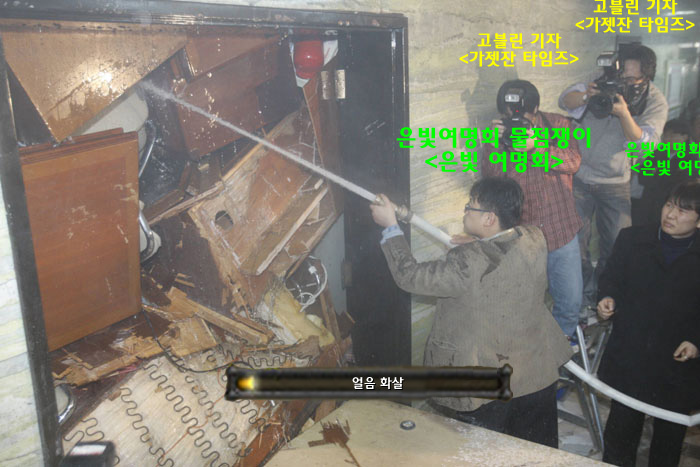
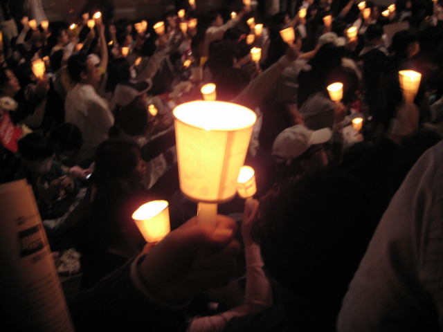

어제가 2mb 당선 1주년 되는 날이던가요?  

<!-- truncate -->

항상 상상 이상을 보여주는 2mb 정부.  
많은 일들이 있었죠.  
앞으로는 잘 좀 해주세요.  
아니, 아무 것도 하지 마세요...라고 해야 하는 걸까요?  
  
뭘 찾아도 우울한 사진들 뿐이군요.  
  

[데일리노컷뉴스 권범철 - 돌잡이...](http://www.cbs.co.kr/nocut/show.asp?idx=1016124)  
  

  

우리의 탐욕이 만든 작품  
  

  

허술한 국정운영 (사진 출처 : [Boston.com - The year 2008 in photographs](http://www.boston.com/bigpicture/2008/12/the_year_2008_in_photographs_p.html))  
  

  

아이의 저지 (부제 : 네놈을 살려두긴 산소가 아까워)  
  

  

2mb의 답례 [(구글 뉴스 검색결과, 키워드 코스피 반토막)](http://news.google.co.kr/news?hl=ko&um=1&ie=UTF-8&q=%EC%BD%94%EC%8A%A4%ED%94%BC%20%EB%B0%98%ED%86%A0%EB%A7%89&lr=&sa=N&tab=bn)  
  

  

끊임없는 학부모들과 학원계의 화답 [(구글 블로그 검색결과, 키워드 공정택)](http://blogsearch.google.co.kr/blogsearch?q=%EA%B3%B5%EC%A0%95%ED%83%9D&hl=ko&lr=&um=1&ie=UTF-8&sa=N&tab=wb)  
  

  

따라서, 당연한 결과 [(구글 뉴스 검색결과, 키워드 일제고사)](http://news.google.co.kr/news?q=%EC%9D%BC%EC%A0%9C%EA%B3%A0%EC%82%AC&hl=ko&lr=&um=1&ie=UTF-8&sa=X&oi=news_group&resnum=1&ct=title)  
  

  

역시 너무나 당연한 결과 (사진출처 : Sample - [월드 오브 국회크래프트](http://jinh.tistory.com/294))  
  

  
...  
  

그리고, 이제는 아련한 기억 (사진출처 : [선한 사람들이 승리하는 세상](http://blog.ohmynews.com/nonla/218401))  
  

