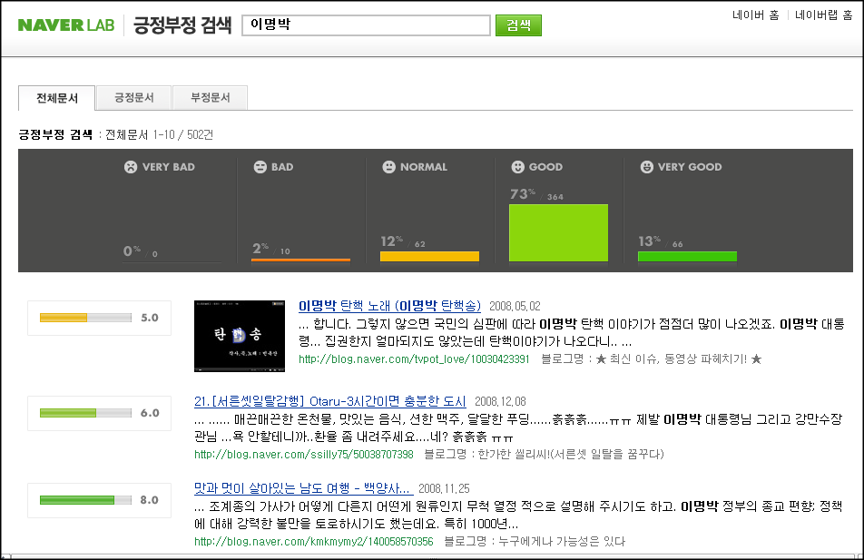

<!-- truncate -->

[**구글 랩스**](http://labs.google.com/)처럼 네이버도 뭔가 베타스러운 것들을 묶어서 [**네이버 랩**](http://lab.naver.com/)이라는 공간에 모으고 있는데, 이 중에 [**긍정부정 검색**](http://s.lab.naver.com/posneg/)이라는 것이 있습니다.

해당 페이지에서는 **"블로그 검색결과 중 리뷰 및 후기 등에 해당하는 문서를 대상, 개별 문서들의 텍스트를 추출, 사용자의 선호도를 판독하여 제공"** 라는 설명과 함께 **2008년 1월 29일 처음 시작**했다고 나와 있지요.

검색어 몇 개를 넣어봤습니다.

**[**이명박**](http://s.lab.naver.com/posneg/?query=%EC%9D%B4%EB%AA%85%EB%B0%95&where=content)**

VERY GOOD : 13%

GOOD : 73%

NORMAL : 12%

BAD : 2%

VERY BAD : 0%

[**강만수**](http://s.lab.naver.com/posneg/?query=%EA%B0%95%EB%A7%8C%EC%88%98&where=content)

VERY GOOD : 22%

GOOD : 78%

NORMAL : 0%

BAD : 0%

VERY BAD : 0%

[**어청수**](http://s.lab.naver.com/posneg/?query=%EC%96%B4%EC%B2%AD%EC%88%98&where=content)

VERY GOOD : 0%

GOOD : 57%

NORMAL : 43%

BAD : 0%

VERY BAD : 0%

[**동방신기**](http://s.lab.naver.com/posneg/?query=%EB%8F%99%EB%B0%A9%EC%8B%A0%EA%B8%B0&where=content)

VERY GOOD : 27%

GOOD : 47%

NORMAL : 22%

BAD : 4%

VERY BAD : 0%

**[**마릴린 맨슨**](http://s.lab.naver.com/posneg/?query=%EB%A7%88%EB%A6%B4%EB%A6%B0+%EB%A7%A8%EC%8A%A8&where=content)**

VERY GOOD : 19%

GOOD : 65%

NORMAL : 14%

BAD : 3%

VERY BAD : 0%

결과가 영 신통치 않네요. 수많은 검색어를 쳐봤는데 부정이 더 많은 검색어는 하나도 발견하지 못했습니다. (보물찾기인가요?) 알고리즘이 신통치 않은 걸까요, 아니면 부정이 많은 검색어는 어차피 여러 업체들 혹은 이해당사자 간의 이익이 걸린 것이라서 네이버가 알아서 막고 보여주는 걸까요? 후자라면 긍정부정 검색이 별 의미없을 것 같은데 말이죠.

기술과 회사 정책 사이에서 갈팡질팡 하는 서비스를 보는 것 같아 안타깝습니다. 정부의 여론 관재 시스템으로 사용하면 좋을 것 같은 인터페이스이긴 합니다. -\_-a
