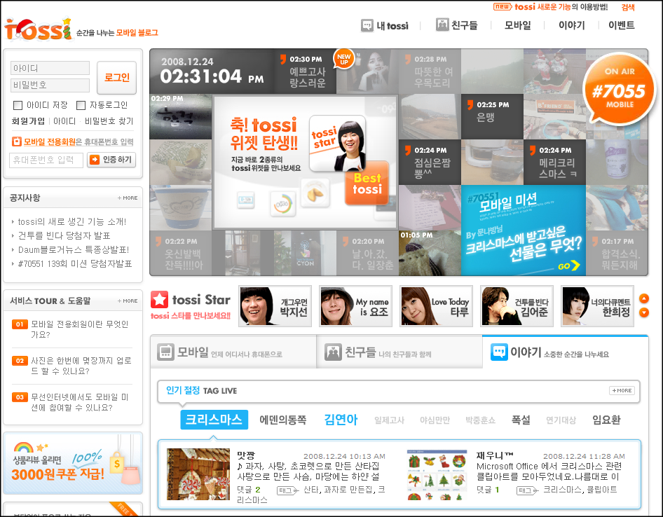
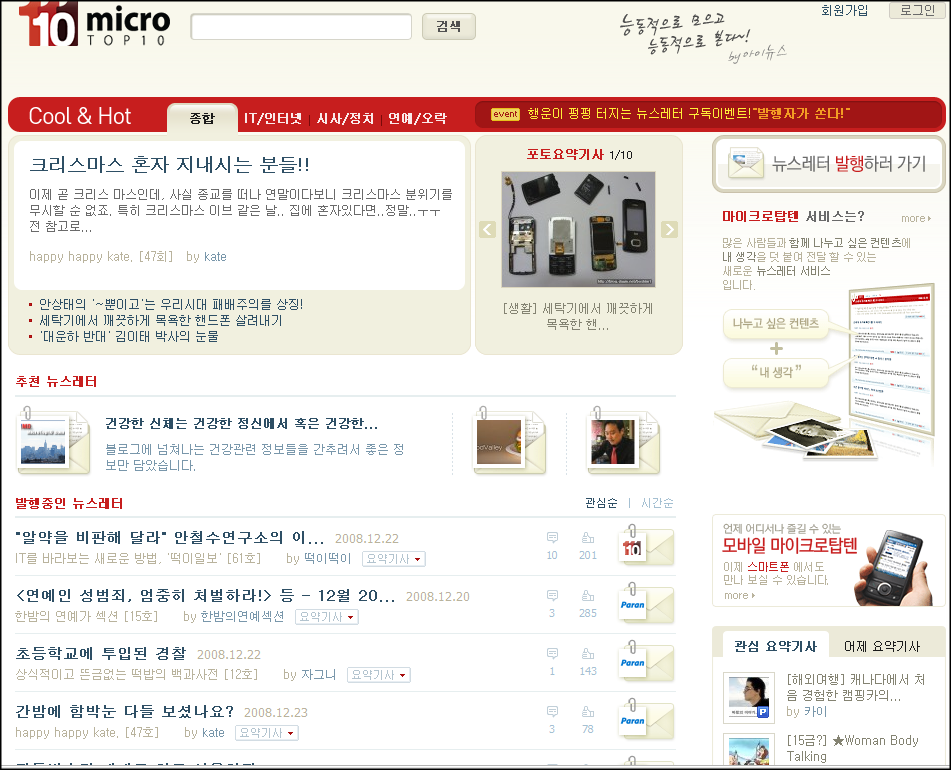
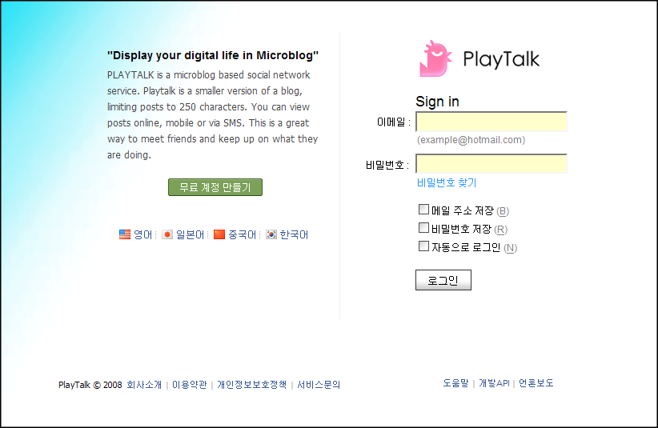
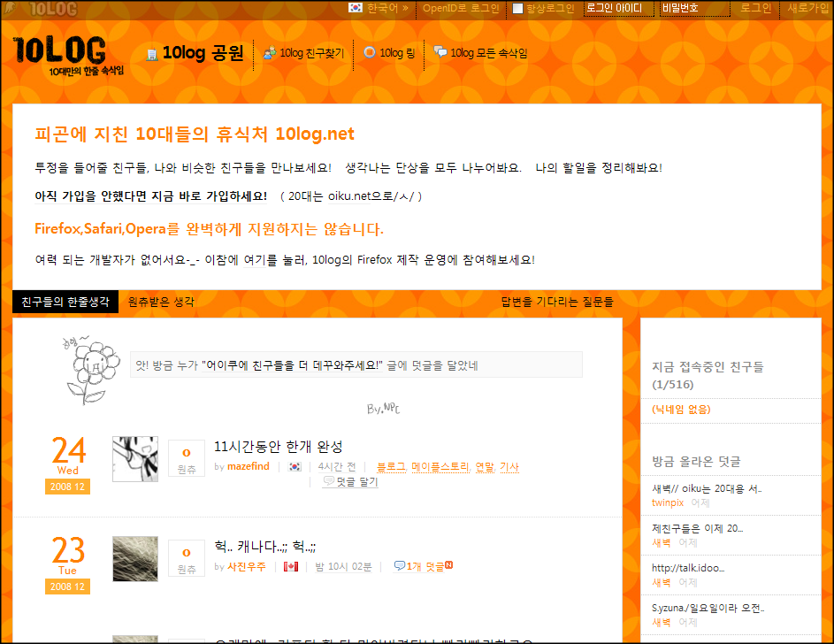

이번에 [미투데이가 NHN에 인수된 계기](http://sumanpark.com/sst3/archives/135)를 통해 국내 마이크로 블로그 서비스들이 어떤지 한번 떠올려봤습니다.  

<!-- truncate -->

이러쿵 저러쿵 적은 것은 철저히 주관적인 관점에서 적은 것이니 이점 오해없으시길 바라겠습니다. (만약 사실과 다른 점을 지적하시면 바로 반영하겠습니다. ^^)  
  
그리고, 아래의 리스트는 제가 알고 있는 마이크로 블로그 혹은 그 범주에 들어갈 만한 서비스들이니 여기에 빠진 마이크로 블로그 서비스를 알려주시면 감사하겠습니다. ^^  
  

[미투데이](http://me2day.net/)  
  

(제가 알고 있기로) 국내에서 최초로 마이크로 블로그를 표방하고 서비스를 시작한 게 바로 미투데이입니다. 국내에서는 보기 드물게 [루비 온 레일즈](http://ko.wikipedia.org/wiki/%EB%A3%A8%EB%B9%84_%EC%98%A8_%EB%A0%88%EC%9D%BC%EC%A6%88)로 제작이 되었다고 하죠.  
  
미투데이의 가장 큰 특징이자 장점은 [초대장](http://www.google.co.kr/search?q=%EB%AF%B8%ED%88%AC%EB%8D%B0%EC%9D%B4%20%EC%B4%88%EB%8C%80%EC%9E%A5&hl=ko&lr=)을 나눠주던 초기 클로즈드 베타 서비스 때부터 기본에 충실한 서비스를 만드는데 공을 들이는데 있다고 생각합니다. 유저의 호응도/충성도가 가장 높은 서비스 중의 하나라는 것도 큰 장점이지요.  
  
충성도가 높은 만큼 미투데이에서 제공하는 오픈 API를 활용한 [각종 어플리케이션들](http://me2day.net/me2/app)이 속속 제작되고 있지요. 또한 다른 외부 서비스 (플리커, 구글 맵스, 유튜브, 픽짜 등)를 미투데이 안에서 적극 연동시키는가 하면 처음부터 모바일 서비스를 염두해두는 등 국내 웹2.0 서비스 혹은 매쉬업의 모범사례라고 할만 합니다.  
  
개인적으로는 예전에 [만박님](http://sumanpark.com/)의(?) [엔비](http://enbee.com/)에서 제공하던 링크블로그와 이어지는 부분이 있다고 생각을 해요. (링크블로그에 보다 가까운 서비스는 사실 마이크로탑텐이긴 합니다) 물론 포지셔닝과 시대의 흐름에 따라 다른 형태의 서비스로 진화를 하는 건 당연한 거고요.  
  
이번에 [NHN](http://www.nhncorp.com/)이 미투데이를 [인수](http://www.zdnet.co.kr/news/internet/0,39031211,39176552,00.htm)하면서 SKT의 토씨와 함께 포털 vs. 이통사의 구도가 생기게 되었습니다. 개인적인 생각으로는 [네이트](http://www.nate.com/)의 토씨보다 [네이버](http://www.naver.com/)의 미투데이가 훨씬 파괴력이 높을 것 같습니다.  
  
※ 링크블로그를 떠올려 볼 때, 미투데이도 사이드바 쪽에 UI를 구성하거나 미투북클릿 같은 UI를 하나 만들면 활용도가 더 높아지지 않을까 합니다. 김국현님처럼 [라이프스트리밍툴로 사용](http://goodhyun.com/830)하시려는 분들도 점차 많아지지 않을까요?

  

[토씨](http://tossi.com/)  
  

[SKT](http://www.sktelecom.com/)가 내놓은 마이크로 블로그 서비스입니다. 아무래도 통신사가 운영하는 서비스이다 보니 무선 네이트에 모블로그라는 메뉴로 포함이 되어 있습니다만 온라인, KTF, LGT 다른 플랫폼에서도 사용이 가능합니다.  
  
런칭 초기에 미투데이를 흉내내도 너무 흉내내는 거 아니냐는 [비판](http://media.daum.net/economic/industry/view.html?cateid=1038&newsid=20070813182010950&p=kukminilbo)이 있었던 것이 사실입니다. 마이크로 블로그라는 서비스를 독창적으로 만드는 고유의 기능이나 서비스가 무엇인지 저는 잘 모르겠습니다만 거대 기업의 문어발식 서비스 확장, SKT에 대한 소비자 반감, 신규 서비스의 독창성 부족 등이 포함된 결과가 아닐까 생각합니다.  
  
SKT가 운영하고 있다는 태생적인 한계 때문에 모바일 쪽은 다른 플랫폼을 개척하는 게 힘들지 않을까 하는 생각을 해봅니다. 몸통 혹은 꼬리는 머리가 움직이는 방향대로 움직이기 마련이니까요.   
  
따라서 토씨 입장에서 볼 때 유무선 포털 및 무선사업자인 SKT의 장점 (예를 들어 유선 포털과의 연계, LBS 기능 활용 등)을 적절히 융합시키는 서비스를 꾸준히 내놓아야 할 것으로 보입니다.

  

[마이크로탑텐](http://www.microtop10.com/)  
  

미투데이가 [바쁜 블로거들을 위해 태어난 서비스](http://www.google.co.kr/search?hl=ko&newwindow=1&safe=off&q=%EB%B0%94%EC%81%9C+%EB%B8%94%EB%A1%9C%EA%B1%B0%EB%A5%BC+%EC%9C%84%ED%95%B4+%ED%83%9C%EC%96%B4%EB%82%AC%EB%8B%A4&btnG=%EA%B2%80%EC%83%89&lr=&aq=f&oq=)라면 마이크로탑텐은 바쁜 (펌블로거를 포함한) 링크 블로거들을 위해 태어난 서비스라고 할 수 있습니다. [이글루스](http://egloos.com/)를 만들었던 [온네트](http://onnet.co.kr/)에서 제공하는 서비스이지요.  
  
마이크로탑텐은 과거로 말하자면 일종의 뉴스레터 서비스입니다. 웹상의 각종 링크들을 모아서 자신의 생각을 담아 발행을 하는 거죠. 제가 일일이 수동으로 링크를 걸고 구성을 하는 '[어쿠스틱 뉴스](http://blog.summerz.pe.kr/search/%EC%96%B4%EC%BF%A0%EC%8A%A4%ED%8B%B1%20%EB%89%B4%EC%8A%A4)'의 자동화 시스템이라고나 할까요? 물론 이메일 구독, RSS 도 지원되죠.  
  
유용한 링크 및 정보를 제공하도록 설계된 서비스이기 때문에 컨텐츠 (링크)들이 대체로 가볍고 트렌디한 경향을 보입니다. 이러한 성향을 [파란](http://www.paran.com/)에서 캐치한 모양인지 [뉴스인사이트](http://mt10.media.paran.com/)이라는 서비스로 파란 내에 제공하고 있습니다.

  

[플레이톡](http://playtalk.net/)  
  

플레이톡은 미투데이가 클로즈드 베타 서비스를 하고 얼마 지나지 않아 바로 오픈 베타 서비스를 시작했습니다. 초대장을 통해서만 가입이 가능했던 미투데이와는 다르게 초기에 가입자수를 비롯해 여러 면에서 우위를 자랑했던 이유지요.  
  
서비스 초기에 미투데이를 모방해 급조된 게 아니냐는 논란도 있었지만 사실 미투데이도 [트위터](http://twitter.com/)나 [자이쿠](http://jaiku.com/)가 없었다면 나올 수 없는 서비스라고 볼 때 그 때 비판들의 방점은 '모방'이 아니라 '급조'에 있었던 게 아닌가 하고 생각해 봅니다.  
  
미투데이를 보사노바 음악이 흐르는 커피숍에 비유하자면 플레이톡은 라운지 음악이 흐르는 화려한 파티장과 같았습니다. 게다가 [소설가 이외수](http://playtalk.net/oisoo/), [정치인 정동영](http://playtalk.net/cdy21/) 등 스타 플레이어들을 영입하면서 외형을 넓히는데 성공적이었죠.  
  
하지만, 서비스의 UI 및 운영 정책이 자주 변경되는 등 운영자의 운영 미숙이 구설수에 오르면서 [그에 항의하는 글](http://dex9.tistory.com/74)들이 속출하던 차에 여러 블로그를 통해 [탈퇴하겠다는 글들](http://www.google.co.kr/search?q=%ED%94%8C%EB%A0%88%EC%9D%B4%ED%86%A1%20%ED%83%88%ED%87%B4&hl=ko&lr=)이 속속 공개되면서 이미지에 흠이 갔습니다. 그래서인지 최근에는 오히려 외부에서 볼 때 많이 열려있지 않은 서비스가 된 것 같기도 합니다.

  

[10log](http://10log.net) & [어이쿠](http://oiku.net/)  
  

어른들은 올 수 없는 오직 10대만의 공간을 표방하는 [아이두](http://idoo.net/)가 내놓은 서비스입니다.  
  
10log는 10대들만을 위한 서비스이고, 어이쿠는 10대가 넘어버린 20대를 위한 서비스입니다. (이 둘은 서비스명과 도메인만 다르고 거의 유사한 서비스입니다) 시간은 흐르기 마련이고 10대였던 사람들은 모두 20대가 되니까 말이죠. 참고로 아이두는 여전히 [10대들에 의해 운영](http://idoo.net/?menu=about&sub=staff)이 되고 있고 10log와 어이쿠는 아이두와 비슷한 UI를 제공하고 있습니다.  
  
[자기소개와 장래희망 등을 묶어서](http://10log.net/friends) 네트웍을 형성하려는 등 정말 10대만을 위해 특화된 부분들이 보이지만 아직까지는 사용자가 많지 않은 모양인지 초기 화면에 날짜별로 모든 회원의 글이 리스팅이 되고 있습니다.  
  
아직까지는 아이두의 회원들을 비롯한 10대 유저들을 10log로 유도하는 게 쉽지는 않은가 봐요. 외부로부터 독립된 서비스가 유지되는 것 그리고 10대들을 중심으로 꾸준히 서비스가 유지되는 것은 참 어려운 일이 아닐 수 없습니다.

  

[루키](http://www.rukie.com/)  
  

루키는 대학생들을 위한 서비스입니다. 회원가입 때 대학교를 입력하거나 학교별로 [수업시간표](http://www.rukie.com/_lectureV2/timetable)를 제공/관리하는 등 대학생에 특화된 기능들이 제공됩니다.  
  
여러가지 서비스 성격상 마이크로 블로그라고만 하기에는 커뮤니티 (혹은 SNS)와 더 가까운 서비스라고 할 수 있습니다. 글은 각자의 공간인 ME:에서 작성하지만, 서로의 글이 소비되는 공간은 [광장 (라운지)](http://www.rukie.com/_square/)거든요.  
  
또한 회원들끼리의 [모임](http://www.rukie.com/_bbs/board/umoim)이나 [이벤트](http://www.rukie.com/_bbs/board/moim)를 서비스 내에서 지원하는데 아무래도 대학생이 되면 이것저것 하고 싶은 게 많고 여러 사람들을 만나고 싶어하는 그런 성향을 서비스에서 적극 유도시키고자 하는 목적이 아닌가 합니다. 대학생들의 혈기왕성함을 적극 활용하는 거지요.  
  
이러고 보니 루키의 경쟁 서비스는 마이크로 블로그보다 [온오프믹스](http://www.onoffmix.com/)부터 각종 카페, 클럽 등 커뮤니티라는 게 더욱 확실해지는군요.

  
이제까지 국내 마이크로 블로그 서비스에 대해 알아봤습니다. 이 글이 미투데이 때문에 쓰여진 글이라고 할 때, 한번 더 미투데이 이야기를 할게요.  
  
개인적으로 미투데이가 가진 장점과 가능성은 아래와 같이 정리해 볼 수 있습니다.  
  

* 안정적인 운영
* 회원들의 강한 충성도
* 오픈 API의 적극적인 도입
* 모바일 플랫폼에 대한 열린 시각
* 온라인 포털의 지원(?)

  
이 중에서도 모바일에 대한 열린 시각이 미투데이가 가진 가장 큰 장점으로 꼽고 싶어요. 서비스 전체가 모바일로 옮겨가지는 않겠지만 앞으로도 모바일에 대한 지원이 강화될 것으로 예상됩니다.   
  
콕 짚어서 이야기하자면 VoIP 지원/활용이 미투데이 2.0 혹은 그 이후의 미투데이가 그리고 있는 청사진에 중요한 부분을 차지하지 않을까 하는 추측을 해봅니다. (네이버의 품으로 들어갔으니 네이버폰부터? ^^)  
  
마지막으로 미투데이를 포함한 국내 마이크로 블로그 서비스들의 선전을 기대합니다. :)
