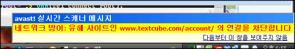

<!-- truncate -->

  
안티 바이러스 프로그램으로 [avast!](http://www.avast.co.kr/) 를 사용하고 있는데, [텍스트큐브닷컴](http://www.textcube.com/)에 들어가려고 하니 다음과 같은 메시지가 나옵니다. 무슨 일이 생겼나봐요. ㄷㄷㄷ  
  
그러고 보니, 예전에는 http://www.texcube.com/ 으로 접근하면 클로즈드 베타 시스템 중을 설명하는 페이지가 나왔던 것 같은데, /account/ 페이지로 자동 리다이렉션 되네요?  
  
흠... 오픈 베타가 임박했다는 뜻일까요?  
  
2008.12.27 01:22 추가  
  
곰곰히 생각해 보니 원래 http://www.textcube.com/account/ 로 자동 리다이렉션 되고 있었던 게 맞습니다. 다만 avast! 에서 유해 사이트라고 잡히는 게 이상할 뿐이었죠. -\_-;  
  
2008.12.31 15:53 추가  
  
지금 실행해보니 유해 사이트로 잡히지 않고 잘 접속이 됩니다. ^^
