아이팟 터치 (혹은 아이폰) 어플들에 대해서 개인적인 별점 평가를 남기면 좋을 것 같아서 적어봅니다. 제가 구입 / 무료 다운로드한 어플 모두에 대해 적기는 힘들겠지만 그래도 앞으로도 틈틈히 적게 되지 않을까 싶어요.   

<!-- truncate -->

유료 위주로 맘에 드는 것과 맘에 들지 않는 것, 그 느낌들이 큰 것들만 적겠습니다. 실제 완성도나 유용성보다도 만족도에 의존한 평가가 될 가능성이 크겠죠. 별은 5개 만점이고, 별점 평가는 GOOD 에만 남기려고 합니다.  
  
아, 참고로 무료인 것들은 맘에 안들면 지우면 되니까... 아무래도 맘에 드는 것들만 적게 되지 않을까 싶어요. ^^  
  

GOOD  
  

[Byline](http://itunes.apple.com/WebObjects/MZStore.woa/wa/viewSoftware?id=284946773&mt=8) ★★★★★  
  
[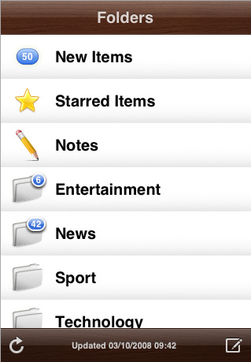](http://itunes.apple.com/WebObjects/MZStore.woa/wa/viewSoftware?id=284946773&mt=8)[구글 리더](http://www.google.com/reader)와 연동이 되는 rss 리더 어플입니다. 온라인인 상태에서 구글 리더와의 싱크를 통해 로컬에 rss의 내용을 저장합니다. 따라서 와이파이 (wi-fi)가 터지지 않는 등 오프라인일 경우에도 각종 블로그의 내용을 확인할 수 있지요. 아이폰 등 항상 네트워크가 온라인 상태가 아닌 분들에게는 아주 유용한 어플이 되지 않을까 합니다.  
  
종종 오프라인 상태에서 읽었던 글들이 온라인이 되어 구글 리더와 싱크가 되면서 다시 안 읽은 글로 표시되는 경우가 있긴 하지만 크게 불편하지는 않더군요.  
  
※ 참고로 rss 전문공개가 아닌 블로그의 경우 일부만 확인하게 되서 아쉬운데, 이건 rss 와 rss 리더 자체의 컨셉 및 구동방식이기 때문에 Byline의 단점이라고는 할 수는 없죠.  
  
(2008-01-08 22:12 추가) ※ 설정값을 변경하는 것만으로 rss 부분공개 블로그에 대한 접근성을 이미 확보했군요. [Byline을 사용해서 부분 공개 rss의 전문 읽기 (Offline Browsing)](http://blog.summerz.pe.kr/1338)를 읽어보세요. (추가 끝)  
  
가격은 $4.99

  

[Top 100 on iTunes](http://itunes.apple.com/WebObjects/MZStore.woa/wa/viewSoftware?id=296010277&mt=8) ★★★★  
  
[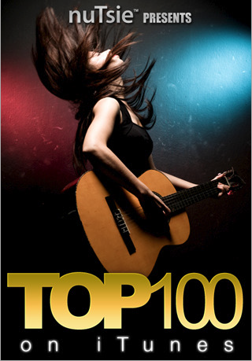](http://itunes.apple.com/WebObjects/MZStore.woa/wa/viewSoftware?id=296010277&mt=8)매주 아이튠즈 뮤직 스토어에서 팔린 음악 중 [1위부터 100위까지](http://ax.phobos.apple.com.edgesuite.net/WebObjects/MZStore.woa/wpa/MRSS/topsongs/limit=100/rss.xml)를 표시해주고, 해당 100곡을 앨범 커버와 함께 라디오처럼 랜덤으로 들려줍니다. 만약 항상 온라인이 가능한 상태라고 한다면 가격대 성능비 최고 어플 중 하나일 겁니다.  
  
원하는 곡을 선택해서 들을 수 없다는 점과 온라인 상태가 아니면 목록조차 볼 수 없다는 것이 단점이긴 하지만 5,000원도 안되는 가격을 한 번만 지불하면 매주 업데이트 되는 곡들을 영원히 들을 수 있다는 것이 굉장히 매력적인 어플입니다. 만약 제가 항상 네트워크 상태가 온라인일 수만 있다면 별 10개를 줘도 부족하지 않은 어플일 거예요.  
  
가격은 $2.99

  

[Tetris® (ENGLISH) (Electronic Arts)](http://itunes.apple.com/WebObjects/MZStore.woa/wa/viewSoftware?id=290497512&mt=8) ★★★☆  
  
[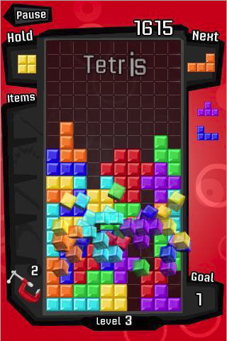](http://itunes.apple.com/WebObjects/MZStore.woa/wa/viewSoftware?id=290497512&mt=8)[국내 핸드폰용으로 나온 테트리스](http://www.com2us.com/Gam/GamInfo/GamInfo.asp?Gcode=103_12_1)에 비하면 가격이 좀 비싼 편입니다. (2배가 넘죠 -\_-) 하지만, 이 버전 나름대로의 아이템이나 게임성이 괜찮은 편이예요.  
  
일단 아이팟 터치 (아이폰) 자체의 기능일 수 있겠지만 음악을 들으면서 테트리스를 할 수 있다는 게 큰 장점이더군요. 또 하나의 장점은 바로 타격감입니다. 테트리스에 무슨 타격감이냐고 하겠지만 블럭 위치를 정한 후 아래로 드래깅을 하면 블럭이 아래로 바로 떨어지는데 그 때의 사운드와 움직임이 괜찮은 쾌감을 주더군요. 그래픽도 깔끔하고 고유한 아이템들도 재밌는 것들로 구성되어 있습니다.  
  
가격은 $4.99

  

[Fuzzle (Candy Cane)](http://itunes.apple.com/WebObjects/MZStore.woa/wa/viewSoftware?id=289962221&mt=8) ★★★☆  
  
[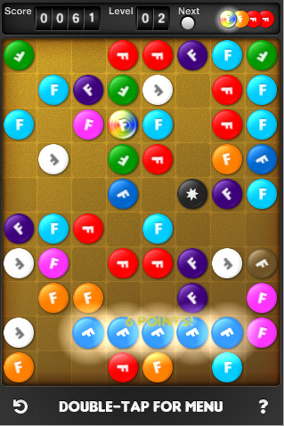](http://itunes.apple.com/WebObjects/MZStore.woa/wa/viewSoftware?id=289962221&mt=8)가로 세로 혹은 대각선으로 같은 색깔의 원형 블럭을 5개 이상 만들어서 블럭을 없애야 하는 보드 게임입니다. 화면에 블럭이 가득차면 게임이 종료되죠. 2개의 스페셜 블럭이 있는데, 무지개빛 블럭은 어떤 색상의 블럭도 대체할 수 있고, 검은색 블럭은 어떤 색상의 블럭을 대체하는 동시에 다른 위치에 있는 같은 색상 블럭까지 없애주는 기능을 갖고 있습니다.  
  
사실 동일한 규칙의 게임으로 [Loop Lines](http://itunes.apple.com/WebObjects/MZStore.woa/wa/viewSoftware?id=295975782&mt=8) 라는 게임이 있는데 무료 버전인 [Loop Lines Free](http://itunes.apple.com/WebObjects/MZStore.woa/wa/viewSoftware?id=295973894&mt=8) 를 받아서 해 본 결과 그래픽이나 사운드의 고급스러운 느낌에서 Fuzzle 이 압도적인 우위에 있습니다.  
  
다만 게임의 난이도가 다소 높게 설정되어 있어서 무료 버전인 [Fuzzle Lite](http://itunes.apple.com/WebObjects/MZStore.woa/wa/viewSoftware?id=291725264&mt=8)나 [Fuzzle Christmas](http://itunes.apple.com/WebObjects/MZStore.woa/wa/viewSoftware?id=299148837&mt=8) 보다 더 오랜 시간을 즐기는 게 그리 마냥 쉽지는 않습니다. 유료인 만큼 크리스마스 버전도 포함되어 있으면 좋겠다는 생각도 살짝 들긴 합니다만 충분히 흡입력 있는 게임임에는 틀림없습니다.  
  
가격은 $0.99

  

[Bejeweled 2 (PopCap Games, Inc)](http://itunes.apple.com/WebObjects/MZStore.woa/wa/viewSoftware?id=284832142&mt=8) ★★★☆  
  
[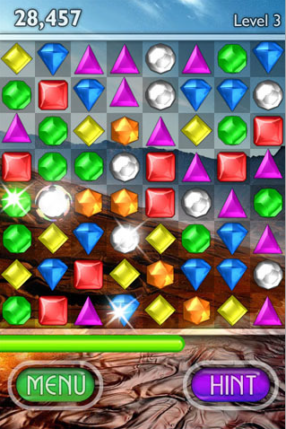](http://itunes.apple.com/WebObjects/MZStore.woa/wa/viewSoftware?id=284832142&mt=8)온라인으로도 한 때 대단한 열풍을 일으켰던 [주키퍼](http://www.nintendo.co.jp/ds/software/azkj/index.html)와 동일한 룰을 가지고 있는 비주얼드입니다. 룰이 매우 간단하지요. 좌우상하의 보석(돌)과 위치를 바꾸어서 가로 세로 같은 색깔의 보석을 3개 이상 만들면 점수를 얻는 게임입니다.  
  
제가 이런 종류의 게임을 좋아해서 그런지 터치 기능을 사용해서 게임을 하니 더 이상 바랄게 없더군요. 그냥 우리가 알고 있는 딱 그 수준의 비주얼드 게임입니다.  
  
가격은 $2.99

  

[Crash Bandicoot Nitro Kart 3D](http://itunes.apple.com/WebObjects/MZStore.woa/wa/viewSoftware?id=285005463&mt=8) ★★★☆  
  
[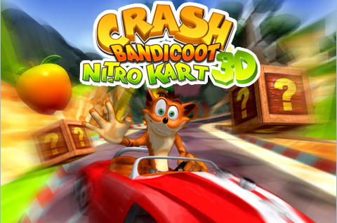](http://itunes.apple.com/WebObjects/MZStore.woa/wa/viewSoftware?id=285005463&mt=8)플레이스테이션 등의 게임기에서 유명한 그 게임의 아이팟 터치 (아이폰) 버전입니다. 마리오 카트나 카트라이더를 해 보신 분들이라면 익숙한 만화풍의 3D 레이싱 게임이지요.  
  
기존의 다른 플랫폼의 게임과 비교해서 특별한 건 없습니다. 터치와 중력 감지 기능을 사용해 조작하는 것 외에는 말이죠.  
  
제가 레이싱류의 게임을 잘 했다거나 아주 즐겨하는 사용자라면 별 5개 만점이 아깝지 않을 거예요. 중력 감지 기능을 사용한 조작성이 직관적이고 그래픽도 그럴 듯 하거든요.  
  
가격은 $5.99

  

[Touch Radio](http://itunes.apple.com/WebObjects/MZStore.woa/wa/viewSoftware?id=299028859&mt=8) ★★★  
  
[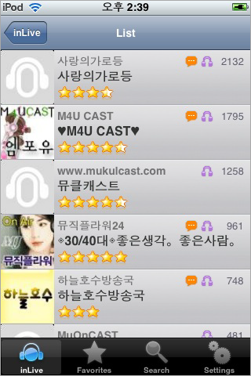](http://itunes.apple.com/WebObjects/MZStore.woa/wa/viewSoftware?id=299028859&mt=8)국내 유무선 포털 중에서 유일하게 아이팟 터치와 아이폰 개발을 대외적으로 선언하고 나선 드림위즈에서 만든 어플입니다. (사실 드림위즈 입장에서는 손해...라고 생각할 만한 부분이 전혀 없지 않나 싶어요)  
  
국내 웹음악방송을 모아서 스트리밍으로 전송해주는 어플입니다. 인라이브와 제휴를 한 듯 해요. 정확하게 소스가 어디인지를 공개한다거나 여기에 표시가 되려면 어떻게 해야 되는지 등을 인라이브 측과 함께 공개했으면 (그리고 영어 설명도 넣고) 훨씬 좋았을 거란 생각이 들더군요.  
  
사실 무료 웹음악방송을 스트리밍으로 들려주는 무료 어플들은 널리고 널렸지만 가요를 들을 수 있다는 점에서는 국내에 특화된 어플이 아닌가 싶어요. 역시 네트워크 상태가 온라인인 상태에서만 들을 수 있지요.  
  
그런데, 음악 들을 때 나오는 버튼들이 찌그러져 보여요. 수정됐으면 좋겠어요.  
  
가격은 $3.99

  

[Discover](http://itunes.apple.com/WebObjects/MZStore.woa/wa/viewSoftware?id=292416855&mt=8) ★★★★☆  
  
[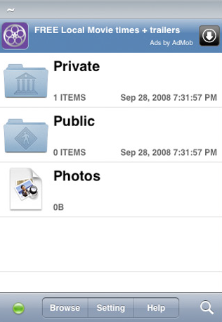](http://itunes.apple.com/WebObjects/MZStore.woa/wa/viewSoftware?id=292416855&mt=8)와이파이를 통해 아이팟 터치 (아이폰)에 각종 파일들을 넣게 해주는 어플입니다.  
  
크게 사진, 개인파일, 공유파일로 그 구분이 나눠져 있으며 프로그램 하나 설치할 필요 없이 웹 인터페이스만을 통해 자료를 업로드/다운로드할 수 있습니다.  
  
이 훌륭한 프로그램이 무료라니!  
  
가격은 무료

  

[Wallpapers by GelaSkins](http://itunes.apple.com/WebObjects/MZStore.woa/wa/viewSoftware?id=296264731&mt=8) ★★★  
  

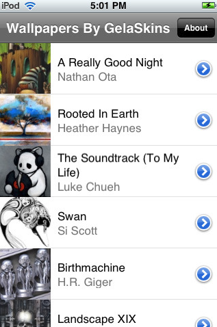

미술가들의 작품을 아이팟 터치 (아이폰)의 배경화면으로 저장할 수 있게 해 주는 어플입니다.   
  
사실 매우 간단한 어플이지만 좋은 점은 현대 미술가들의 몇몇 작품은 물론이고 몽크의 절규나 클림트의 키스, 고흐의 카페테라스 등의 명화를 쉽게 저장할 수 있다는 점입니다. 실제 작품 수가 그리 많지는 않지만 무료이기 때문에 모든 게 용서가 됩니다.  
  
가격은 무료

  

NOT GOOD NOT BAD  
  

[SimCity™ (International)](http://itunes.apple.com/WebObjects/MZStore.woa/wa/viewSoftware?id=300260420&mt=8)  
  
[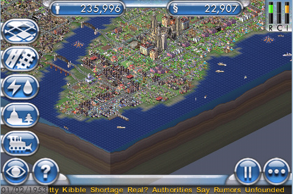](http://itunes.apple.com/WebObjects/MZStore.woa/wa/viewSoftware?id=300260420&mt=8)틈틈히 도시를 건설해 볼 수 있을까 싶어서 거금을 들여서 구입했는데, 아아... 조작법도 쉽지 않고, 아이팟 터치 (아이폰)의 화면이 조금 작은 감이 있어요. 살짝 느린 느낌도 무시할 수 없고요.  
  
게임은 즐겁기 위해서 하는 건데, 좁은 화면으로 불편해 하면서 하는 게 쉽지가 않더라고요. 익숙해지기 전까지는 애정을 주기 힘들 것 같아요.  
  
가격은 $9.99

  

[Super Monkey Ball](http://itunes.apple.com/WebObjects/MZStore.woa/wa/viewSoftware?id=281966695&mt=8)  
  
[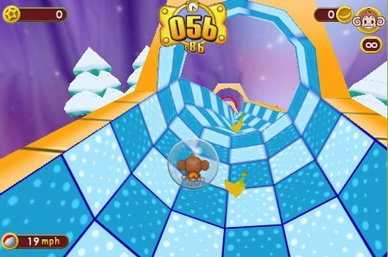](http://itunes.apple.com/WebObjects/MZStore.woa/wa/viewSoftware?id=281966695&mt=8)이 역시 기존 콘솔 게임기에서 유명한 게임이죠. 꽤 할만 합니다. 분명 다운그레이드였을텐데 포팅도 잘 되어 있고요. 조작성도 꽤 괜찮습니다.  
  
다만... 가격이... 좀 셉니다. 그리고, 저에게는 난이도가 살짝 높군요.  
  
가격은 $7.99

  

[iDrum: Ministry of Sound Anthems](http://itunes.apple.com/WebObjects/MZStore.woa/wa/viewSoftware?id=296270624&mt=8)   
  
[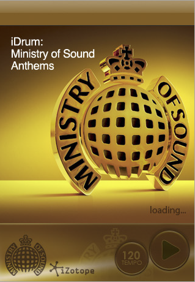](http://itunes.apple.com/WebObjects/MZStore.woa/wa/viewSoftware?id=296270624&mt=8)여러 가지 샘플들을 가지고 드럼 루프를 만드는 프로그램입니다. 다운 받으면 몇 십 개의 프리셋이 이미 있기 때문에 그것만 가지고도 충분히 즐길 수 있긴 합니다만, 그래도 자신만의 루프를 만들어야 하지 않겠어요? 하지만 아무래도 pc나 랩탑에 비해 화면이 작기 때문에 불편한 게 사실입니다.  
  
이걸 통해 뭔가 결과물을 얻기 전까지는 마냥 긍정적인 평가를 내리기가 힘들 것 같아요. 사실 iZotope과 Ministry of Sound의 콜라보레이션(...)이라는 말에 냉큼 구입한 충동 구매성 어플입니다.  
  
가격은 $5.99

  

[iFlipClock Lite](http://itunes.apple.com/WebObjects/MZStore.woa/wa/viewSoftware?id=296276722&mt=8)  
  
[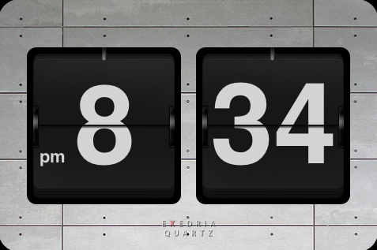](http://itunes.apple.com/WebObjects/MZStore.woa/wa/viewSoftware?id=296276722&mt=8)플러스 버전을 살까 라이트 버전을 살까 한참을 고민하다가 라이트 버전으로 산 어플입니다. 그런데, 사고 나서 조금 비싸더라도 플러스 버전 ($2.99) 을 살걸 그랬다는 생각이 들고 있습니다.  
  
그냥 수많은 무료 시계 어플과 크게 다를 바가 없지만 디자인이 꽤나 정교하게 플립형 시계를 표현해주고 있습니다. 그 왠지 레트로스럽고 무게감 있어 보이는 그런 거 있잖아요.  
  
알람이 지원되고 20 여 가지 배경 테마가 있습니다. 라이트 버전은 시간:분만 HH:MM 형태로 표시가 되는데, 플러스 버전은 시간:분:초가 HH:MM:SS 형태로도 표시가 가능합니다. 그냥 얼마 더 주고 플러스 버전 살 걸 하는 생각이 여전히 남는 어플입니다. 으흑.  
  
가격은 $0.99

  

BAD  
  

[Touch News](http://itunes.apple.com/WebObjects/MZStore.woa/wa/viewSoftware?id=299029071&mt=8)  
  
[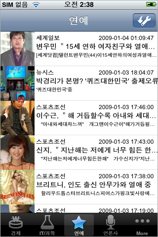](http://itunes.apple.com/WebObjects/MZStore.woa/wa/viewSoftware?id=299029071&mt=8)드림위즈에서 만든 어플입니다. 국내 11개 신문사의 기사를 분야별로 보여주죠. 사실 아이팟 터치를 구입하고 뭣도 모르는 상태에서 구입을 했는데, 굳이 구입할 필요가 없는 어플인 것 같아요.  
  
요즘 왠만한 신문사들이 다 RSS 서비스를 하고 있는데, [Byline](http://itunes.apple.com/WebObjects/MZStore.woa/wa/viewSoftware?id=284946773&mt=8) 같은 유료 어플 혹은 [Free RSS Reader](http://itunes.apple.com/WebObjects/MZStore.woa/wa/viewSoftware?id=290537970&mt=8) 같은 무료 어플을 구입해서 보면 되지 않을까 생각합니다.  
  
아, 물론 RSS 를 전문 공개를 하지 않으면 오프라인에서는 보기 힘들겠지요. 하지만, 무료 RSS 리더도 많은데 굳이 국내 신문만을 위해 추가로 유료 구입해야 하는 건 좀 아닌 것 같아요.  
  
가격은 $3.99

  

[Crazy Lighter - Gold](http://itunes.apple.com/WebObjects/MZStore.woa/wa/viewSoftware?id=285735373&mt=8)  
  
[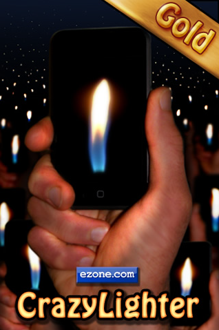](http://itunes.apple.com/WebObjects/MZStore.woa/wa/viewSoftware?id=285735373&mt=8)제가 이걸 왜 구입했을까요? 영어로 된 설명을 제대로 읽어 보지 않고 구입했기 때문입니다.  
  
많은 아이팟 터치 (아이폰) 어플들이 기기를 흔들면 작동되는 기능을 가지고 있는데, 이 어플도 흔들면 불빛이 흔들리고 가만히 있으면 불빛이 가만히 있는 줄 알고 구입을 한 것이지요.  
  
설명을 제대로 안 읽어 본 탓이니 누굴 원망할 수도 없겠지요. 배경에 아무 것도 없이 라이터 불과 비슷한 형태의 이미지가 표시되는 건 좋긴 합니다.  
  
가격은 $0.99

  
(2008. 12. 28 ~ 2009. 1. 3)
