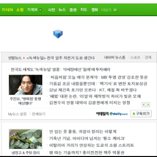

네이버가 리뉴얼을 하며 중점을 둔 두 개의 섹션 중 하나 - 컨셉은 둘 다 오픈. 그래서 인지 테스트 도메인도 open.www.naver.com  

<!-- truncate -->

네이버와 신문사들 간의 알력다툼은 너무나 오래된 이야기이다. 신문들은 자신들이 내어준거나 다름없는 네이버의 편집권을 시기했고 네이버는 자신들이 언론(media)이 아니라고 했다.  
  
리뉴얼 후 들려오는 이야기들은 더욱 코미디 같다. 사용자들은 예전의 그 시시콜콜한, 가공된 세상 이야기들과 네이버 악플 공간을 그리워하는 듯 하다.  
  
신문사들은 네이버로부터 편집권과 퍼머링크를 찾았지만 트래픽 폭주에 제대로 대비하지 못해서 서버가 다운되고 있단다.  
  
이런 코미디는 네이버 기획자들도 예상치 못한 결과가 아닐까? 혹시 사용자들이 단체로 스톡홀름 신드롬이라도 걸린 걸까. 아니면 매트릭스에 적응을 마친 걸까.  
  
만약 이 상태로 네이버가 사용자 핑계를 대고 예전처럼 에디터들이 손을 대고 신문사들이 서버 운영에 대한 비용을 핑계대고 네이버 인링크를 활용하기 시작한다면 어떤 일들이 이어 벌어지게 될까?  
  
네이버 파워를 확인한 이후이기 때문에 아마도 네이버 광고 비용은 올라가고 신문사들은 네이버에게 받는 기사 비용을 쉽게 올려달라고 하지 못할 것이다.  
  
하지만 신문사들이 여전히 투덜거릴 요인은 남아있다. [네이버 뉴스](http://news.naver.com)는 여전히 네이버가 편집하고 있고 네이버 안의 신문 기사 페이지에서 발생하는 수익은 여전히 네이버 몫이기 때문이다.  
  
그나저나 신문협의 주장들을 가만히 듣다 보면 문득 떠오르는 단체가 하나 있다. 바로 음반협. 6년 전 이 기사가 떠오른다. [음반협, 개인 음악 CD 제작 기술적 금지](http://www.betanews.net/article/68481)

[Posted with [iBlogger](http://illuminex.com/iBlogger/index.html) from my iPod touch]

  
  

관련 링크  
  
[이승훈과 이화경의 인터넷 인사이트 - 네이버 뉴스캐스트 수정제안, 이후는?](http://telling7star.newsboy.kr/19)  
  
[서명덕 기자의 人터넷 세상 - 한국인들에겐 "네이버가 첫화면 편집해 준 것이 최고야"](http://itviewpoint.com/92801)  
[서명덕 기자의 人터넷 세상 - '뉴스캐스트 트로이목마'로 네이버가 신뢰를 잃게 될까?](http://itviewpoint.com/blog/93538)  
  
[아주작은 언론, 동네 이야기 - 네이버 개편, 뉴스캐스트·오픈캐스트 성공적일까?](http://dongnae.tistory.com/397)  
[이정환닷컴! - 네이버 초기화면 개편 이후.](http://www.leejeonghwan.com/media/archives/001322.html)   
[차트사랑 @ 엑스차트 네트워크 - 네이버 아웃링크 효과 있나(단위:만명)](http://www.xchart.net/P000000109)  
  
[최진순 기자의 온라인저널리즘의 산실 - 공동 뉴스포털은 `최후의` 도전](http://www.onlinejournalism.co.kr/1196230766)  
[서명덕 기자의 人터넷 세상 - 신문협회의 공동 뉴스포털, 성공하려면 어떻게 해야 할까](http://itviewpoint.com/92770)

  
※ 2008-01-06 19:47 관련 링크 박스 추가
