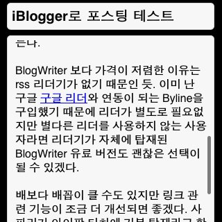

바로 이전 글에 달린 [댓글](http://blog.summerz.pe.kr/1334#comment944870)을 보고 [iBlogger](http://itunes.apple.com/WebObjects/MZStore.woa/wa/viewSoftware?id=291211374&mt=8)를 구입했다. [BlogWriter](http://itunes.apple.com/WebObjects/MZStore.woa/wa/viewSoftware?id=286094270&mt=8)보다 가격이 저렴하다.  

<!-- truncate -->

구입하고 보니 오- 딱 봐도 훨씬 좋다. 무엇보다 다중 블로그를 지원한다. 여러 개의 블로그를 운영하는 분들에게는 정말 유용한 기능일 것이다. 글을 블로그에서 직접 수정한 것도 바로 어플 상에서 갱신이 잘 되고 사진 전송 기능, 태그 입력 기능 (태그가 본문에 입력된다. 좋지 않다.), 간단하게 링크 입력 기능, 블로깅 위치 삽입 기능 등 유료 어플스러운 기능을 갖췄다.  
  
다만 링크를 본문 밖에서 입렷을 해야 하는 게 조금 불편하다. 사진도 원하는 위치에 여러 장 삽입하고 싶은 욕구도 충족이 안되지만 이건 다른 어플들도 그런 듯. (사람 욕심은 끝이 없다) 블로깅 위치 삽입도 구글 맵이 연동되는데 서울이 아니라면 아직 한국 다른 지역은 자세한 구분이 어렵지 않을까 하는 생각도 든다.  
  
BlogWriter 보다 가격이 저렴한 이유는 rss 리더기가 없기 때문인 듯. 이미 난 구글 [구글 리더](http://reader.google.com)와 연동이 되는 Byline을 구입했기 때문에 리더가 별도로 필요없지만 별다른 리더를 사용하지 않는 사용자라면 리더기가 자체에 탑재된 BlogWriter 유료 버전도 괜찮은 선택이 될 수 있겠다.  
  
배보다 배꼽이 클 수도 있지만 링크 관련 기능이 조금 더 개선되면 좋겠다. 사파리가 아이팟 터치에 기본 탑재라고 할 때, 사파리에 저장된 즐겨찾기에서 링크를 선택할 수 있거나 외부에서 미리 url를 입력해두고 글을 작성할 때 그 url 중에서 선택할 수 있게 하면 좋겠다. 그렇게만 된다면 어쿠스틱 뉴스도 모블로깅 할 수 있을텐데...  
  
어쨌든 봏은 어플 알려 주신 [1월의가면님](http://januaryface.net/)에게 감사 :)  
   

Mobile Blogging from [here](http://maps.google.com/maps?ll=37.5154,127.0173).

[Posted with [iBlogger](http://illuminex.com/iBlogger/index.html) from my iPod touch]

  
  
2008-01-06 09:30 추가/수정  
  
- 태그가 본문에 들어가는 듯. 으음. -\_-; 본문에 들어간 태그 삭제.  
- 끝에 iBlogger에서 작성되었다고 표시가 되네. 이것 역시 좋지 않다. 저렴하긴 하더라도 유료 버전인데, 이렇게 뒤에 자기 링크를 걸 필요가 있을까? 호감도 하락; (다음부터는 삭제해야지)  
  
2008-01-08 14:58 추가  
  
스프링보드의 설정에 가서 iBlogger 설정값을 체크하면 Footer 항목이 있다. Footer 내용을 삭제하면 iBlogger 에서 작성되었다는 표시를 없앨 수 있다.
