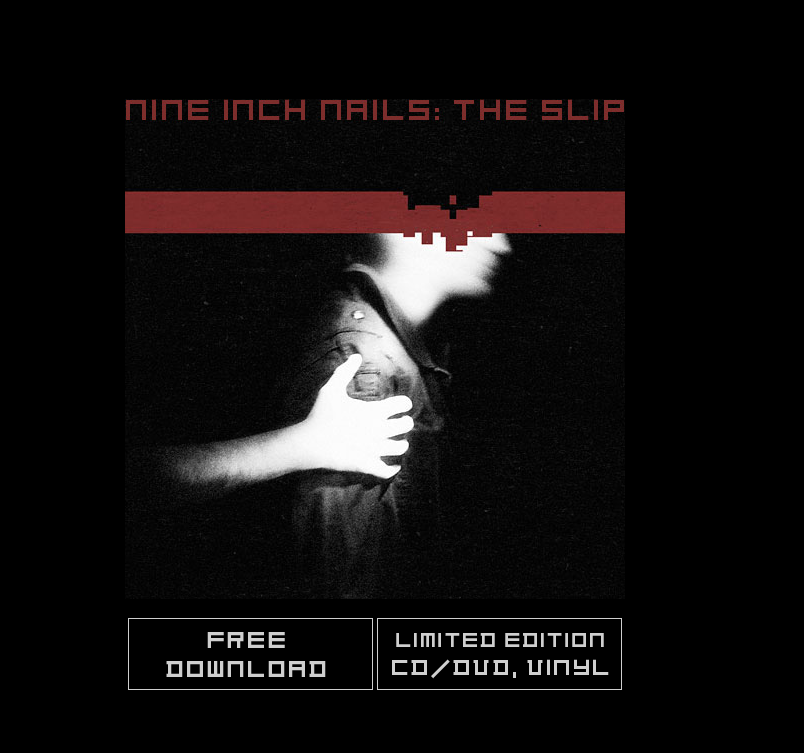
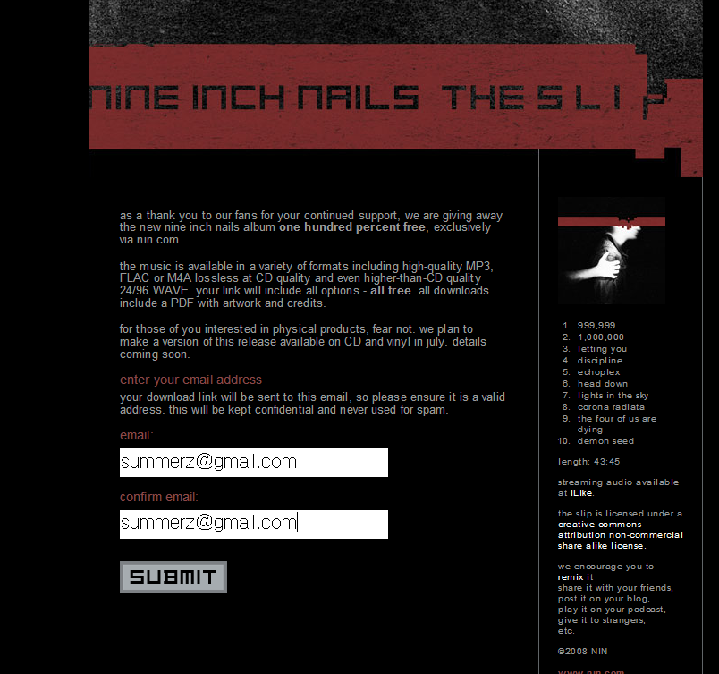
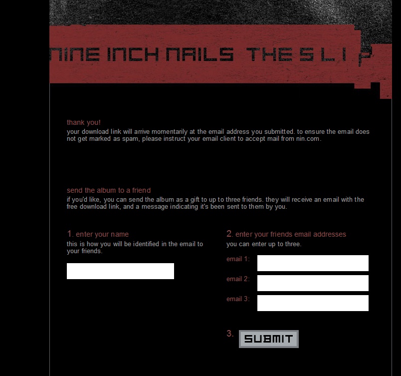
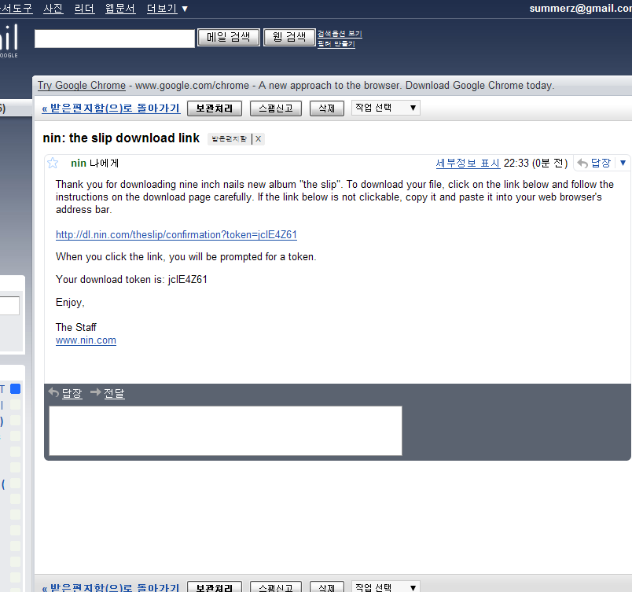
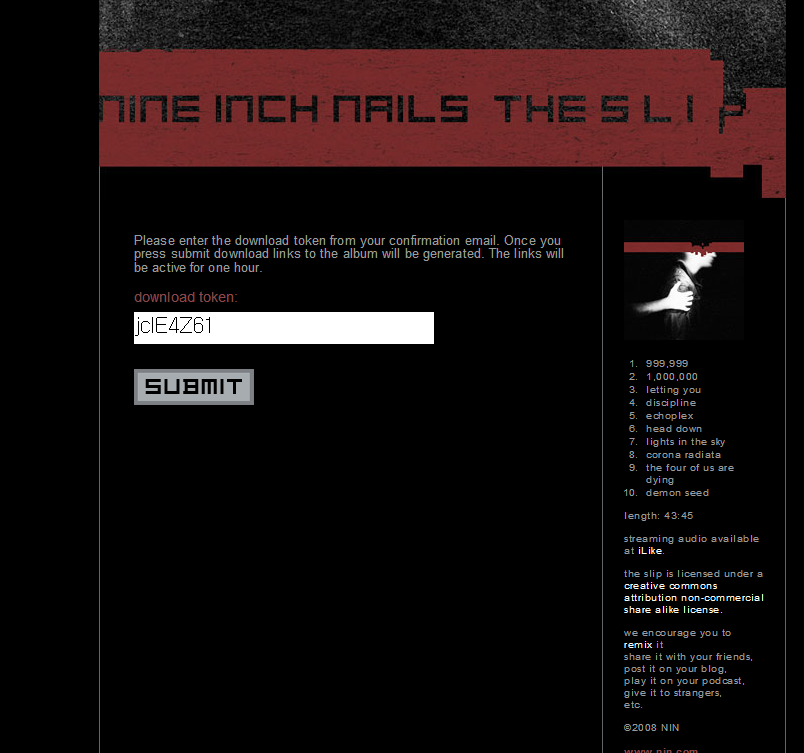
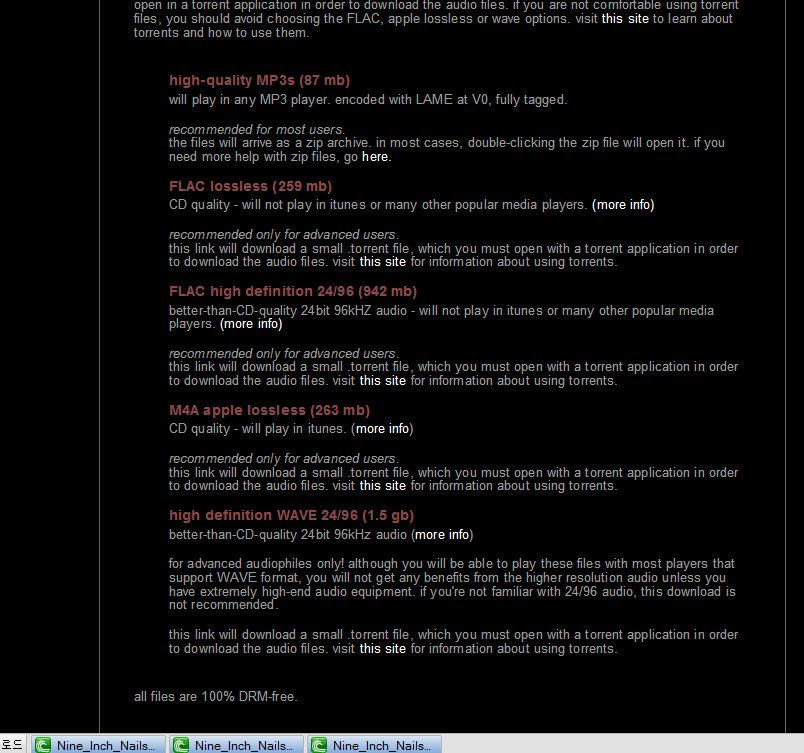
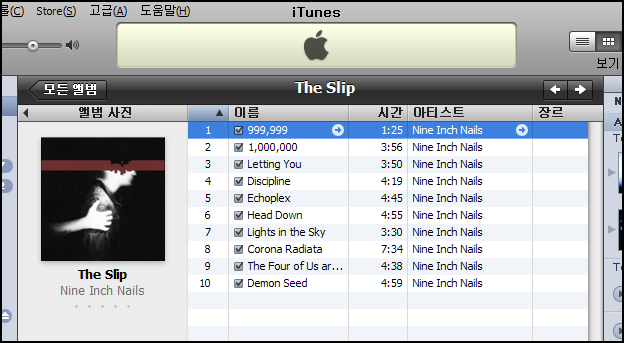

작년 10월 경에 [라디오헤드](http://www.radiohead.com/)가 신보 [In Rainbows](http://www.inrainbows.com/)를 인터넷을 통해 ['내고 싶은 만큼만 내고 우리 앨범 다운로드 받아가세요'](http://blog.summerz.pe.kr/1105) 하더니,  

<!-- truncate -->

이번엔 [나인 인치 네일스](http://www.nin.com/)가 '우리 신보 The Slip인데 공짜야. 마음대로 퍼가. mp3는 물론이고 아이팟에서 들을 수 있는 무손실 m4a, 무손실 FLAC, 심지어는 CD 음질보다도 훨씬 더 좋은 24bit / 96kHz WAVE 파일까지 (CD는 16bit / 44.1kHz) 준비했어.' 라고 하는군요.  
  
그것도 돌이킬 수 없게(!) 토렌트에 뿌렸어요.  
  
하고 싶은 말은 많지만 생략하고, 어쨌든 부러운 놈들, 부러운 동네입니다. ㅠ.ㅠ  
  

[▶ nine inch nails: the slip 다운받으러 가기](http://theslip.nin.com/)

  
  
※ 사실 그 뿐만이 아닙니다. 그들의 공식 포럼에 가보면 [무려 400GB가 넘는 라이브 공연 (Lights in the Sky 투어) 클립들을 공개](http://forum.nin.com/bb/read.php?18,378166)했다고 쓰여있군요.  ㄷㄷㄷ  
  
※ 팬들에 의해 멋지게 편집된 라이브 클립들이 돌아다니게 될까요? 쟤네 좀 짱이군요.  
  
  
다운로드 받는 방법 알아보기

[nine inch nails: the slip](http://theslip.nin.com/) 에 접속합니다.  

  
  
"이메일 주소 알려주면 다운로드 할 수 있는 링크 알려줄게"  

  
  
친구들에게도 뿌려줘. 많이 다운 받게 해줘!  

  
  
"자, 이거야 다운 받으삼"  

  
  
토큰은 저절로 입력이 되어 있습니다.  

  
  
짜잔- 모든 파일이 준비되어 있습니다. (링크는 1시간 동안 유효하다고 하는군요. 물론 토런트 링크는 언제나 유효하겠지요)  

  
  
이미 저는 아이튠즈에 넣고 좋아하고 있습니다.  

  
  
※ 2009-01-09 추가  
  
그러고 보니 이미 작년 (2008년 5월)부터 뿌린 것이었군요. 몰랐습니다. 아이고 창피해라. 그동안 얼마나 음악을 못들었으면... ㅠ.ㅠ  
  
(아, 저 라이브 투어 풋티지는 이번에 뿌린 게 맞고요)
