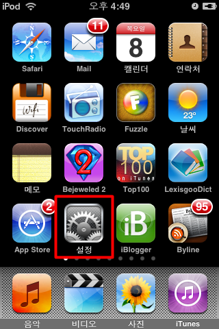
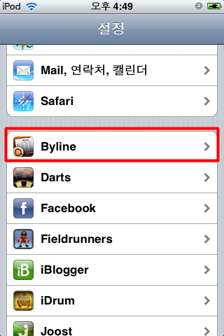
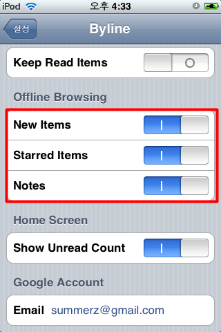
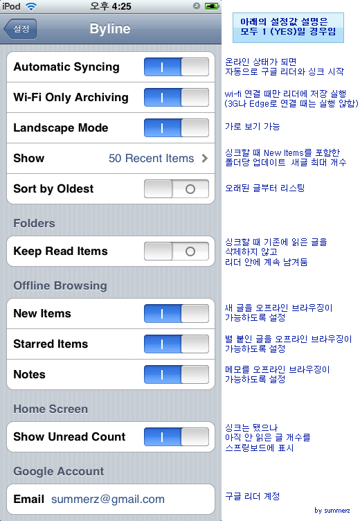

지난 번에 제가 아이팟 터치 (아이폰)에서 구동되는 rss reader 프로그램인 [Byline](http://www.phantomfish.com/byline.html)을 좋아한다고 했었죠.  

<!-- truncate -->

관련 링크  
  
[어쿠스틱 터치 (2008. 12. 28 ~ 2009. 1. 3)](http://blog.summerz.pe.kr/1332)  
[새삼스레 RSS 전문공개에 대하여](http://blog.summerz.pe.kr/1333)

  
위의 두 링크 중에서 Byline과 관련된 내용을 간단하게 요약하면 다음과 같습니다.  
  

Byline은 유용성에 있어서 별 5개 만점이 아깝지 않은 rss reader 이지만 rss를 전문 공개 하지 않는 피드들은 오프라인 - 즉 와이파이 (wi-fi)가 연결되어 있지 않은 상태에서는 글의 일부분 밖에 확인할 수 없으니 불편하다.  
  
따라서 구글 리더와 연동이 되는 Byline을 사용하는 한 구글 리더에도 전문 공개한 피드들 위주로 넣어둘 수 밖에 없다.

  
하지만 이는 제가 Byline의 기능을 잘 모르는 상태였기 때문에 벌어진 일이었습니다. 즉, 오프라인 상태에서도 부분 공개한 rss의 전문을 확인할 수 있다는 거죠! 바로 Offline Browsing을 사용하는 것입니다.  
  
  
  
  
다음과 같이 설정을 하면 됩니다.  
  

1. 스프링보드 (아이팟 터치의 바탕화면)에서 설정을 클릭  

  
  
2. 설정 화면 아래 쪽에서 Byline을 클릭  

  
  
3. Byline의 설정 화면 아래 쪽에서 Offline Browsing 란 값들을 1로 변경  

  
위와 같이 설정해 두면 인터넷이 되지 않는 오프라인 상에서도 New Items와 Starred Items, Notes에 대해서 브라우징이 가능하게 됩니다.  
  

예를 들어 [익스트림무비](http://extmovie.com/)의 경우 rss가 부분 공개이지만 좌측 하단의 링크 버튼을 클릭하면, (좌측 상단을 보면 네트워크 연결이 되지 않은 상태임을 알 수 있음)  
  

  
  
싱크 상태에서 저장한 웹페이지가 보이게 됩니다. (플래시가 보이지 않는 건 아직 어쩔 수 없죠) 다시 rss 내용으로 돌아가려면 역시 좌측 하단의 돌아가기 버튼을 클릭하면 됩니다.  
  

  
사람들이 Byline을 사용하기 좋은 rss 리더로 꼽는 이유가 바로 여기에 있었군요.   
  
  
이미 똑똑한 rss 리더기가 존재하는데, 그걸 모르고 있었군요. -\_-;  이렇게 싱크할 때 실제 페이지로 가서 저장해오는 방식이 좋은 점은 싱크할 당시의 댓글까지 그대로 보여주는 것입니다. 물론 글이 수정되거나 하는 것에 대해서는 우려되는 상황이지만 그리 우려할 만한 수준은 아니예요. 왜냐면 아이팟 터치가 자료의 영구 보존을 위한 기기가 아니라 이동 중에 확인하는 기기이며 다시 싱크를 하면 새 글에 뭍혀 사라지게 하는 옵션도 있으니까요. 기존 리더에 비하면 상당히 발전된 형태가 아닐까 생각합니다.   
  
단, 네이버 블로그, 설치형 텍스트큐브의 블로그는 저장된 페이지가 제대로 보이지 않습니다. 네이버는 많은 아이프레임과 스크립트로 인해 그런 것 같고 (추측입니다) 설치형 텍스트큐브는 /m 으로 리다이렉션 되는 방식에 있어서 Byline이 뭔가 대응을 제대로 못하기 때문인 것 같습니다.  
  
  
  
그럼 마지막으로 Byline의 설정값들에 대해 알아보겠습니다. 물론 영어가 되시는 분들은 [Phantom Fish - Byline - Help](http://www.phantomfish.com/bylinehelp.html) 페이지에서 확인하실 수 있습니다.  
  

  
  
※ 참고로 위의 경우라면 0 으로 되어 있는 설정값이 Sort by Oldest와 Keep Read Items이니 글의 리스팅은 최신 순으로 하고, 읽은 글은 싱크할 때 남겨두지 않는 상태가 되겠지요.
