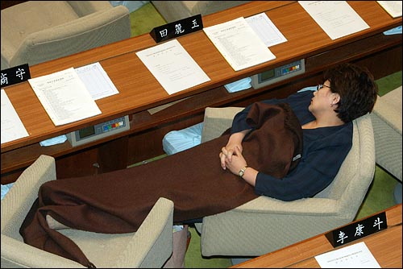

※ 시작하기 전에 : 이제까지 어쿠스틱 뉴스라는 제목으로 링크들을 모아봤는데요, 날짜를 중심으로 하다 보니 부담감도 크고 해서, 앞으로는 조금 비정기적인 성격을 띄게 되더라도 부담감을 줄이기 위해 그냥 순차적으로 넘버링을 하려고 합니다. (2006년 3월 13일 시작했는데, 가장 최근에 쓴 게 2008년 10월 6일이고 107번을 썼더군요.) 그러니까 이번 글은 108번째. :)  

<!-- truncate -->

dobiho on HCI - 네이버 새홈의 로그인창 위치  
  
닐슨이 엉뚱한 얘기를 많이 했지만, 그중 쓸만한 얘기중 하나는 When Bad Design Elements Become the Standard 라는 글이다.  
> 어떤 디자인 요소가 산업에 80% 이상 쓰이고 있을때 다른 디자인을 쓸려면 100% 이상의 신뢰할 수 있는 연구를 해야 하고,  50~79% 가 쓰이고 있다면 적어도 50% 이상의 사용성 연구로 입증해야 한다

퍼셋티지 숫자야 닐슨 자기 맘대로 적었겠지만 내가 이 글에서 얻은 것은 ‘산업비표준이 아닌 새로운 UI를 얘기할때에는
확실한(?) 것을 만들어야 할 만큼 어렵다’는 것이다. 이런 닐슨의 사용성 얘기 말고 내 생각엔  전략적으로 어떻게  아이덴티를
보이는 것도 중요한 의사결정 사항이다. 대안이 없는 비판은 공허하다는 말과 일맥상통하는 거라고 생각한다. 따지고 보면 GNB 영역의 상단에 들어가는 로그인 (혹은 회원가입) 링크들은 다 오른쪽에 있잖아. 지메일도 로그인 창이 오른쪽에 있는데; 이거 혹시 ... 찍기로 결정되는 건가.  
  
[▶ 보러가기](http://dobiho.com/?p=1668)

  

한겨레 - 룸살롱 접대 늘려 ‘경기부양’?  
  
한 대기업 홍보담당자는 “그동안에도 소액 분할 결제 등을 활용해 접대 기록을 보관해야 할 일은 거의 만들지 않았다”며 “규제가 풀리면 편법을 쓰는 불편과 심리적 부담이 사라질 것”이라고 말했다. 그러니까, 계산서를 그렇게 이리저리 맞추는 건 불법일까, 요령일까? 적어도 회사에서 누군가 그걸 불법이라고 말하면 '미친X' 소리를 듣는 게 대한민국의 오늘인 것만은 틀림없다. 불법을 불편으로 여기는 사회.  
  
[▶ 기사보기](http://www.hani.co.kr/arti/society/society_general/328521.html)

  

뉴시스 (@야후) - 李대통령 "GM 부도, 노조 과잉요구 때문"  
  
이 대통령은 "전 세계에 닥친 경제위기를 우리 노사관계를 재정립하는 계기로 삼아야 한다"며 "개별 기업의 문제 하나 하나를 해결하는데 힘을 쏟기보다 노사관계의 패러다임, 구조적 틀을 바꿔야 한다"고 제시했다. / 이 대통령은 이어 "수소차를 개발한 일본 도요타사(社)의 경우에도 노사관계가 완벽했는데도 불구하고 지금 휘청이고 있다"며 "우리가 부딪힌 전대미문의 위기 때문에 세계의 모든 노사관계가 달라져 가는 것"이라고 강조했다. 만약 현실에서 - 어머니와 자식들의 이야기를 잘 들어주는 아버지가 회사에 다니다가 실직한 후 '와이프와 애들의 요구를 다 들어줬기 때문에 회사에서 짤린거야!' 라고 하면 그게 정상일까?  
  
[▶ 기사보기](http://kr.news.yahoo.com/service/news/shellview.htm?linkid=4&articleid=2008121215142086280&newssetid=1331)

  

최훈의 프로야구 카툰 - 영웅의 꿈  
  
완전 구구절절하다. 모습을 이리저리 바꾸며 계속해서 새로 태어나는 걸 보면 과거부터 박쥐처럼 이리저리 붙어다니며 살아왔던 사람들이 생각난다. (저, 우리 히어로즈 안티 아니예요. 흑흑) / 그나저나 최훈은 역시 쵝오!  
  
[▶ 만화 보러가기](http://news.naver.com/sports/index.nhn?category=kbo&ctg=cartoon&mod=read&id=519&office_id=223&type=kbo_cartoon&article_id=0000000281&m_url=%2Flist.nhn%3Fgno%3Dnews223%2C0000000281)

  

진중권 (@진보신당) - 전여옥 의원, 1박2일의 원조  
  

  
국회 본회의장에서 저렇게 곤히 잠든 모습을 보세요. 지금 저것이 지중해 지방의 시아스타(낮잠)가 아니라면, 저게 1박 2일의
원조일 겁니다. 이게 2004년이라니까, 민주당보다 저작권이 한 4년 앞섭니다. 또 그 날이 12월 31일이었다고 하니, 1박
2일 2004년 송년특집이었던 셈이지요. 아, 그보다 조금 앞서 당시 한나라당은 국회점거를 9박 10일이 아니라, 13박 14일
동안 했다고 하네요. 한나라당이 MBC를 망하게 하는 방법 - 전XX을 무한도전 고정 패널로 출연시킨다. 한나라당이 KBS를 망하게 하는 방법 - 전XX을 1박2일에 고정 패널로 출연시킨다. 한나라당이 SBS를 망하게 하는 방법 - 전XX을 패밀리가 떴다에 고정 패널로 출연시킨다. 내가 보기에 넉넉잡고 4주면 우리나라 방송사는 시청률 저조로 광고 다 떨어지고 망하게 되어있다.  
  
[▶ 가서 보기](http://www.newjinbo.org/board/view.php?id=discussion&no=23792)

  

뉴시스 - 최화정 학력날조 들통  
  
모 연예인이 학력 위조를 했다는 건 별로 관심없고, 저 사진을 보라. 국내유일 민영 뉴스통신사라고 주장하는 뉴시스의 기사에 올린 사진이 저렇다. 저걸 새로운 미학이 어쩌고 하며 진지하게 받아치면 미X놈이고, 실수라고 한다면 이미 4개월이 넘은 기사다. 네이버가 뉴스캐스트로 오픈해주면 뭐하나. 저런식으로 말도 안되는 낚시질을 할 거 같은데. 가만... 곰곰히 생각해 보니 이미 여러 신문사들은 제목 가지고 낚시질을 충실히 하고 있는 것 같기도 하다. 김용호기자 yhkim@newsis.com 기사란다.  
  
[▶ 기사 내용과 사진의 언발란스함 확인하러 가기](http://www.newsis.com/article/view.htm?cID=article&ar_id=NISX20070830_0004223908)
