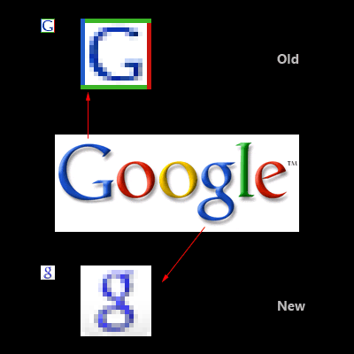
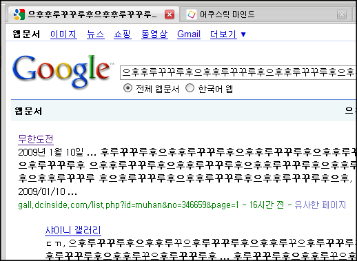

대문자 G 에서 소문자 g 로 바뀐지 얼마 안된 거 같은데,  

<!-- truncate -->

이미지 출처 : [Google shows off new favicon | Life, the Universe, and Everything](http://blog.codesignstudios.com/google-shows-off-new-favicon/)

  
  
  
아래처럼 바뀌었네요? 소문자 g 에 색깔을 넣었군요. 크롬 아이콘 생각나는군요.  
  

  
  
[구글 크롬](http://www.google.co.kr/chrome) 아이콘은 아래와 같죠.  
  

