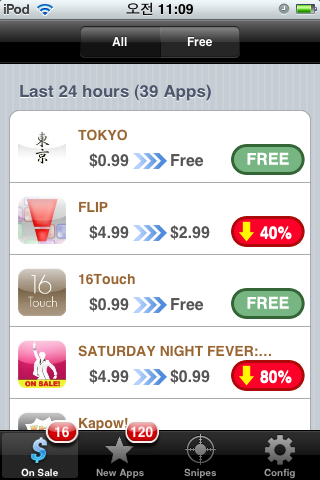
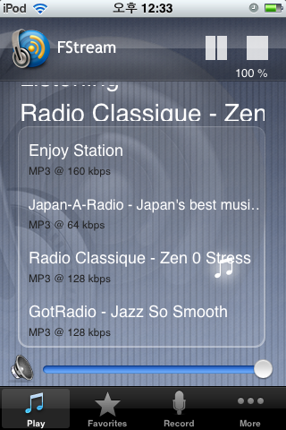
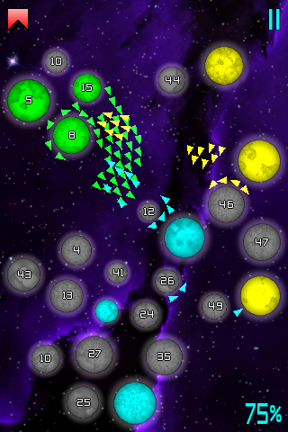
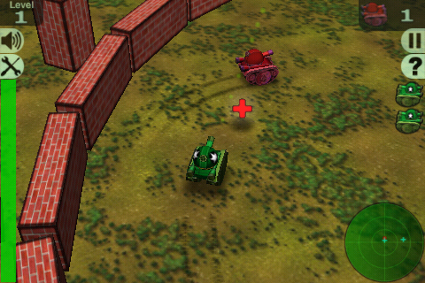
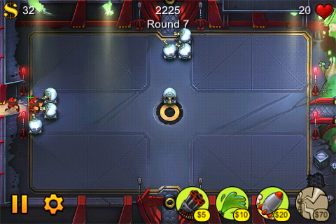
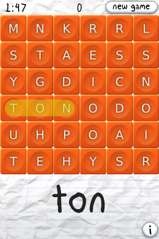
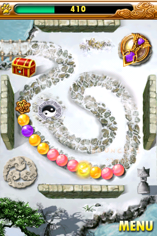
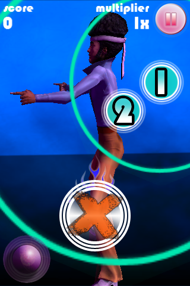

어쿠스틱 터치 2번째 입니다.   

<!-- truncate -->

역시나 간단하게 설명드리면 이 글은 아이팟 터치 (혹은 아이폰) 어플들에 대해서 개인적인 별점 평가이며 유료 위주로 만족도 평가 별 5개 만점, 별점 평가는 GOOD 에만 남깁니다.  
  

GOOD  
  

[AppSniper](http://itunes.apple.com/WebObjects/MZStore.woa/wa/viewSoftware?id=294706770&mt=8) ★★★★★  
  
 지름신이 만들어낸 악마의 어플 되겠습니다. 현재 할인 중인 어플들의 리스트를 보여줍니다. 리스트는 매일 갱신되고, 할인폭 및 무료 어플의 경우에는 따로 구분을 해서 보여줍니다. 한 마디로 천재적인 경제 생활을 영위할 수 있게 하는 어플인 거죠.  
  
구입하고는 싶은데, 가격이 비싸서 구경만 하는 어플의 경우 Snipes라는 메뉴에 등록을 해두면 자신이 설정한 적정 가격까지 할인이 됐을 때 알려주는 기능도 가지고 있습니다. 철저하지요. 스나이퍼라고 할만 합니다.  
  
할인되어 무료가 되는 어플만 매일 확인하고 다운 받아도 뽕을 뽑을 수 있습니다. 하!지!만! 부작용으로는 이 어플을 들여다 볼수록 청구서는 두꺼워지기 십상이고, 자신이 예전에 비싼 돈 주고 구입했던 어플이 할인된 것을 확인하면서 배가 쓰리는 고통을 느끼게 됩니다. 모두들 주의하시길;  
  
※ 가끔 AppSniper에서의 가격과 앱스토어의 가격이 맞지 않을 때가 있는데, 이 때는 무조건 앱스토어의 가격이 맞는 겁니다. 구입하기 전에 꼭 확인을 하셔야 해요.  
  
※ 배가 아픈 경우에 대한 실제 예를 들자면 얼마 전에 [SATURDAY NIGHT FEVER: DANCE!](http://itunes.apple.com/WebObjects/MZStore.woa/wa/viewSoftware?id=299382375&mt=8)를 $4.99 에 다운 받았는데, 오늘 보니 $0.99로 할인 중이더군요. 으흑;   
  
가격은 $0.99 (AppSniper도 할인되는 거 아냐? -\_-)

  

[FStream](http://itunes.apple.com/WebObjects/MZStore.woa/wa/viewSoftware?id=289892007&mt=8) ★★★★☆  
  
어정쩡한 이름과는 다르게 매우 좋은 음악 스트리밍 어플입니다.  
  
기본적으로 프리셋으로 입력된 서버에서 많은 웹방송 주소를 검색할 수 있습니다. ShoutCast, SourceMac,
iTunes 이렇게 세 곳인데, 대부분 연결이 잘 됩니다. 저의 경우에는 클래식 방송하는 곳을 주로 듣는데 끊기지도 않고
좋습니다.  
  
물론 자신이 원하는 주소도 입력할 수 있죠. 또한 현재 듣고 있는 음악을 녹음하는 기능도 있습니다 다만 녹음하는데 용량이 많이 필요해요. 압축해서 녹음하는 것이 아니니까요. 1분에 10MB 정도 필요합니다.  
  
이보다 더 풍부한 웹방송 주소를 기본으로 포함한 어플이 있다는 것도 알지만, 이 프로그램은 무료잖습니까!  
  
가격은 무료

  

[Galcon](http://itunes.apple.com/WebObjects/MZStore.woa/wa/viewSoftware?id=285820845&mt=8) ★★★★  
  
매우 독특한 방식의 전략 게임입니다. 화면에는 행성이 있고, 행성에는 숫자가 있습니다. 플레이어의 행성을 클릭하고 적 행성이나 중립 행성을 클릭하면 숫자만큼 화살표가 나가서 공격을 합니다. 적/중립 행성의 숫자를 모두 없애면 플레이어의 행성으로 변합니다. 즉, 행성에 써진 숫자가 공격지수과 방어지수를 나타내는 거죠. 게임의 목표는 자신의 행성을 늘려가면서 모든 적 행성을 없애는 것이죠.  
  
설명하기가 꽤나 까다로운 게임인데, 직접 해보면 게임 각 행성당 별이 있고, 일
단 해보면 대부분 바로 이해가 될 거라 생각합니다. 무료 버전인 [Galcon Lite](http://itunes.apple.com/WebObjects/MZStore.woa/wa/viewSoftware?id=290775344&mt=8)를 통해 어떤 게임인지 대략 확인할 수 있을 거예요.  
  
여기까지만 하면 가격이 조금 비싸다고 생각할 수도 있습니다만 무려 네트워크 대전이 가능합니다! 전세계 사용자들과 대전을 할 수 있습니다. 아주 재밌어요. 랙도 거의 없는 것 같고요. 최대 4명이 동시에 플레이할 수 있습니다. 물론 네트워크에 연결되면 배터리가 금방 닳기 때문에 전원을 꼽아두고 플레이를 해야겠죠.  
  
가격은 $4.99

  

[Crazy Tanks](http://itunes.apple.com/WebObjects/MZStore.woa/wa/viewSoftware?id=300479860&mt=8) ★★★★  
  
탱크 게임입니다. 아이폰 터치의 위치 감지 센서를 이용해서 기울기로 방향을 조절하며 터치로 대포를 쏘아 적 탱크를 물리치면 한 스테이지가 끝납니다.  
  
난이도도 그렇게 높지 않고 저렴한 가격에 즐겁게 할 수 있는 게임입니다. $1 만 더 비쌌어도 별점이 뚝뚝 떨어질 듯;  
  
가격은 $0.99

  

[Fieldrunners](http://itunes.apple.com/WebObjects/MZStore.woa/wa/viewSoftware?id=292421271&mt=8) ★★★☆  
  
언젠가부터 선풍적인 인기를 끌며 거의 하나의 장르로 굳어지기 시작한 타워 디펜스류 게임입니다.  
  
총 4개의 타워를 세울 수 있는데, 공격할 수 있는 유닛의 종류가 나뉘지 않고 모든 타워는 모든 유닛을 공격할 수 있습니다. 타워별로 지상 유닛만 공격할 수 있다든지, 공중 유닛만 공격할 수 있다든지 하는 게임들이 많죠.  
  
게임 고유의 특별한 기능이나 룰은 없고 오히려 룰도 만순해진 면이 있지만 오히려 그것이 게임의 접근성과 몰입도를 높여주는 것 같아요. 사운드와 그래픽이 만족스럽군요.  
  
가격은 $4.99

  

NOT GOOD NOT BAD  
  

[Wurdle](http://itunes.apple.com/WebObjects/MZStore.woa/wa/viewSoftware?id=287712243&mt=8)  
  
각각의 알파벳을 터치 & 드래그해서 단어를 만들어서 정해진 시간 안에 (기본 2분) 좋은 점수를 얻는 것이 이 게임의 목적입니다. 영어 단어 공부도 할 겸해서 구입해봤는데, 제 목적과는 조금 다른 하드코어한 게임이예요.  
  
실제로 사용이 되는 단어보다는 짧지만 사전에는 존재하는 그런 단어들 위주로 공략할 수 밖에 없는 구조이다 보니 학습 효과는 거의 없다고 보시면 됩니다;;; (게임으로 공부를 하겠다는 발상이 우선 잘못된...-\_-)  
  
제가 네이티브였다면 더 즐겁게 했을 것 같긴 해요.  
  
가격은 $1.99

  

BAD  
  

[Bonsai Blast](http://itunes.apple.com/WebObjects/MZStore.woa/wa/viewSoftware?id=298410235&mt=8)  
  
레일을 타고 이동하는 구슬들 중에서 같은 색의 구슬을 3개 이상 붙이면 사라지는 게임입니다. 이런 류의 게임들은 많죠. 아이팟 터치 게임 중에서도 당장 [Blackbeard's Assult](http://itunes.apple.com/WebObjects/MZStore.woa/wa/viewSoftware?id=294739283&mt=8)나 [Puzzleloop Free](http://itunes.apple.com/WebObjects/MZStore.woa/wa/viewSoftware?id=289689048&mt=8) 같은 게임이 같은 게임이라고 할 수 있습니다.  
  
원래 이런 류의 게임을 좋아하는 건 사실인데, 가격이 비쌉니다. 심지어 Puzzleloop Free 같은 게임을 알고 있었는데, 제가 뭘 기대하고 이 게임을 샀을까요? 알다가도 모르겠습니다. @.@  
  
게임은 재밌지만, 가격 때문에 BAD.  
  
가격은 $3.99

  

[SATURDAY NIGHT FEVER: DANCE!](http://itunes.apple.com/WebObjects/MZStore.woa/wa/viewSoftware?id=299382375&mt=8)  
  
NDSL의 응원단 같은 종류의 게임이라고 생각하면 됩니다. 음악과 리듬에 맞춰서 정해진 곳을 콕콕 찌르는 게임입니다. 특별한 기능, 특이한 룰 같은 거 없이 거의 동일하죠. NDSL처럼 터치의 특성을 가장 잘 이용한 게임 중의 하나이긴 히자만 대신 곡이 너무 적습니다.  
  
음악을 미리 확인하고 샀어야 했는데, 그런 것 없이 그냥 사버렸기 때문에 누굴 탓할 수도 없죠. 4곡을 다 플레이하고 나면 할 게 없습니다.  
  
곡이 계속 추가된다면 몰라도 겨우 4곡에 이 가격을 지불하기에는 아까운 게임입니다.  
  
가격은 $4.99 (이 글을 쓰는 지금 할인해서 $0.99 입니다! ㅠ.ㅠ)

  
(2009. 1. 4 ~ 2009. 1. 13)
