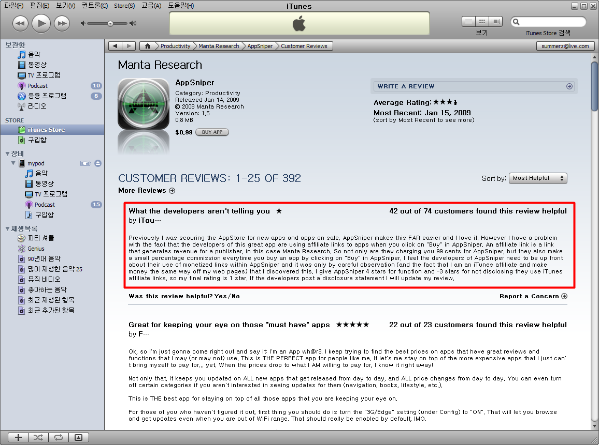

<!-- truncate -->

  
> 난 예전에 새로운 어플과 할인을 하는 어플을 알아보기 위해 (아이튠즈) 앱스토어를 찾아다녔지. 앱스나이퍼는 이것을 정말 쉽게 해줘서 너무 좋았어. 그런데, 한 가지 사실이 걸리는데, 우리가 “구매 (Buy)” 버튼을 클릭할 때마다 앱스나이퍼가 광고제휴 링크를 사용한다는 것을 이 대단한 어플을 만든 개발자들이 알려주지 않았다는 거야. 제휴광고 링크는 퍼블리셔에게 수입을 주는데, 이 경우라면 맨타 리서치 (Manta Research)가 수입을 얻는 퍼블리셔겠지. 그래서 맨타 리서치는 우리로부터 앱스나이퍼를 다운받는 요금으로 99센트를 받을 뿐만 아니라 우리가 앱스나이퍼에서 “구매” 버튼을 클릭할 때마다 작은 비율의 커미션을 받는다는 거야. 난 앱스나이퍼의 개발자들이 그들이 링크를 통해 돈을 번다는 사실을 밝히는 게 좋다고 생각해 (사실 나도 내 홈페이지에 같은 방식(링크)으로 돈을 버는 제휴 프로그램에 참여하고 있어) 이것도 잘 관찰한 끝에 발견한 거야. 앱스나이퍼의 기능에 있어서는 별 4개를 주고, 아이튠즈 광고제휴 링크 사용을 밝히지 않아 별 3개를 빼서 최종 별점은 별 1개야. 만약 개발자들이 이에 대해 밝히면 나도 내 리뷰를 업데이트 할게.  
>   
>
> [AppSniper](http://itunes.apple.com/WebObjects/MZStore.woa/wa/viewSoftware?id=294706770&mt=8)에 대한 어느 리뷰

자칫 앱스나이퍼 (AppSniper)가 부정한 방법으로 돈을 버는 거 아니냐고 곡해할 수도 있지만 '너네 어차피 광고 수익으로 돈을 벌건데, 왜 우리에게 그 사실을 숨겼니! 너네는 돈 벌 수 있는 다른 방법이 있으니 99센트도 받지 않고 무료로 해줘!' 라며 귀여운 투정을 부리는 것 같습니다. 혹은 자신도 광고제휴 링크를 달고 있는데 경쟁자가 돈을 잘 버니 부러웠던 것일까요? ^^  
  
물론 저건 불법도 아니고, 부정한 것도 아니고, 속인 것도 아니죠. 아이디어가 뛰어난 거죠. 애플도 허락했고, 잘못된 기능이 있는 것도 아니고, 소비자들에게 불이익이 가는 것도 아니니까요. 그렇다면 - 아이디어를 잘 짜내서 각종 CPS, CPA 프로그램을 잘 이용한 어플을 만들어 본다면, 어떤 게 있을까요?  
  
만약 아이폰에서 - 사파리 브라우저에서 - IE가 아닌 - ActiveX가 지원되지 않는 브라우저에서 결제가 가능한 쇼핑몰이 있다면, 그리고 그런 쇼핑몰들의 상품을 광고하는 광고 프로그램이 있다면, 저렇게 할인 상태를 표시해주고 신제품을 표시해준다면 충분히 경쟁력 있는 어플이 되지 않을까요? 쇼핑몰에서 아이폰 (아이팟 터치) 전용 웹페이지를 구성해주면 금상첨화겠지요.  
  

관련링크  
  
[어쿠스틱 터치 (2009. 1. 4 ~ 2009. 1. 13)](http://blog.summerz.pe.kr/1346)
