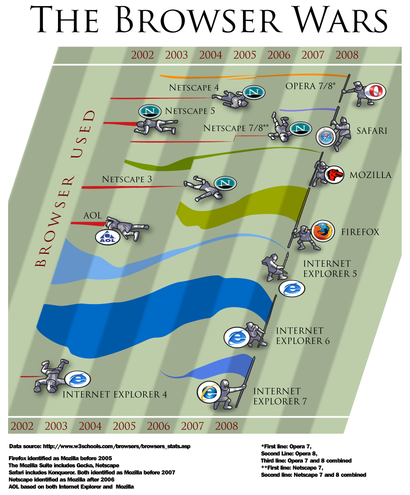

전파만세 - 리라하우스 제 3별관 - 외환개입  

<!-- truncate -->

일본은행 상사 「알겠나? 지금부터 1분마다 10억엔씩 엔 매도 달러 매수 개입을 실시한다」  
일본은행 부하 「1분마다 10억엔이나?」  
일본은행 상사 「그렇다. 1분마다 계속 아무렇지도 않게 판다. 지금부터 24시간 계속 판다」  
일본은행 부하 「24시간입니까?」  
일본은행 상사 「그렇다. 환 시세에는 신경쓰지 않아도 좋다」  
일본은행 부하 「음, 그렇지만 1분 간 10억엔이라면 하루에 1조엔 이상의 자금이 필요합니다만?」  
일본은행 상사 「지금 30조엔이 준비되어 있다. 당장은 이것을 사용한다」  
일본은행 부하 「그것을 다 사용하면 어떻게 합니까?」  
일본은행 상사 「재무성이 보유하고 있는 200조엔의 미국채 가운데, 비교적 단기의 것을 최대 100조엔 팔아  
                       새로운 개입 자금을 만든다」  
일본은행 부하 「미국채는 팔아버려도 좋습니까?」  
일본은행 상사 「엔 매도로 산 달러로 새롭게 미국채를 사, 국고에 반환하므로 문제는 없다.  
　　　　　　　  어쨌든 상대가 굴복할 때까지 계속 미친듯이 판다. 헤지펀드를 무너뜨려야 한다」  
이것을 35일간 계속했습니다.  
그 결과 미국의 헤지펀드 2000개가 도산했습니다.  
또한, 행방불명이 되거나 자살한 사람도 속출했습니다. 실화.  
  
혹시 우리 만수씨도 저런 각오였을까? 헤지펀드를 무너뜨려야 한다는 비장한 각오?  
  
[▶ 보러가기](http://newkoman.mireene.com/tt/2289)  
  
참고링크 : [네 골짜기 - 전설의 일본은행포 (日銀砲）사건](http://takahisa.egloos.com/4040097)

  

iPhoneIndiaBlog.com - 2008 Best App Ever Award Announced  
  
[Shazam](http://phobos.apple.com/WebObjects/MZStore.woa/wa/viewSoftware?id=284993459) - 2008 Best App Ever  
[Shazam](http://phobos.apple.com/WebObjects/MZStore.woa/wa/viewSoftware?id=284993459) - Most Innovative App  
[Air Sharing](http://phobos.apple.com/WebObjects/MZStore.woa/wa/viewSoftware?id=289943355&mt=8) - Most Useful App  
[Stanza](http://phobos.apple.com/WebObjects/MZStore.woa/wa/viewSoftware?mt=8&id=284956128) - Best Free or Ad Supported App  
[Ocarina](http://phobos.apple.com/WebObjects/MZStore.woa/wa/viewSoftware?id=293053479&mt=8) - Best 99 Cent App  
[Shazam](http://phobos.apple.com/WebObjects/MZStore.woa/wa/viewSoftware?id=284993459) -Best iPhone WOW App  
[Things](http://phobos.apple.com/WebObjects/MZStore.woa/wa/viewSoftware?id=284971781&mt=8) - Best Productivity Enhancer  
[Facebook](http://phobos.apple.com/WebObjects/MZStore.woa/wa/viewSoftware?id=284882215&mt=8) - Best Productivity Killer  
[Now Playing](http://phobos.apple.com/WebObjects/MZStore.woa/wa/viewAlbum?playListId=193558513) - Best Outdoor Use Appest Feel Like A Local App  
[RunKeeper Free](http://phobos.apple.com/WebObjects/MZStore.woa/wa/viewSoftware?id=300226023&mt=8) - Best Outdoor Use App  
[Ocarina](http://phobos.apple.com/WebObjects/MZStore.woa/wa/viewSoftware?id=293053479&mt=8) - Best Musical Instrument App  
[Facebook](http://phobos.apple.com/WebObjects/MZStore.woa/wa/viewSoftware?id=284882215&mt=8) - Best Social Networking App  
[Pano](http://phobos.apple.com/WebObjects/MZStore.woa/wa/viewSoftware?id=293709029) - Best Photography App  
[iChalky](http://phobos.apple.com/WebObjects/MZStore.woa/wa/viewSoftware?mt=8&id=289890666) - Best Kid Distraction App  
[Ocarina](http://phobos.apple.com/WebObjects/MZStore.woa/wa/viewSoftware?id=293053479&mt=8) -Most Creative Use of iPhone Hardware  
[Urbanspoon](http://phobos.apple.com/WebObjects/MZStore.woa/wa/viewSoftware?mt=8&id=284708449) - Best Use of Location Services  
[Weightbot](http://phobos.apple.com/WebObjects/MZStore.woa/wa/viewSoftware?id=293642937&mt=8) - Most Original User Interface  
[Twitterrific](http://phobos.apple.com/WebObjects/MZStore.woa/wa/viewSoftware?mt=8&id=284540316) - Best User Interface  
[Touchgrind](http://phobos.apple.com/WebObjects/MZStore.woa/wa/viewSoftware?id=297694601&mt=8) - Most Innovative Game  
[Fieldrunners](http://phobos.apple.com/WebObjects/MZStore.woa/wa/viewSoftware?id=292421271&mt=8) - Best Original Game  
  
[베스트앱에버닷컴 (BestAppEver.com)](http://bestappever.com/)에서 실시한 어워즈 결과란다. 아이폰이 있어야 사용 가능한 어플도 보이긴 하지만 언젠가 천천히 다 써보겠지?  
  
[▶ 보러가기](http://iphoneindia.gyanin.com/2009/01/11/2008-best-app-ever-award-announced/)

  

VoIP on WEB2.0 - [신년기획] VoIP 사망논란(1) - VoIP 사망이 의미하는 것은?  
  
이 블로거는 자신의 글에서 2008년은 VoIP의 사망 원년이라고 규정한다. 일단 VoIP자체는 서비스라기 보다는 전송 및 신호 기술, 즉 배관(plumbing)에 불과하다고 규정한다. TCP/IP가 처음 출현했던 1980년 말에는 하나의 혁신적인 기술이자 서비스였지만.. 인터넷에서 정보를 실어나르는 기술로 자리를 잡으면서 TCP/IP를 더 이상 서비스라고 부르지 않는데.. 초기 TCP/IP가 타 기술과 대비되는 요소(differentiator)였다면 이제는 완전히 필수품(commodity)로 자리를 잡았다는 주장이다. VoIP도 이와 비슷한 행보를 보이는데..인터넷 상에서 실시간 음성을 전달하는 보편적인 기술로 자리를 잡은 상태이며.. 이제는 단순히 음성을 전송하는 단계를 뛰어넘는 새로운 단계로 나아가야 한다는 것이다. 역설적이면서도 정확한 표현. 즉, 이제 VoIP는 백그라운드가 되었고, 그 위에 서비스를 쌓아야 할 시즌이 점점 다가오고 있다. 국내는 좀 요원한 일인 것 같긴 하지만.  
  
[▶ 보러가기](http://mushman.co.kr/2690918)

  

Pixel Labs - The Browser Wars  
  

  
아니 저렇게 치열한 싸움에 아직도 인터넷 익스플로러 5가 살아남았다니... 올해는 사파리와 오페라의 도약을 바라보면 되는 것인가? 그러고 보니 크롬이 안 보이네? 아직은 듣보잡이라는 얘기?  
  
[▶ 이미지 원본 위치](http://www.pixellabs.com/images/browserwars.png)

  

타인의 취향 - 버거킹(Buger King)의 짓궂은 마케팅 : Whopper Sacrifice  
  
'Whopper Sacrifice'은 공짜로 와퍼 쿠폰을 주는 아주 좋은 어플리케이션이다. / 그런데 그 조건이....페이스북에 있는 친구 10명의 리스트를 삭제하는 것. ㅡㅡ; / 리스트 중 만만한 친구를 골라 삭제하면 / 와퍼에 대한 사랑을 증명하였지만 아직 희생이 더 필요하다는 메시지가 뜨고 / 삭제된 친구에겐 넌 와퍼땜에 버려졌어라는 메시지를 보낸다...ㅋ 기발한 아이디어다. 어차피 친구야 삭제했다가 다시 추가하면 되니까. 오히려 정말로 친한 사람들을 지워야 하는 경우가 더 많을 것이다. 그래야 다시 추가해도 별 탈이 없겠지. 우리나라에 적용해 볼 만한 서비스는 싸이월드 밖에 없다. 한번 해본다면 어떤 업체가 뭘 걸고 하면 좋을까? "친구 100명 삭제하면 쥐 잡아 드립니다."  
  
[▶ 가서 보기](http://theothers.tistory.com/118)

  

스튜디오 판타지아 2.0 - Forget Journals  
  
지금 있는 신문이나 저널의 대개는 지적 또는 문화적 발전이라는 목표에 그다지 도움을 주지 못하고 있다. 오히려 이들 신문이나 저널이 성행하고 있다는 것은 과도한 전문화, 다시 말해 논의되는 주제는 점점 더 사소해지고, 그러한 사소한 주제를 점점 더 많은 사람들이 주절거리고 있는 현상을 나타내는 증상이다. 역사의 물결은 점점 서로 얼키고 설킨, 서로가 묶여 있는 쪽으로 나아가고 있는데, 신문이나 저널이 보이는 증상은 그 물결을 거스르고 있는 셈이다. 따라서 내가 하는 충고는 이렇다. 저널 따위는 잊어라. 나는 더 이상 학술 저널을 읽지도 않고 발행하지 않은 지도 오래다. 신문과 저널이 수행하고 있는 유일한 기능은 저희들 신문이나 저널에 글을 써주는 학자들(이러한 학자들의 수는 점점 줄고 있다)에게 일종의 권위를 부여하는 일 뿐이다. 아이디어가 대중들 사이에서 중요성을 띠려면(반드시 그래야 한다) 우리가 할 일은 그 아이디어들이 소통되는 방식을 완전히 바꿔야 한다는 것이다. bahamund님이 마크 테일러의 인터뷰 글에서 발췌한 것을 다시 발췌했다. 세상이 달라졌다고 학술의 의미가 줄어드는 게 아니다. 신문이나 언론도 마찬가지다. 그 의미는 여전히 중요하다. 다만 소통되는 방식, 유통 과정이 달라질 뿐이다. [구글의 에릭 슈미츠가 한 이야기](http://blog.summerz.pe.kr/1342)도 어느 면에서 잇닿아 있다고 생각한다. 그걸 신문사들이나 여러 학계의 몇몇 보스들이 모를 뿐.  
  
▶ 발췌 내용 보러가기  
원래 [Bahamund님의 블로그 스튜디오 판타지아 2.0](http://bahamund.wordpress.com/)에서 본 글인데, 원글이 사라졌다.
