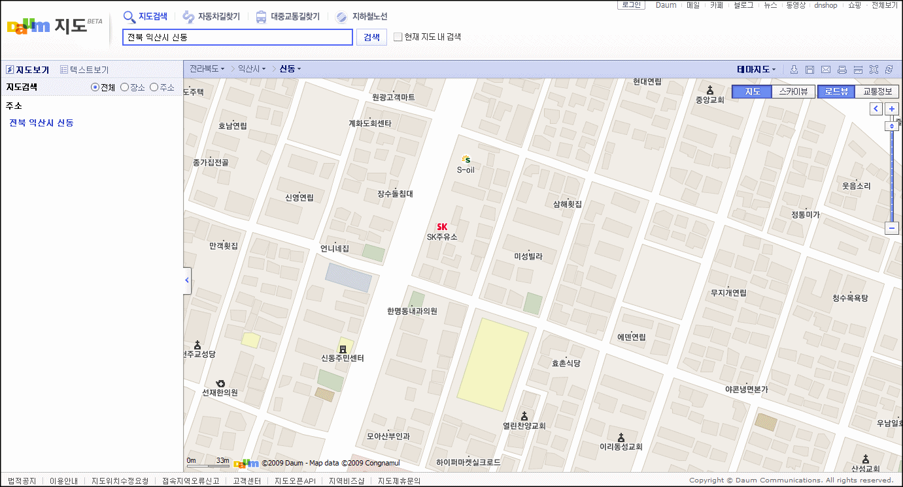
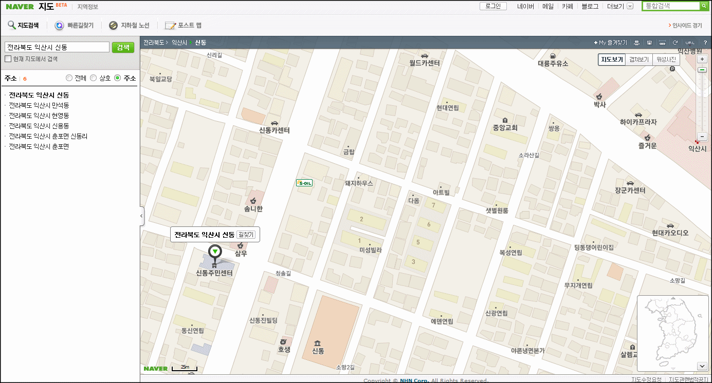
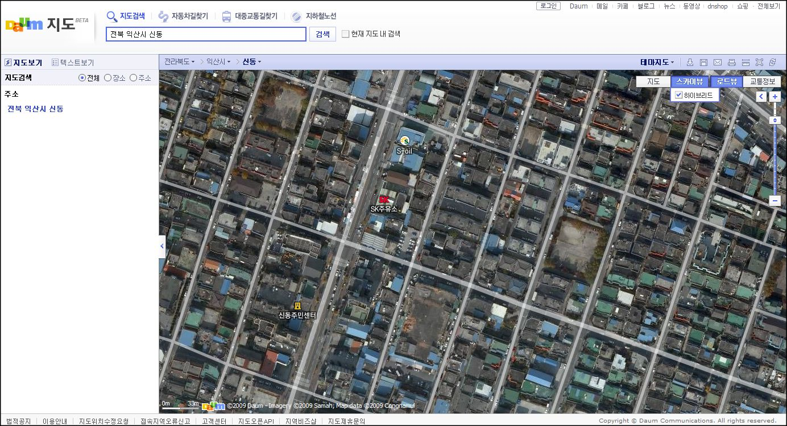
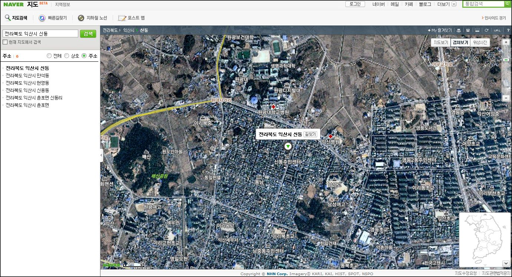
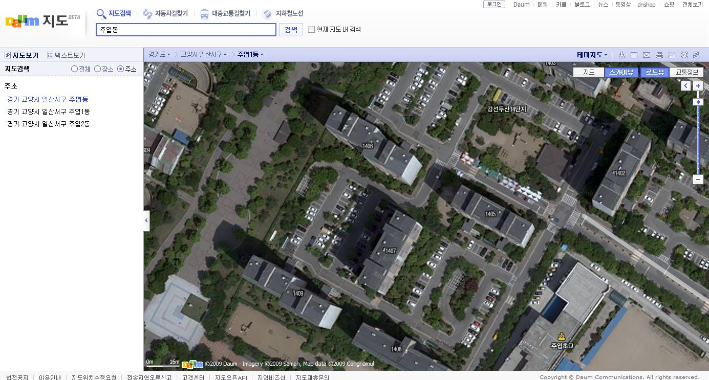
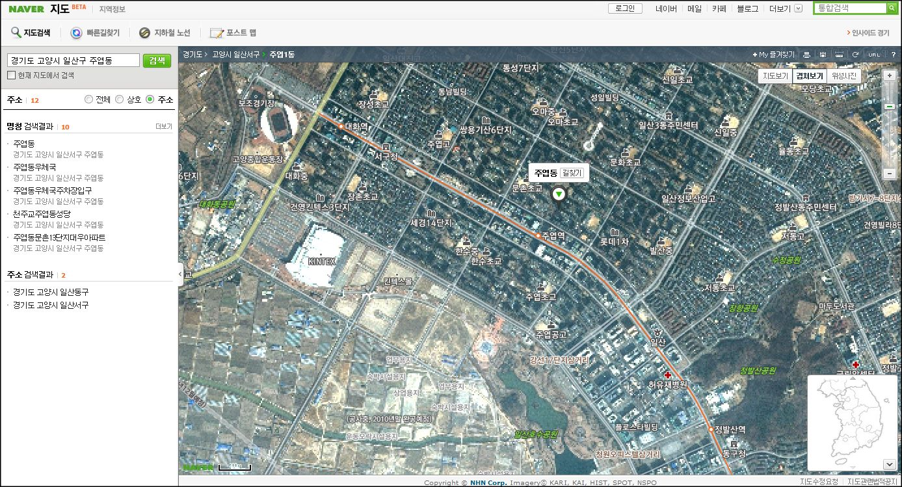
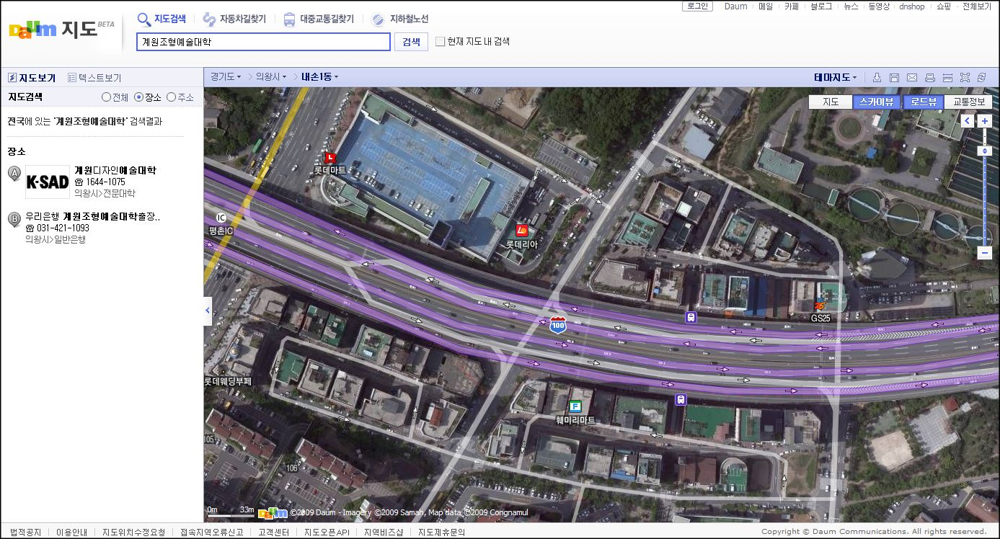
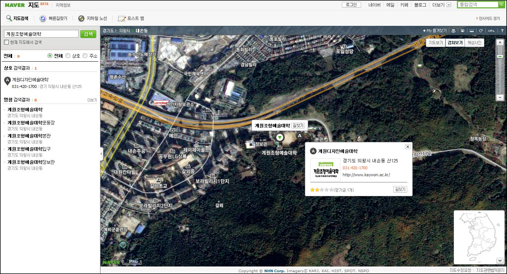

[대한민국을 통째로 스캔하다](http://blog.daum.net/daummaps/94)라는 카피로 [다음(Daum) 지도](http://local.daum.net/map/index.jsp)가 개편 오픈을 했습니다.  

<!-- truncate -->

Daum 지도 바로가기 : <http://local.daum.net/map/index.jsp>  
  
<http://map.daum.net/> 이라고만 해도 갑니다. 이게 외우기 쉽겠군요.

  
얼마 전에 [네이버 지도](http://map.naver.com/)가 항공위성 사진과 겹쳐보기 기능을 "재빠르게" 선보였었죠. 다음이 오래 전부터 준비하고 있었는데, 네이버가 대중을 상대로한 언론 플레이를 잘했다는 반응들도 있었습니다.  
  

관련링크  
  
[킬크로그 - 네이버 때문에 김빠진 다음의 50cm급 항공사진 지도서비스](http://cusee.net/2461798)  
[VoIP on WEB2.0 - 네이버 위성지도 서비스 전격 공개!!](http://mushman.co.kr/2690906)

  
저 역시 정말 언론 플레이인 것 같다고 생각이 드는 이유는 [새로운 서비스를 베타 오픈 (http://map.naver.com)](http://map.naver.com) 했으면서도 아직 [예전 지도 서비스 (http://maps.naver.com)](http://maps.naver.com)를 여전히 유지하고 있기 때문입니다. 새로 오픈한 것은 네이버의 다른 서비스들 (검색, 오픈 api 등)과 연동이 제대로 안된다든지 아니면 뭐 수틀리면 닫아버리겠다는 그런 뜻일까요?  
  
  
각설하고,  
  
준비는 준비대로 하고 발표에 선수를 뺐긴 다음(Daum)도 어쨌든 [오늘자로 블로그를 통해 발표](http://blog.daum.net/daummaps/94)를 하게 됐습니다. (몇 일 전부터 각각의 기능 소개를 하며 오픈을 했지만 공식 블로그를 통한 오픈이 오늘인 것 같군요) 블로그에 적힌 내용을 목차별로 간단하게 정리하면 아래와 같죠.  
  

1. 스카이뷰 - 국내 최고! 전국 고해상도 항공지도  
2. 로드뷰 - 국내 최초! 고해상도 파노라마 거리사진  
3. 실시간 교통정보 - 전국 도로 소통 상황을 지도에서 바로바로 확인  
4. 깔끔해진 지도 디자인  
5. 상세해진 지도검색

  
일단 2번 로드뷰는 국내 최초입니다. [구글 스트리트 뷰 (Street View)](http://maps.google.com/help/maps/streetview/)를 따라한 서비스죠. 일단은 서울시만 지원이 됩니다. 방향성을 위해 구글 스트리트 뷰처럼 화살표의 트랜지션 효과를 사용하는 것 같은데 조금 빨라서 잘 안 느껴져요.  
  
3번 교통정보 기능은 꽤 괜찮은 것 같습니다. 고속도로와 서울시내 주요 도로의 교통량 등을 알려주는데, 여러 기기를 통한 접근성만 확보되면 여러 모로 유용하게 사용될 수 있을 것 같아요.  
  
4번이나 5번은 기존 기능의 업그레이드죠.  
  
1번 스카이뷰는 이번 개편에 있어서 가장 큰 점수를 주고 싶은 부분입니다. 정말 대한민국을 통째로 스캔했다는 말에 어울리는 퀄리티입니다. 기존의 구글이나 네이버, 야후의 서비스와는 비교를 할 수 없을 정도로 사진이 너무나 깔끔하고 해상도도 높군요.  
  
그 중에서도 다른 서비스와 가장 큰 차별점이 느껴지는 점은 바로 비수도권 - 지방의 항공사진의 품질이 압권이라는 것입니다. 대부분 서울에만 집중을 하고, 기껏해야 서비스별로 수도권도 조금 더 신경써 주는 정도인데 반해 다음(Daum)의 이번 항공사진 서비스는 지방까지 낱낱이 보여줍니다.  
  
진정한 항공사진 서비스라고 할만 해요. 멋져요. 다음(Daum). 짝짝짝.  
  
  
  
실제로 네이버 지도와 한번 비교해 봤습니다. 왼쪽이 다음(Daum), 오른쪽이 네이버.  
  
전라도 쪽입니다.  
  

일반 지도 서비스는 큰 차이 없습니다.

표시 건물만 다를 정도죠.

  

다음은 아직 두 단계 더 들어갈 수 있습니다

이게 여타 지도서비스 수준이었고요

  
  
일산 쪽입니다.  
  

다음은 여기서 한 단계 더 들어갈 수 있습니다.

네이버는 더 들어가면 지도 데이터가 없다고 나옵니다.

  
  
경기도 쪽입니다.  
  

계원조형예술대학 진입로

네이버 지도 최대입니다. 차이가 확연하죠.

  
  

마지막으로 항공사진의 전국적인 해상도만 가지고 각각의 지도서비스를 따지면  
  
[다음(Daum)](http://map.daum.net/) > [야후 코리아](http://kr.gugi.yahoo.com/ymap/map.php) > [네이버](http://map.naver.com/) > [구글 코리아](http://maps.google.co.kr/) 순입니다.  
  
야후 코리아는 은근히 서비스 업그레이드도 잘 되고 좋은 기능도 많은데 많이 알려지지 않는 것 같아요.

  

2009-01-19 추가  
  
유튜브에 [다음(Daum) 지도 로드 뷰 (예전 이름 : 스트리트 뷰) 서비스 촬영 과정 메이킹 영상](http://www.youtube.com/watch?v=OEYTewExJgc)이 올라와 있었군요. 재밌고, 멋집니다.
