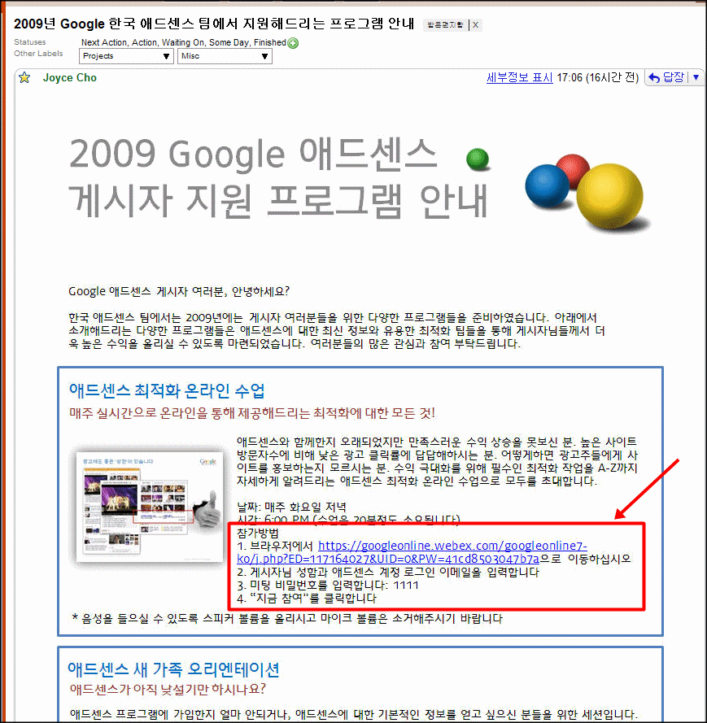

<!-- truncate -->

  
저렇게 애드센스 최적화 온라인 수업을 한다면서 참가방법을 적어뒀는데, 브라우저에 주소를 입력하라면서 저렇게 복잡한 주소(!)를 알려줬습니다. 그런데, 링크도 걸려있지 않아요! 저걸 다 직접 치라는 건가요? ㄷㄷㄷ  
  
버튼 이미지 같은 거 하나 만들어서 저 복잡한 주소를 가리게 하는 센스는 없더라도 저 주소를 다 치라고 하는 건 좀 심하지 않았나 합니다. ^^  
  
저 아래 애드센스 새 가족 오리엔테이션 쪽에도 저런 주소가 하나 더 있어요. ㄷㄷㄷ  
  
귀찮으신 분들을 위해 제가 타이핑을 대신 했습니다.  
  

애드센스 최적화 온라인 수업  
  
날짜 : 매일 화요일 저녁  
시간 : 6:00 PM (수업은 20분 정도 소요됩니다)  
참가방법  
1. 브라우저에 <https://googleonline.webex.com/googleonline7-ko/j.php?ED=117164027&UID=o&PW=41cd8503047b7a> 이동하십시오  
2. 게시자님 성함과 애드센스 계정 로그인 이메일을 입력합니다  
3. 미팅 비밀번호를 입력합니다 : 1111  
4. "지금 참여"를 클릭합니다

  

애드센스 새 가족 오리엔테이션  
  
날짜 : 매일 화요일 저녁  
시간 : 6:00 PM (세션은 20분 정도 소요됩니다)  
참가방법  
브라우저에서 <https://googleonline.webex.com/googleonline7-ko/j.php?ED=115520382&UID=o&PW=99bdae5a46545d> 으로 이동하십시오  
다음 절차는 (비밀번호 포함) 위의 최적화 수업과 동일합니다

  
p.s.1 보낸 사람도 구글 애드센스팀이 아니라 개인 이름이어서 혹시 사칭 메일이 아닌가 싶기도 했지만, 보낸 메일 인증기관은 google.com 으로 되어 있더군요. 링크들도 다 정상적으로 가요.  
  
p.s.2 한 가지 더 이야기하자면 이미지를 클릭해서 확대해 보면 알겠지만 이미지가 많이 깨져있습니다. 큰 이미지를 만들고 그걸 jpg로 저장해서 그런 건데요, 이런 경우는 보통 이미지 슬라이스를 하고, 이미지 종류를 봐서 gif 나 jpg 혹은 png 로 저장을 하잖아요. 담당자 분이 여러 가지 면에서 좀 급하셨나 봅니다. ^^  
  
p.s.3 그러고 보니 새 가족 오리엔테이션 시간과 최적화 온라인 수업 시간이 겹치는군요!
