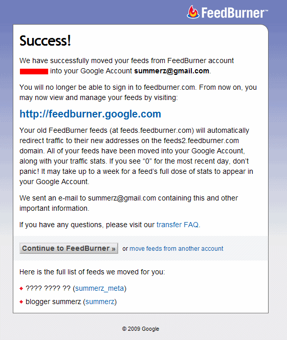

<!-- truncate -->

  
[피드버너](http://feedburner.com/)에 로그인하면 노란 줄로 조그맣게 뭔가 설명이 되서 봤더니 구글 계정으로 통합을 한다는 문구였습니다.  
  
그래서, 승인을 했습니다.  
  
그런데, rss 주소가 바뀌는군요. -\_-;  
  
예전 주소를 쳐도 자동으로 포워딩 되기는 하는데, 포워딩 되는 걸 못 알아보는 rss 리더들이 있지 않을까요? 확인해 보고 조치한 건가;  
  

기존  
http://feeds.feedburner.com/아이디  
  
통합 후  
http://feeds2.feedburder.com/아이디

  
관리를 위한 로그인 주소도 바뀌네요. 변경 후에 피드버너로 로그인 하려면 [http://feedburner.google.com](http://feedburner.google.com/) 으로 가서 로그인을 해야 합니다.  
  
  
피드버너 쓰시는 분들은 참고하시면 되겠습니다.
