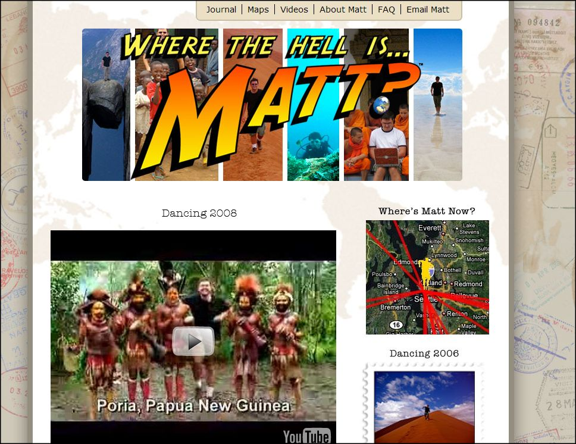
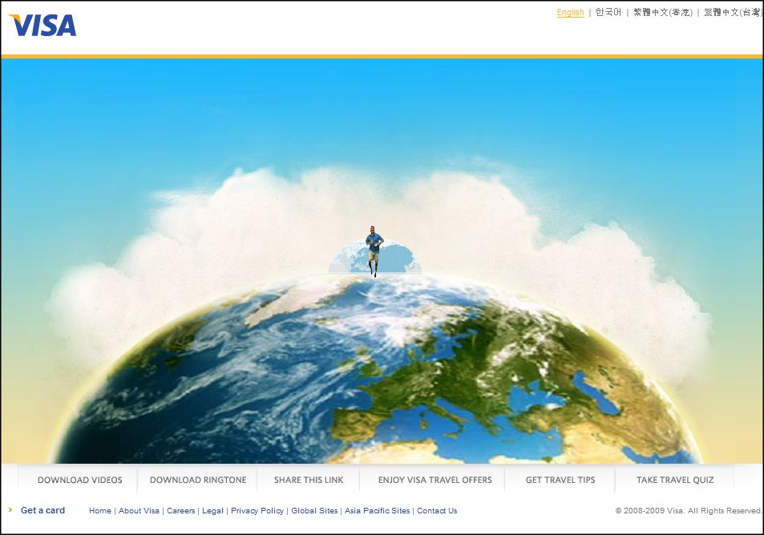

<!-- truncate -->

  
각종 소개와 더불어 유명해진지 오래된 [Where The Hell Is Matt?](http://www.wherethehellismatt.com/) 입니다. 호주에 사는 (원래는 코네티컷 출신인) 비디오 게임 프로그래머인 맷 하딩 (Matt Harding)이 막춤(^^)을 추며 전세계를 돌아다니는 것을 비디오로 찍은 영상이 폭발적인 인기를 끌었죠. 이 때가 2006년입니다.  
  
  
  

사실은 2003년도부터 여행을 떠나 우연히 춤을 췄지만 [스트라이드](http://www.stridegum.com/)라는 껌을 만드는 곳에서 스폰서를 대줘서 본격적으로 춤을 추는 위의 영상이 탄생한 거죠. 2003년과 2004년에 돌아다니면서 찍은 것들 (그리고 2005년도에 공개한 영상)은 장소도 적고, 조금 덜 댄서블합니다. 하지만, 그 영상으로 관심을 끌었으니 몫을 충분히 한 거겠죠.  
  
뭐 더 자세한 이야기가 있지만 맷은 한 번 더 스트라이더 껌의 협찬을 받아 여행을 하게 됩니다. 2008년도 버전이죠.

이 영상을 보면 업그레이드 포인트가 보입니다. 일단 음악이 보다 감성적인 곡으로 바뀌었습니다. 스케일도 조금 더 커졌죠. 물론 제3세계 음악같은 분위기는 유지한 채로 말이죠. 그리고, 음악이 고조되면서 바로 다른 이들과 함께 춤을 춥니다. 자신이 찍은 영상을 보여주며 협조를 구했을테고, 영상을 보고서 바로 알아보는 사람들도 있었겠죠. 일종의 인터렉티브한 관계를 영상으로 구현한 것이죠.  
  
뭐든 반복적인 것을 보거나 듣거나 만지거나 하면 감정이 고조되기 마련입니다. 그게 나쁜 쪽으로든 좋은 쪽으로든 말이죠. 화면에 보이는 것은 장소만 바뀔 뿐 계속해서 같은 춤을 추는 맷이지만 그가 여행한 여정과 가는 곳마다 좋은 위치를 선정하려고 노력했던 것들이 함께 떠오르게 되면서 감정이 고조되는 거죠.  
  
어쨌든 그가 이번에는 광고를 찍었습니다. 광고주가 완전히 거물이군요. 비자 카드입니다. 극장에서 처음 봤어요.  
  

  
[비자 Travel Happy, Dance & Win! 컨테스트 바로가기](http://www.visatravelhappy.com/kr/index.shtml)

일단 '여행'는 요소와 '신용카드'라는 요소는 참 잘 어울립니다. 맷이 어딜 가든 비자카드로 결제를 하며 생활한다는 걸 알리는 사실은 인터넷과 현실세계와의 적절한 조합이기도 하고요.  
  
하지만 그가 처음 자신의 직업을 그만두고 돈이 떨어질 때까지 여행을 한다고 생각했을 때 이런 걸 예상했을까요? 사람들이 대단하다, 멋지다, 감동적이다...고 했던 부분에는 분명히 그의 행위에서 무모하게 생각될 만큼의 어떤 도전정신 같은 걸 봤기 때문일 겁니다. 각자의 현실과 대조해 보면서 말이죠.  
  
그런 의미에서 비자는 광고를 잘 찍었습니다. 수백만명 수천만명 이상이 본 인터넷 영상이 가지고 있던 느낌을 그대로 자사 제품에 이입시킬 수 있었으니까 말이죠.  
  
그런데 관람하는 제 입장에서 볼 때는 돈이 있어야, 신용이 있어야, 카드가 있어야 여행을 할 수 있다 (원하는 걸 할 수 있다)로 치환되는 현실이군요. 적어도 저에게 있어서는 맷이 상징하던 자유와 도전정신이 갑자기 '사실 현실은 이런 거야, 정신차려.'로 바뀌는군요.
