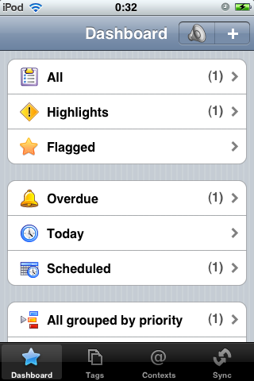
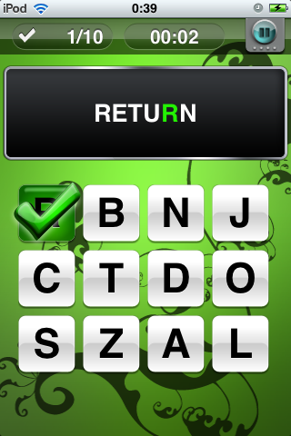
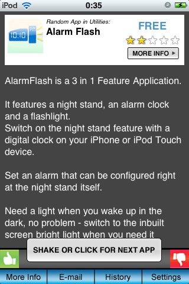
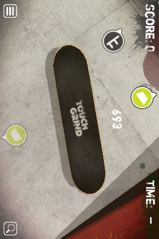

어쿠스틱 터치 3번째 입니다.   

<!-- truncate -->

역시나 간단하게 설명드리면 이 글은 아이팟 터치 (혹은 아이폰) 어플들에 대해서 개인적인 별점 평가이며 유료 위주로 만족도 평가 별 5개 만점, 별점 평가는 GOOD 에만 남깁니다.  
  

GOOD  
  

[Ultimate Todos](http://itunes.apple.com/WebObjects/MZStore.woa/wa/viewSoftware?id=293006734&mt=8) ★★★★★  
  
요즘 유행하는 GTD 방법론을 따르는 개인 일정 관리 어플입니다. 사실 저는 언젠가 맥을 사서 씽크를 하리라는 야심에 [Things](http://itunes.apple.com/WebObjects/MZStore.woa/wa/viewSoftware?id=284971781&mt=8)를 계속 사용하고 있기는 합니다만, Ultimate Todos 를 먼저 구입했더라면 참 좋아라 했을 겁니다. ^^  
  
기본적인 일정 입력 기능과 각종 리스팅 (overdue, today, scheduled) 및 업무별 우선 순위 (priority), 여러가지 아이콘, 음성 녹음 기능까지 (아이팟 터치는 마이크가 필요합니다만) 정말 많은 기능을 지원합니다.  
  
온라인 일정 관리 서비스인 [Toodledo](http://www.toodledo.com/)와 싱크가 됩니다. 유무선 일정 관리가 매우 간편하게 이루어진다는 뜻이죠.  
  
무조건 지금 앱스토어로 가서 INSTALL 버튼을 누르세요! 언제까지가 될지는 모르지만, 현재 무료 판매 중입니다.  
  
현재는 무료 / 원래 가격은 $4.99

  

[My Word Coach](http://itunes.apple.com/WebObjects/MZStore.woa/wa/viewSoftware?id=296564066&mt=8) ★★★★  
  

일종의 단어 맞추기 게임이라고 할 수 있습니다. 하지만, 학습에 상당히 도움이 되도록 체계적인 방식으로 게임이 진행됩니다.  
  
우선 처음 게임을 시작하기 전 자신의 레벨을 테스트해서 현재의 어휘 구사 능력을 알려줍니다. 총 6가지의 단어 맞추기 관련 게임이 있는데, 빈칸에 올바른 스펠링 넣기나 단어의 뜻 맞추기 같은 게임들입니다.  
  
난이도가 어렵지 않은데, 그게 실제 반복적으로 학습을 할 수 있게 하는 원동력이 됩니다. 하루에 정해진 분량의 게임을 하고 나면 단어를 더 효율적으로 외우고 싶으면 오늘은 그만하고 내일 다시 하라는 메시지도 나오죠.  
  
매일 하다보면 정말 어휘 능력이 좋아질 것 같아요. 쉬운 걸 반복하는 게 무언가를 암기하는데 제일 좋은 방법이니까요.  
  
가격은 $4.99

  

[Fluke](http://itunes.apple.com/WebObjects/MZStore.woa/wa/viewSoftware?id=301098873&mt=8) ★★★  
  

지름신이 만든 충격의 어플인 [AppSinper](http://itunes.apple.com/WebObjects/MZStore.woa/wa/viewSoftware?id=294706770&mt=8) 와 조금은 비슷하고, 조금은 다른 어플입니다.  
  
Fluke는 앱스토어에 등록되어 있는 어플을 소개해주는데, 랜덤으로만 확인이 가능합니다. 자신이 원하는 것을 저장하거나 순서대로 본다거나 하는 기능이 전혀 없이 랜덤으로만 보여줍니다.  
  
다만, 유료/무료 어플만 보겠다를 결정할 수 있고, 앱스토어에 등록된 카테고리별로 보고 싶은 카테고리만 선택 (중복선택 가능)해서 볼 수는 있습니다.  
  
그냥 운에 맡긴다 치고 가끔씩 확인하기에 좋습니다. 아무래도 현재의 앱스토어는 검색을 통해서 무언가를 찾는 것이 그렇게 쉬운 구조만은 아니잖아요?  
  
가격은 무료

  

NOT GOOD NOT BAD  
  

[Touchgrind](http://itunes.apple.com/WebObjects/MZStore.woa/wa/viewSoftware?id=297694601&mt=8)  
  

손가락으로 화면 상에 있는 보드를 타는 게임입니다. 검지와 중지를 양 발처럼 사용하는 거죠. 묘기를 부릴 수록 점수가 올라가는 게임이지요. 그래픽 퀄리티도 뛰어나고 조작법도 신기해요.  
  
아, 다 좋은데 너무 어려워요. 저에게는 너무 어려워요. 흑흑. 제가 이런 류의 게임에는 뭔가 소질이 없나봐요. 좀 쉬운, 뭔가 자동으로 되는 기능이 있으면 참 좋을텐데... 너무 아쉽습니다.  
  
가격은 $4.99

  

BAD  
  
이번 회에는 BAD가 없습니다! 아무래도 AppSniper를 구입한 이후로 경제적인 구매생활이 이루어지는 걸까요?  
  
AppSniper 덕에 무료로 할인되는 어플들 위주로 다운 받아 사용을 하기 때문에, 어플이 좀 나쁘더라도 딱히 불평을 할 수 없다는 것도 중요한 이유겠지요. :)
