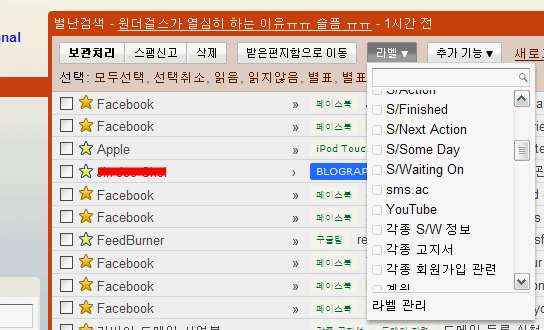

<!-- truncate -->

최근에 지메일 관련 그리스몽키 스크립트를 새로 설치한 것도, 업데이트한 것도 없는데 뭔가 좀 바뀌었다 싶었는데, 버튼들이 바뀐 거로군요. 위치도 살짝 변경되었습니다.

라벨 버튼과 추가 기능 버튼은 클릭하면 바로 검색창이 나오게 변경되었군요. 안그래도 라벨이 너무 많아서 매번 스크롤 하느라 번거로웠는데, 편해졌습니다. :)
