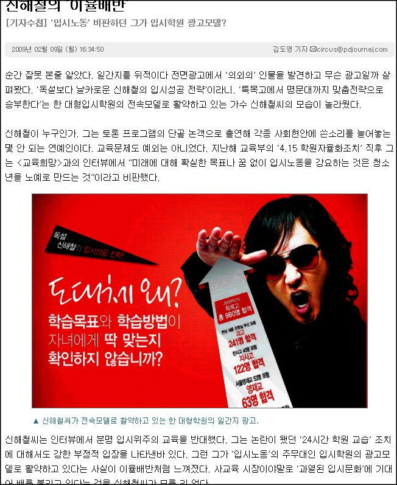
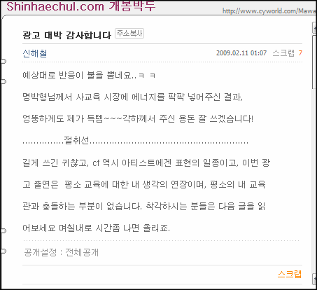

<!-- truncate -->

> 신해철이 누구인가. 그는 토론 프로그램의 단골 논객으로 출연해 각종 사회현안에 쓴소리를 늘어놓는 몇 안 되는 연예인이다.
> 교육문제도 예외는 아니었다. 지난해 교육부의 ‘4.15 학원자율화조치’ 직후 그는 <교육희망>과의 인터뷰에서 “미래에
> 대해 확실한 목표나 꿈 없이 입시노동을 강요하는 것은 청소년을 노예로 만드는 것”이라고 비판했다.  
>   
> 신해철씨는 인터뷰에서 분명 입시위주의 교육을 반대했다. 그는 논란이 됐던 ‘24시간 학원 교습’ 조치에 대해서도 강한
> 부정적 입장을 나타낸바 있다. 그런 그가 ‘입시노동’의 주무대인 입시학원의 광고모델로 활약하고 있다는 사실이 이율배반처럼
> 느껴졌다. 사교육 시장이야말로 ‘과열된 입시문화’에 기대어 배를 불리고 있다는 것을 신해철씨가 모를 리 없다.  
>   
> 출처 : [PD저널 - [기자수첩] ‘입시노동’ 비판하던 그가 입시학원 광고모델?](http://www.pdjournal.com/news/articleView.html?idxno=20297)

  
예전부터도 '사실은' 금전적으로 밝히는 것으로 유명했다는 풍문이 있었지만, 그거야 '부자로 사는 거 원하지 않을 사람이 누가 있겠어' 정도로 넘어갔었지.  
  
그런데, 이건 완전히 블랙 코미디다. '흐흐흐' 하고 웃음이 나올 정도로. 한 2-3년 조용하다가 이런 광고를 찍으면 그동안 정말 힘들었겠구나 싶기도 할텐데, 계속 사회의 부조리한 면을 질타하는 독설로 먹고 살던 사람이 저러니 저 학원이 이미지를 무단으로 도용했나 싶은 의심도 든다. 신해철의 한 때 팬이었기 때문에 오는 인지부조리인지부조화 현상인가? 아니면 학원에서 열심히 반항하라는 심오한 복선이 담겨 있는 건지도 모르지.  
  
[노브레인이 이명박 후보 선거 캠페인 송에 동원](http://blog.summerz.pe.kr/1126)되었던 것보다 좀 더 심한 것 같다. 노브레인은 그래도 자기네가 먼저 곡을 제공하거나 자기들이 개사한 노래를 부른 건 아니잖아.  
  
...  
  
최근에 [둘째를 가지셨다는 기사](http://patzzi.joins.com/article_html/34710.html)도 나오던데, 이제 마왕도 락커로서의 무거운 짐은 벗어버리고 개한민국에서 분유값 많이 버세요. 저도 열심히 돈 벌며 살겠습니다. -\_-;  
  
  
  

추가  
  
마왕이 이번 일에 대해 미니홈피에 글을 적었군요. 아아, 꼰대가 되어가는 것 같아 안타깝습니다. ㅠ.ㅠ  
  

