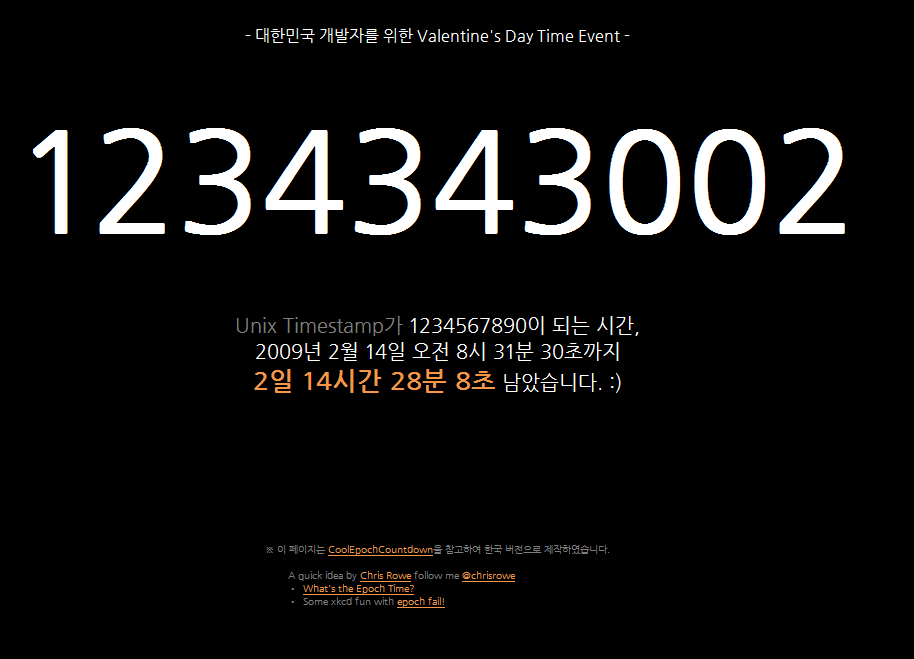
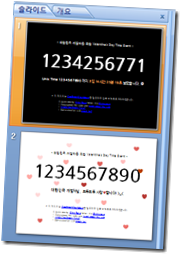

<!-- truncate -->

  
발렌타인 데이를 기념하기 위한 유닉스 타임스탬프가 1234567890이 되는 시간을 기념하기 위한 이벤트. -o-  
  

바로가기 : <http://labs.smle.net/valentine2009>

  
유닉스 타임스탬프가 1234567890 이 되면 이렇게 바뀔 거래요.  
  

  

참고링크  
  
[Wikipedia - Unix time](http://en.wikipedia.org/wiki/Unix_time)  
[전경헌의 블로그 :: 타임스탬프(Timestamp) 프로그래밍의 기초](http://allenjeon.tistory.com/235)  
[Mobile Life with Chuly~! :: 유닉스 타임(타임스탬프)을 일반 표준 시간으로 변환하기~](http://chuly.com/2630792)  
[텅날개.넷 - 리눅스 팁 - 유닉스 타임스탬프를 사람이 보는 형식으로 바꾸기](http://ttongfly.net/zbxe/?mid=linux&page=4&document_srl=43484&listStyle=&cpage=)
