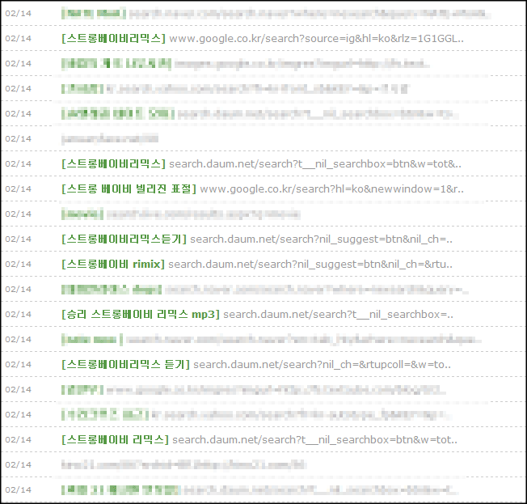

얼마 전에 빅뱅의 승리가 솔로 활동을 하는 곡인 스트롱 베이비 (Strong Baby)의 노래가 마이클 잭슨의 빌리 진 (Billie Jean)과 너무 비슷해서 이어 붙여본 적이 있습니다.  

<!-- truncate -->

바로가기  
  
[어쿠스틱 마인드 - 스트롱 베이비 REMIX (Billie Jean sneaky copycat ver)](http://blog.summerz.pe.kr/1363)

  
그런데,  읽어보시면 알겠지만 사실 저 포스트는 "이거 왠 대한민국 대표 아이돌 그룹이 자행하는 백주대낮의 뻔뻔한 표절이냐"는 맥락의 글인데, 제목에 리믹스라고 붙였더니 검색 엔진에서 찾아 들어오는 검색어가 재밌어지더군요.  
  

  
앞으로도 계속 제목을 이런 식으로 붙여야겠군요. :p
