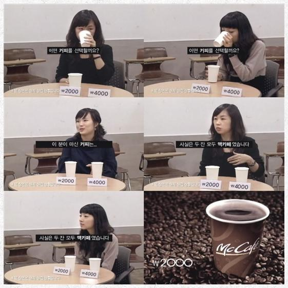

<!-- truncate -->

카메라는 블라인드 테스트 중인 한 실험자를 보여줄 뿐이다.  
  
2,000원짜리 커피와 4,000원짜리 커피라고 라벨링이 되어 있지만 실제로는 같은 커피다, 즉 커피 질에 있어서는 차이가 없으니 비싼 커피 사먹지 말고 싼 맥카페를 사먹으라는 얘기.  
  
두 가지 생각이 떠올랐다.  
  
첫째, 누군가에게는 커피의 질이 문제가 아닐 수도 있다. 예를 들어 싸구려 이미지를 가진 맥도널드에 들어가는 것 자체가 싫은 사람들이 있을 수 있다는 것이다.  
  
커피의 질에 있어서 큰 차이가 없다면 후진 브랜드의 커피를 사먹는 사람이 되느니 기꺼이 2,000원 더 주고 괜찮은 브랜드의 커피를 사먹을 사람들도 적지 않을 수 있다는 것이다.  
  
둘째, 광고 속의 실험자들이 실험에 앞서 어떤 설명을 들었느냐에 따라 광고 장면은 해석이 달라질 수 있다.  
  
예를 들어 실험자에게 '고급 커피를 새로 런칭했으니 시음을 하고 맛을 설명해달라'고 했다면 광고 속 영상은 블라인드 테스트가 아니라 실험자를 심리적으로 속인 테스트가 된다.  
  
완전한 블라인드 테스트였고 항상 두 커피가 같은 커피였다면 2,000원 짜리 커피가 더 맛있다는 실험자도 나왔을 것이고, 그 영상이 소비자에게는 더 자극적인 광고가 될 수 있었을 것이다. 만약 맥카페와 스타벅스 혹은 맥카페와 커피빈 커피를 두고 블라인드 테스트를 해서 맥카페를 선택하는 장면을 광고로 내보낸다면 더 큰 자신감을 보여줄 수도 있었을 것이다.  
  
하지만 고작 두 커피는 사실 같은 커피이고, 사람들은 4,000원 짜리를 고른다는 데에서 광고는 멈춘다. 참 소극적이면서도 속임수가 있는 게 아닌가 하는 의심을 들게하는 광고라 할 수 있겠다.   
  
이런 이유로 난 맥도널드 맥카페 광고를 볼 때마다 사람들이 얼마나 맥카페로 옮겨갈까 궁금해진다. 일단 나는 별로 옮길 생각이 들지 않는다.  

[from my mobile device, iPod Touch]
