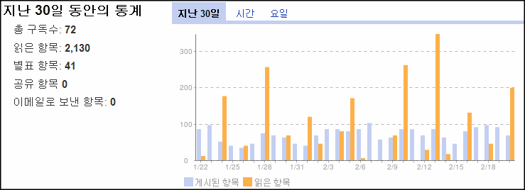
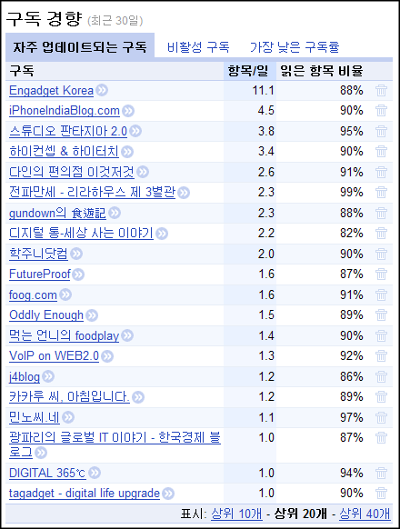

이것 저것 닥치는 대로 RSS 리더기를 갈아타며 RSS를 구독해 온 제가 마침내 정착하게 된 것은 아이팟 터치 어플인 [Byline](http://www.phantomfish.com/byline.html) 이었습니다.  

<!-- truncate -->

관련 링크  
  
[Byline을 사용해서 부분 공개 rss의 전문 읽기 (Offline Browsing)](http://blog.summerz.pe.kr/1338)

  
[구글 리더](http://reader.google.com/)와 싱크가 되는 Byline을 꾸준히 사용하면서 제 구글 리더 계정에 들어있는 RSS 피드들을 성실(^^)하게 읽게 되었지요. 그 성실함이 어느 정도인지 문득 통계를 보다가 저도 놀라서 간단하게 적어봅니다.  
  

지난 30일 동안의 통계  
  

  
옮겨다니고 지우고 추가하고 하면서 현재 총 72개의 피드가 등록되어 있습니다. 제가 생각해도 참 깔끔한 수치군요. 몇 백개를 넘어가던 때도 있었는데 말이죠. :D  
  
읽은 글은 2,130개, 별을 친 글은 41개입니다.  
  
그래프를 보니 저는 대략 2-3일에 한번씩 몰아서 읽는 패턴이군요.  
  
탭을 넘기면 나오기는 하지만, 시간대 별로는 오후 1시와 오후 10시에 집중적으로 읽었습니다. 점심 시간과 퇴근 시간 집에 돌아오는 지하철 안이죠.

  

구독 경향  
  

  
자주 업데이트 되는 구독 피드 리스트입니다. 상위 20개입니다.  
  
거의 스트레이트 위주의 [인가젯 코리아](http://kr.engadget.com/)나 [아이폰인디아블로그](http://iphoneindia.gyanin.com/)가 1, 2위를 차지했습니다. 인가젯 코리아 같은 경우는 거의 하루에 11개 이상의 글을 뽑아내는군요.  
  
바하문트님의 [스튜디오 판타지아 2.0](http://bahamund.wordpress.com/) 에서 나오는 글이 하루 평균 3.8개로 3위라는 게 개인적으로 놀랍네요. foog님의 [foog.com](http://foog.com/)이 1.6개 밖에(!) 안되는 것도 조금 이상하고요. (귀찮아서 일일이 확인 작업은 안할랍니다. -\_-)  
  
사실 여기서 정말 놀래야 하는 포인트는 바로 읽은 항목 비율이 모두 80% 이상이라는 거죠. 상위 40개 피드까지 살펴봐도 모두 80% 이상이라는 겁니다!  
  
이 모두가 Byline 덕분입니다. RSS를 부분 공개만 해도 오프라인 브라우징 기능 덕분에 본문을 다 읽을 수 있기 때문에 이동 중에도 (오프라인 중에도) 별 걱정없이 스스슥 하고 읽을 수 있으니까요.

  
  
밥 먹으면서 혹은 지하철 안에서 주로 읽기 때문에 브라우저에 원래 즐겨찾기가 되어 있는 많은 블로그들과 뉴스, 영어권 피드들은 되도록 구독을 자제했는데, 이렇게 빼먹지 않고 잘 읽고 있다니, 슬슬 하나씩 하나씩 추가를 해야겠습니다.  
  
이 참에 이리저리 즐겨찾기 안에 흩어져 있던 많은 블로그들 링크가 한꺼번에 정리가 되겠군요. ^^  
  
  

p.s.  
  
현재 구독 중인 피드들을 기준으로 Byline의 오프라인 브라우징이 제대로 작동하지 않는 경우가 있는데, 네이버 블로그와 텍스트큐브 블로그들입니다.  
  
네이버 블로그는 아이프레임 떡칠을 비롯해서 워낙 많은 페이지들을 읽어대서 그런지 제대로 불러오질 못합니다. 그냥 빈 화면만 보여요.  
  
텍스트큐브 블로그의 경우 Byline이 아이폰의 유저 에이전트 값을 가지고 접근을 하는 모양인지 아이폰 스타일의 인터페이스로 리다이렉팅 시키는 바람에 글을 읽을 수가 없습니다.   
  
이 두 블로그 서비스/프로그램의 경우에는 [RSS 부분 공개 + 오프라인 상태]일 때는 여전히 글을 나중에 확인해야 합니다.
