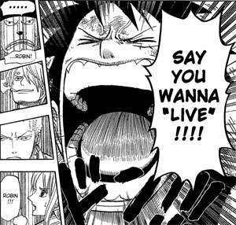

> 내가 인터뷰에서 “미래에 대해 확실한 목표나 꿈 없이 입시노동을 강요하는 것은 청소년을 노예로 만드는 것” 이라고 했다? 그렇다. 확실하게.  
> 내가 이 문장을 배신하기 위해서는 “사교육은 미래에 대해 확실한 목표나 꿈 없이 입시노동을 강요하고 청소년을 노예로 만드는 절대적이며 무조건적인 악”이라는 전제 조건이 필요하다. 과연 그러한가? 그래서 내가 광고에서 뭐라고 말했나? 학.습.목.표 를 확인하라. 바꿔 말하자면 무조건 요령도 없이 무턱대고 몰아세우지 말자.  
> 달을 가리키는데 왜 손톱을 보나.  
>   
>
> 출처 : [신해철](http://www.shinhaechul.com/)의 답변 중에서  
> (저는 재펌한 거예요)
>
>   
> 전체를 보고 싶으면 여기 클릭
>
> 신해철 광고 사건 1편 왜곡의 매카니즘  
>   
> 일단 하고싶은 말 다 지껄인 뒤 최종 축약본을 하나 만들겠다. 기자분덜은 서두르지 말고 그때 쯤 기사 쓰시면 좋것다.  
>   
> :에피타이저  
>   
> 그동안 두들겨 패느라 얼마나들 기쁘셨겠습니까. 신해철 저 놈을 언제 한번 늘씬하게 패야겠는데 당췌 꼬리를 안잡히더란 말이지.  
>   
> 신
> 해철 얘기가 인터넷 댓글에 달릴 때마다 죽어라고 대마초 얘기가 나오는 이유는 역설적으로 그거 말고는 별로 꼬투리 잡을게
> 없어서라는 거지요. 연예인들 한 번씩 거쳐 가는 음주운전도 안 걸려, 스캔들도 없어, 탈세자 명단에도 없어, 매년 터지는 연예계
> 비리에도 연관 없어, 심지어 연예인 이혼이 홍수를 이루는 와중에 제일 먼저 이혼 할 줄 알았던 놈이 애 둘 낳고 알콩달콩
> 살아....그러니 씹을 거라고는 15년 전에 벌어진 대마초 사건 밖에 없던 차에, 허, 이놈이 ‘사교육 광고’에 뽈뽈뽈
> 기어나오네? 오냐 이 새끼 범 국민적 인간 쓰레기를 만들어주마 하고 너도 나도 선정적 제목 붙이기 콘테스트를 열었겄다.
> (콘테스트 시상 결과는 별첨)   
>   
> 기도 안차서 실실 웃으며 구경 좀 다녔더니 이제는 아, 이 새끼가 입이 열 개라도 할 말이 없나부다 하고 더 지랄들을 떤다. 아, 대꾸하기 귀찮은데...  
>   
> 이왕 쓰는 글이니 아마도 글이 꽤 길 것이다. 난 내 글을 안 읽는 사람보단 대충 발췌 후 편집하는 사람들이 더 재수 없다. 각오하고 읽으시기를.  
>   
> 어떻게하여 신해철은 ‘절라디언’이 되었나  
>   
> 다소 엉뚱하지만 옆구리에서 얘기를 시작하자. 인터넷을 돌아다니다 보면 참 별의별 쓸데없는 얘기들 많다. 여기가 북조선인민민주주의공화국도 아닌데 ‘출신성분’ 따지는 글들을 보면 화가 난다기보다는 글쎄, 하품이 나온다.   
>   
> 그런데 어라? ‘신해철, 저 전라디언 새끼...’ 운운하는 글들에 의하면 나는 호남 사람이다. 그것도 구체적으로 전남 보성이란다. ㅋ ㅋ(아마 보성, 벌교 사람들이 이빨이 세다는 이미지 때문인 듯)  
>   
> 글쎄, 나는 전라도 사람들이 싫지 않으니까 내가 ‘전라도 사람’이 되는 것도 나쁘지는 않지만, 약간의 걸림돌이 있다면. . . 내 고향이 ‘경상북도 대구’라는 ‘사실’ 이다. (결혼하여 분가하면서 본적이 서울로 바뀌긴 했다)   
>   
> 걸
> 지게 경상도 사투리를 날려대는 6명의 고모 사이에서 자랐어도, 아직도 백명 단위가 훨씬 넘는 친척들이 대구에 살아도, ‘고마
> 디비 자라’ 라는 문장을 매우 오리지날하게 구사 할 수 있어도, 인터넷에서는, 최소한 그 일부에서는, 나는 ‘전라디언’ 이다.   
>   
> 내
> 가 전라도 사람이 된다는 것이 그들에게는 많은 고민을 덜어주는 모양이다. 그렇게 되면 왜 노무현을 지지했었는지에서 부터 시작해서
> 나의 여러 가지 ‘튀는’ 행동들은, 특정한 신념에서 온 것이 아니라 지역적 연고에 의한 응큼한 노림수 내지는 ‘우리가 남이가’
> 풍의 저차원으로 얼마든지 설명된다.   
>   
> 하긴, ‘불행한 군인 대통령’을 3명이나 연달아 배출한 ‘자랑스런’ 경북
> 대구 보다는 왠지 이름에서부터 차향기가 풍기는 전남 보성 사람이 되는 것도 (요즘 부쩍 친근감을 느끼는 ‘보성’이다) 나쁘진
> 않겠다마는, 부모나 고향이란게 바꾼다고 바뀌겠는가.   
>   
> 띠용. 그런데도 ‘편견’은 그 엄연한 사실 까지도 바꿔버린다.   
>   
> “신해철 그 쉑 전라도 출신이래”   
>   
> “아하∼∼어쩐지”  
>   
> 게임셋.   
>   
> “어, 내가 듣기론 그 친구 경상도라던데..”라고 누군가 얘기해도 절대 소용없다. 그들은 자신들에게 편리한 결론이 나온 후엔 귀를 닫아버린다.   
>   
> 그
> 리하여 나는 ‘제2의 고향’ 보성에서 전라도 사람이 되었고, 우리 아버지는 신중현 선생님이시고, (진짜로 그랬으면 좋은 점도
> 있긴 하겄다마는 어뜨케 멀쩡한 남의 아부지를 바꾸냐) 나는 또한 재벌2세이기 때문에 현실에 구애 받지 않고 소신 발언을 하는
> 것이며,(여기서 신중현 선생=재벌 이라는 공식이 성립) 심지어 사탄에게 영혼을 팔아 음악을 한다. 흠, 프로필 빵빵하군.  
>   
> .....................................................................................................................................................  
>   
> 사
> 람들은 자신이 원하는대로 보고 싶어하고 또 그렇게 본다. 광고사건도 그런 것이다. 뭔가 또 하고픈 말이 있어서 광고까지 나와서
> 떠드네 하는 것 보다는 저 새끼도 돈 앞에서 별 수 없이 말 바꾸네 하는 것이 더 씹을 거리도 많고 즐거운 것이다.  
>   
> .......................................................................................................................................................  
>   
>   
>   
> 본문 : 어떻게하여 신해철은 ‘사교육 절대 반대론자’가 되었나  
>   
> 먼저, 이 질문부터 하겠다. 신해철이 교육 문제에 대해 발언하는 것을 ‘직접’ 들어 본 사람?   
>   
> 거의 없을 것이고, 교육에 관한 나의 견해를 체계적으로 좌악 피력한 적은 한번도 없으니 들었어도 ‘짤막한 토막’들을 들었을 것이다. 하.지.만.  
>   
> “
> 사교육에 대해 반대해 온 신해철이..” 라고 하면 어떻게 들리나? 왠지 그럴 것 같지? 자 그럼 다음 문장을 보자. “양심적
> 병역거부에 강력한 처벌을 주장한 신해철은...” 어떤가, 왠지 신해철이면 이런 얘기는 안 어울리는 이미지지?   
>   
> 불과 몇 개의 발언을 추출하여 황당한 논리적 비약을 첨가하고, 그것을 대중들이 갖고 있는 선입견 위에 뿌리면 사람 하나 바보 만들기는 쉽다.  
>   
> 그리고 인터넷의 속성은, 한 인간의 일생에 걸친 생각과 행동을 불과 3∼4개의 단어(심지어 문장도 아니고)로 마음대로 재단한다.  
>   
> 자, \*얼마든지 반박 할 수 있는 발언 추출  
>   
> \*임의 대로 재단하고 갖다 붙임  
>   
> \*황당한 논리적 비약----일방적 결론  
>   
> \*본인의 반박 여지 없이 보도  
>   
> \*오해하고 분노한 여론, 처음부터 ‘오해’ 할 기회만 노리고 있었던 여론,옹호론, 동정론 뒤죽 박죽 됨  
>   
> 이리하여 몇몇 매체의 ‘선빵’으로 나는 ‘사교육 절대 반대론자’가 되었다. 고스트스테이션을 8년이나 진행했고 그 많은 증인들과 증거들이 있어도 마찬가지다.  
>   
> “신해철 그 쉑 입시교육 비판하더니 사교육 광고 나오네”  
>   
> “개쉔”  
>   
> 게임셋.  
>   
> 이
> 대화가 정당성을 가지려면 ‘사교육=입시교육을 더욱 지옥으로 만드는 절대악’ 이라는 전제가 필요한데, 한 가지 문제는 나는 한
> 번도 그런 논리에 동의한 바가 없고, 또 한 가지 문제는 나는 공교육의 총체적 난국을 내가 생각해도 과격 할 정도로 비판 해
> 왔지만(라디오를 통해 8년간!)입시교육 비판은 그러한 공교육 비판의 일부 였지 사교육과는 거의 무관한 얘기였다는 것이다.  
>   
> 그
> 렇다고 내가 사교육 예찬론자는 아니다. 내 생각에 사교육이란 자동차나 핸드폰 같은 것이다. 필요하면 쓰고 싫으면 안쓰면 되는
> 선택의 여지가 있으나, 공교육은 음식 같은 것이다. 없으면 죽으니, 선택의 여지가 없다. 그렇기 때문에 나의 짜증과 불만은 늘
> 공교육을 향했다. 이 얘긴 길어지니 뒤편에서 한번 다시 하겠다.  
>   
> 신해철의 ‘언행불일치’를 주장하는 허무한 예들을 몇 개 들어보자.   
>   
> “자신의 아이가 원하지 않는다면 학교에 보내지 않을 수도..”  
>   
> 아니 대가리에 총을 맞지 않은 이상(백지영은 총 맞았지....썰렁...미안하다)이게 사교육 비판으로 보이나? ‘공교육에 대한 과격한 불신’ 이지.  
>   
> “입시노동을 비판 해온 그가..”  
>   
> 입시노동의 원인이 사교육인가? 0교시 수업에 보충수업에 타율학습을 강요하는 학교는? 자식을 위해서라며 몰아세우는 부모는? 학력만능의 사회 분위기는?   
>   
> 내가 인터뷰에서 “미래에 대해 확실한 목표나 꿈 없이 입시노동을 강요하는 것은 청소년을 노예로 만드는 것” 이라고 했다? 그렇다. 확실하게.   
>   
> 내
> 가 이 문장을 배신하기 위해서는 “사교육은 미래에 대해 확실한 목표나 꿈 없이 입시노동을 강요하고 청소년을 노예로 만드는
> 절대적이며 무조건적인 악”이라는 전제 조건이 필요하다. 과연 그러한가? 그래서 내가 광고에서 뭐라고 말했나? 학.습.목.표 를
> 확인하라. 바꿔 말하자면 무조건 요령도 없이 무턱대고 몰아세우지 말자.   
>   
> 달을 가리키는데 왜 손톱을 보나.

<!-- truncate -->

  
아니! !@#$#@#$^%&#$%$!#())+|\_)(!@#%#($#$)  
  
완전 좌절 중;;;  
  
흑흑... 해철이횽 왜 그래. ㅠ.ㅠ  
  
횽의 현실 인식이 정말 이랬단 말야? 흑흑 ㅠ.ㅠ  
  
  

  

차라리 그냥 먹고 살기 위했다 그러면 아무 말 안할텐데... 흑흑

  
  

관련 링크  
  
[어쿠스틱 마인드 - 잡담: 신해철 - 사회에 대한 독설과 분유값 사이](http://blog.summerz.pe.kr/1364)  
[재수생 라이프 - 신해철 학원광고 해명](http://joonsick.tistory.com/184)
