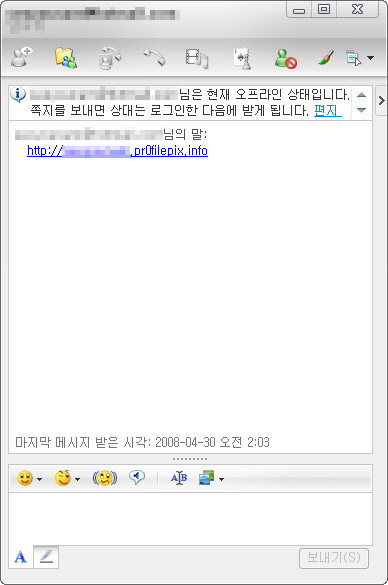

친구 님의 말 :  
써머즈.. MSN 나 아니다..  
속지마라.. 써머즈..  

<!-- truncate -->

써머즈 님의 말 :  
오  
  
친구 님의 말 :  
MSN 메신져 나 아니다..  
해킹 당한듯..  
  
써머즈 님의 말 :  
이젠 스팸이 국어도 해?  
대단대단;  
  
친구 님의 말 :  
이거 신고 어떻게 해야하는건가?  
나에게도 이런일이..  
  
써머즈 님의 말 :  
근데 어디다 신고해야 하나;;;  
  
친구 님의 말 :  
그러게.. 비밀번호 변경도 안 되고..  
  
써머즈 님의 말 :  
헉. 왜?  
  
친구 님의 말 :  
한동안 안 쓰고 있었는데...  
비번을 바꿔버렸나봐..  
오늘 아침부터 여러사람에게 연락이 오네..  
  
써머즈 님의 말 :  
오-  
인간관계를 연결시켜주는 스팸?  
  
친구 님의 말 :  
글쎄.. 친구로 등록되어 있는 사람들에게 연락하는듯..  
  
써머즈 님의 말 :  
그니깐.  
  
친구 님의 말 :  
나에게도 이런 일이 생기는구나..

  
아침에 [MSN 메신저 (윈도우 라이브 메신저)](http://im.msn.co.kr/im/)에서 친구로부터 "뭐해?" 라며 연락이 오길래 대답해줬더니, 나중에 [네이트온 메신저](http://nateonweb.nate.com/)로 다시 접속해서 사실은 그게 자기가 아니었다고 하더군요.  
  
MSN 메신저에 주로 상주하는 스팸성 바이러스 같은 건 줄 알았죠. 따라서, 그런 스팸성 메시지가 국어까지 자유자재로 구사하는 줄 알고 매우 놀랐는데(!), 알고 보니 아예 해킹을 당한 것 같더군요.  
  
여러분들도 모두 메신저 해킹/피싱 조심하세요.  
  
  
p.s. 인간관계를 연결해주는 스팸이냐는 말은 국어를 너무 자연스럽게 구사하는 봇인 줄 알고 놀라움에 한 질문이었습니다. -o-  
  
  

대부분의 피싱은 이런 식으로 달랑 주소만 날라온다든지 영문으로만 되어있죠.  
이미지 출처 : [Binary Notation System](http://hfkais.blogspot.com/2008/05/pr0filepixinfo-msn.html)
