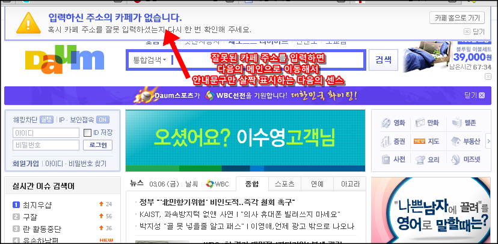
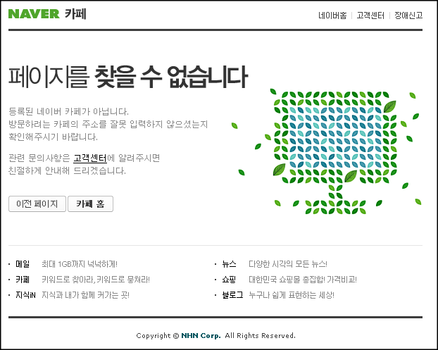
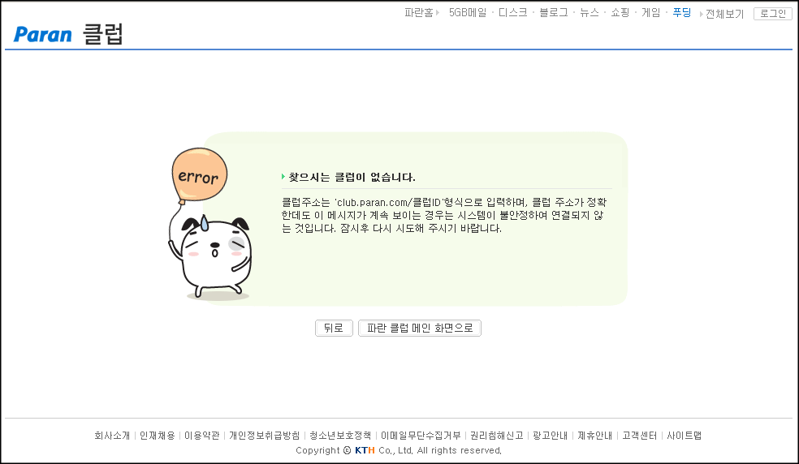
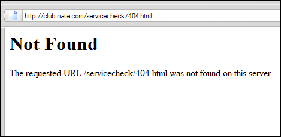

다음 (Daum) - <http://cafe.daum.net/sddsojfdsjfisdoifj>  

<!-- truncate -->

오! 센스가 좋아요.

  
  
네이버 - <http://cafe.naver.com/sddsojfdsjfisdoifj>  

적당히 평범합니다.

  
  
파란 - <http://club.paran.com/sddsojfdsjfisdoifj>  

여기도 평범한데, 느낌은 왠지 90년대 느낌;

  
  
  
  
  
  
그리고, 네이트 - <http://club.nate.com/sadeqwkoewqe>  

네이트, 너네는 뭐냐 =.=

  
  
추가)  
  
SK컴즈의 [앎드로메다](http://amdro.skcomms.co.kr/) 분들이 다녀가시더니 네이트도 제대로 나오기 시작했습니다.
