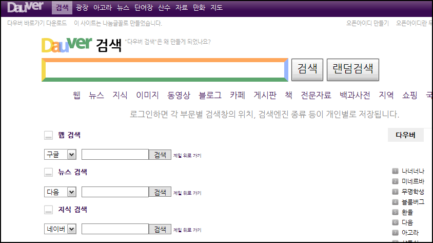
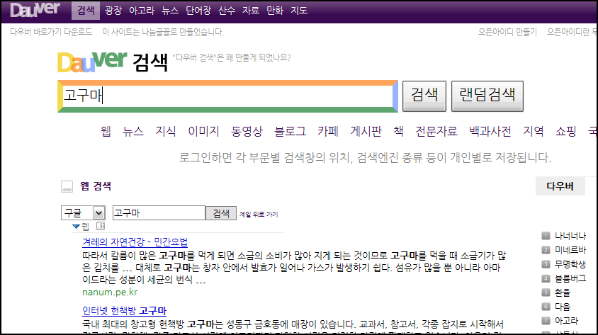
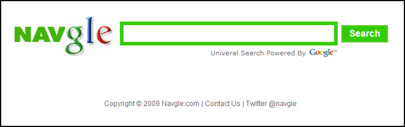
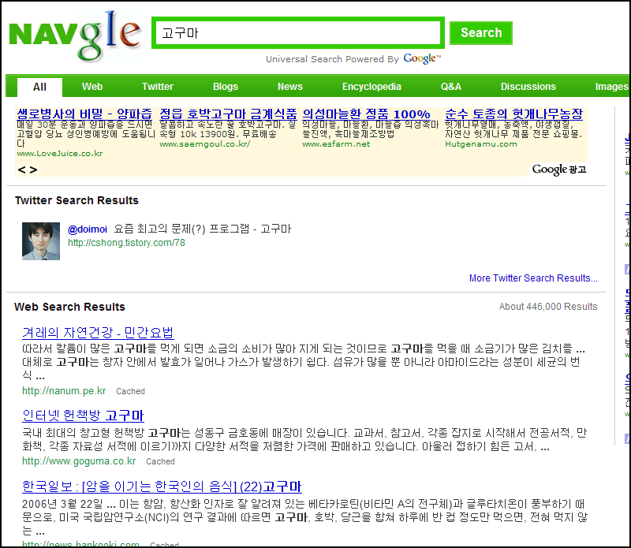

[다우버](http://dauver.com/)  

<!-- truncate -->

[다음(Daum)](http://www.daum.net/) [아고라](http://agora.daum.net/)에서 활동하는 무명학생님이 [검색 환경의 개인화](http://dauver.com/intro/search)를 외치며 다음과 네이버를 합쳐 만든 [다우버](http://dauver.com/)라는 검색 서비스가 있습니다.  
  

  
실제 검색은 다음과 네이버 뿐만 아니라 구글과 유튜브 등 각종 사이트에서의 검색 결과를 보여주지만 상징적으로 다음(Daum)과 네이버를 합쳐서 이름을 만든 걸로 보여지죠.  
  

  

[Navgle](http://navgle.com/)  
  
요즘 [트위터](http://twitter.com/)에서 [navgle](http://twitter.com/navgle)이라는 사람(?)이 follow를 해서 보니, [Navgle.com](http://navgle.com/) 이라는 서비스가 있더군요. 실제 트위터에 계정이 있어요. [twitter.com/navgle](http://twitter.com/navgle)   
  
내용을 보면 봇이 글을 쓰는 부분도 있는 것 같고, 사람이 운영하는 부분도 있는 것 같은데, 한글 검색 내용이 간혹 섞여 있는 걸로 보아 한국 사람이 만드는  서비스인 것 같아요. 일단 NAV 의 타이포가 네이버의 그것과 동일하니까요.  
  

  
재밌는 건, 서비스명은 타이포에서부터 전체적인 UI의 구성까지 분명하게 네이버의 모양새 따다 쓰고 있지만 검색 결과에는 Universal Search Powered By  Google 이라고만 표시한다는 겁니다. 실제로 네이버와는 검색 결과가 다르고요.  
  
뭘까요. 네이버의 검색 기술은 쓸만한 게 없다는 뜻인가요, 아니면 원래부터 네이버의 UI와 구글의 검색결과만을 합치는데 목적이 있었던 걸까요.  
  

