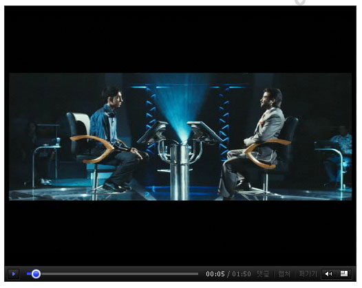
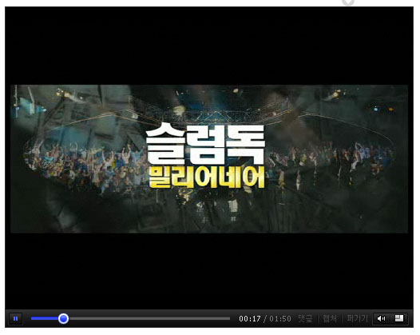
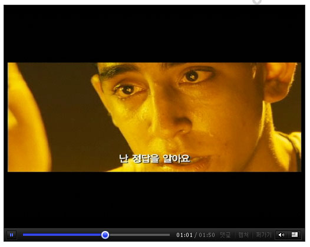
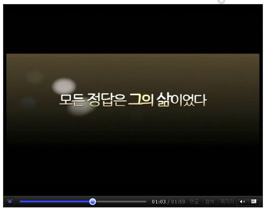
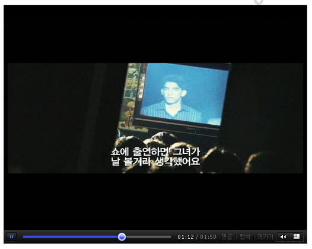
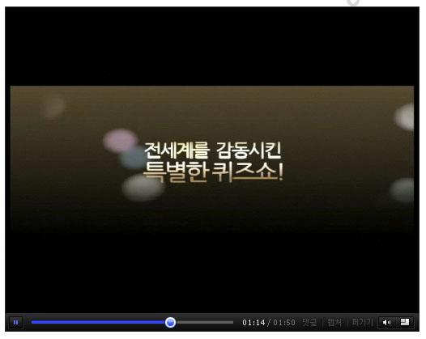
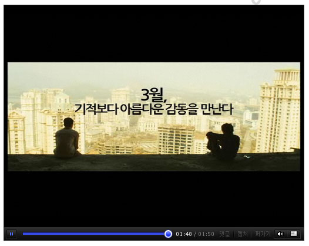
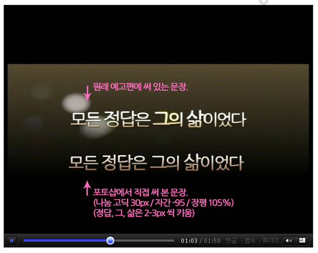
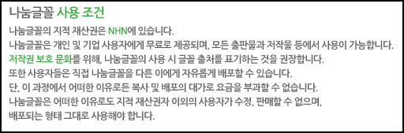

극장에서 대니 보일 감독의 [슬럼독 밀리어네어](http://kmdb.or.kr/movie/md_basic.asp?nation=F&p_dataid=23673)의 예고편을 봤습니다. 얼마 전에 있었던 제81회 아카데미상 시상식에서 무려 8개 부문에 걸쳐 수상을 했었죠.  

<!-- truncate -->

  
  
가만히 예고편을 보고 있는데, 영화가 재밌겠다는 것 말고도 눈에 띄는 점이 한 가지 있었습니다. 바로 예고편에 사용된 폰트! 저기 저 폰트는 바로 [네이버가 배포하는 나눔글꼴](http://hangeul.naver.com/index.nhn?goto=fonts#fonts)이 아니겠습니까! (정확하게는 [나눔고딕](http://hangeul.naver.com/index.nhn?goto=fonts#gothic))  
  
  

  

만약에 나눔글꼴이 깔려있고, 포토샵을 사용하시는 분이라면 아래 첨부파일을 받아서 확인해 보세요.  
  
[slumdog\_nanum\_font.psd](./slumdog_nanum_font.psd)

  
  
개인 및 기업사용자에게 무료로 배포한지 얼마 안 된 글꼴이 저렇게 사용되는 걸 보니 왠지 신기하더군요. ^^  
  
근데, [네이버에서 제시하는 사용 조건](http://hangeul.naver.com/index.nhn?goto=fonts#fonts)을 보면 글꼴 출처를 표기하는 걸 권장하던데, 영화 예고편 끝에 아주 조그만하게라도 글꼴 출처를 적었으면 어땠을까 하는 생각이 들었습니다. 뭐, 권장사항이니 표기를 안해도 전혀 문제는 없겠죠.  
  

  
  
  
  
슬럼독 밀리어네어 예고편 보기
