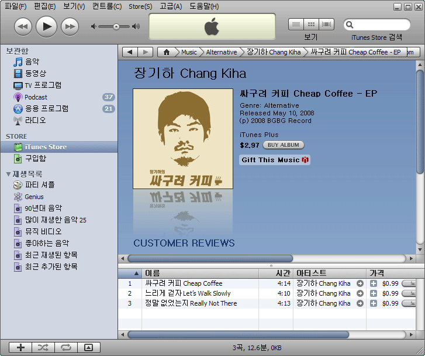

저는 아직 [장기하와 얼굴들의 1집 앨범](http://www.yes24.com/Goods/FTGoodsView.aspx?goodsNo=3289740)은 커녕 [싸구려 커피 (EP)](http://www.yes24.com/Goods/FTGoodsView.aspx?goodsNo=3093385)도 구매하지 않은 짝퉁 팬입니다.  

<!-- truncate -->

비판적 지지자는 아니고 -\_- 인터넷으로 비디오 클립만 열심히 보고 들었죠. TV에서도 가끔 보고 말이죠. 그래서 이번 기회에 속죄하는 마음으로 소식을 전해 드립니다.  
  
작년 온라인을 강타한 장기하의 첫 번째 EP 싸구려 커피 앨범을 [아이튠즈에서 구매하실 수 있다](http://ax.itunes.apple.com/WebObjects/MZStore.woa/wa/browserRedirect?url=itms%253A%252F%252Fax.itunes.apple.com%252FWebObjects%252FMZStore.woa%252Fwa%252FviewArtist%253Fid%253D306648968)는 사실! 두둥~!  
  
자자, 팬들은 모두모두 구입하세용~  
  

이미지를 클릭하면 아이튠즈로 연결됩니다.

  
이 참에 창키하님의 곡을 구입해야 겠습니다. :)  
  
  
  
p.s.1  
아이튠즈에 뜬 거 나만 몰랐나? -\_-  
  
p.s.2  
소녀시대, 빅뱅, SG워너비 등도 아이튠즈에 올라가면 좀 팔릴 것 같은데...  
  
p.s.3  
애플님하, 차라리 아이튠즈 뮤직스토어 코리아를 만들어 주삼;
