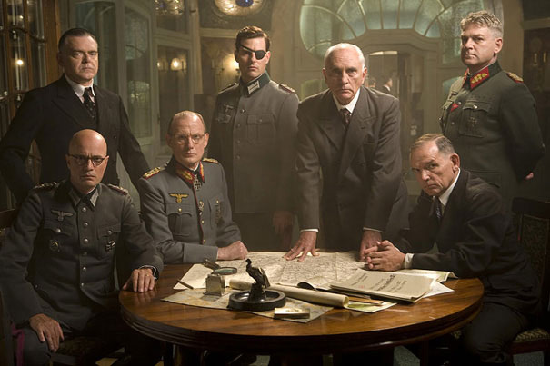
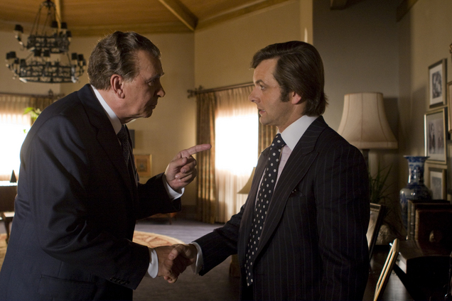

... [작전명 발키리](http://kmdb.or.kr/movie/md_basic.asp?nation=F&p_dataid=23650) 때도 [프로스트 vs 닉슨](http://kmdb.or.kr/movie/md_basic.asp?nation=F&p_dataid=23678)을 봤을 때와 비슷한 느낌을 받았습니다. 표현하자면 일종의 선수치기라는 것이죠.

<!-- truncate -->

한 인물이나 사건을 공평(?)하게, 중도적인 입장에서 묘사하는 듯 하지만 결과적으로는 조금 자신이 원하는 포지션을 차지한 상태로 작품을 완성한다는 뜻입니다.

[작전명 발키리](http://kmdb.or.kr/movie/md_basic.asp?nation=F&p_dataid=23650)를 예로 들어보죠.

이 영화의 이야기 구조는 부가적인 설명이나 기타 서브플롯 없이 거의 하나의 결과를 향해 돌진해 나가는 형태를 띄고 있습니다. 슈타펜버그를 중심으로 한 히틀러의 암살 세력이 행했던 역사적 사건이 핵심이죠.

예로부터 나찌 홀로코스트 영화는 많아도 이 영화와 같이 당시 독일 내부에서의 자정작용에 대한 내용을 그리는 영화는 많지 않습니다. 어떻게 보면 슈타펜버그와 그의 동료들은 독일과 유럽을 구원하기 위해 목숨을 바치는 영웅들입니다. 우리나라로 따지자면 안중근 의사나 윤봉길 의사 정도 될까요?

주저하는 영웅들

하지만, 영화를 보면 알겠지만 슈타펜버그의 세력들은 수많은 망설임과 의지 부족으로 인해 거사를 그르치는 것으로 묘사됩니다. 슈타펜버그 역시 왜 그가 히틀러 암살이라는 사명감을 가지는지에 대한 설명은 거의 없으며 관객이 그를 주인공으로서 멋있게 보일만한 장면도 별로 나오지 않습니다. 단지 목표를 향해 저돌적으로 돌진하는 인물일 뿐이죠. 이 영화가 다큐멘터리도 아닌데 말이죠.

왜 그럴까요? 저는 감독이 유태인인 브라이언 싱어이기 때문이라고 생각했습니다. 어떤 감독이 맡느냐에 따라 다르긴 하겠지만, 나찌로부터 독일과 유럽을 구하려는 사람들에 대한 이야기를 유태인이 아닌 감독에 의해 만들어졌다면 조금 더 영화에 기름기가 흘렀을 것 같지 않나요? 또한 기왕 이 영화의 기획이 상업영화였다면 그리고 그 주인공이 탐 크루즈라면 조금 더 주인공과 그 주변인물이 처한 상황을 극적으로 만들거나 동정심을 주는 요소를 양념처럼 넣는 게 안전한 선택이 아니었을까요? 그랬다면 관객들이 영화에 조금 더 몰입할 수 있었을 테고, 극중 캐릭터가 더 멋있게 보여서 더 많은 관객들이 몰렸을 것 같기도 하거든요.

[프로스트 vs 닉슨](http://kmdb.or.kr/movie/md_basic.asp?nation=F&p_dataid=23678)도 마찬가지입니다.

이 영화의 감독은 론 하워드입니다. 각종 뉴스를 살펴보면 그는 분명히 민주당 지지자입니다. 지난 대선에서도 민주당 후보를 지지했었죠.

하지만 그가 만드는 영화들을 보면 신기하게도 보수적인 성향이 강합니다. 적어도 그가 만드는 영화는 공동체 안의 질서와 도덕의 가치를 높게 평가하고, 영상적인 면에 있어서도 기존의 영화문법을 충실히 따르는 형태의 연출을 보여줍니다. 분노의 역류나 아폴로 13, 뷰티풀 마인드, 신데렐라 맨 등이 대표적인 영화지요. 보수적인 아카데미의 취향에 딱 어울리는 작품으로 그의 영화는 아주 충실한 편입니다.

그런 의미에서 저는 론 하워드 감독이 프로스트 vs 닉슨을 만든다는 사실에 의아해 했습니다. 영화가 안전하게 갈 것 같고, 기존의 인물 (주인공인 닉슨 대통령)에게 무언가 의미를 부여할 것 같은데, 영화의 소재는 또 워터게이트 사건(과 인터뷰) 였거든요.

영화는 분명 닉슨 대통령의 국가 권력에 대한 잘못된 해석/운용의 결정판인 워터게이트 사건에 대한 인터뷰를 다루고 있습니다. 하지만, 결국 영화는 닉슨을 결국 "의지에 찬 인물이고 열심히 노력했지만, 흠이 있었던 인물" 정도로 만들어 버리고 맙니다.

사실상 체급이 다른 선수들

이 영화 속 닉슨과 비슷한 캐릭터인 어 퓨 굿 맨의 제셉 장군 (잭 니콜슨 분)을 떠올려 보세요. 그가 캐피 중위 (탐 크루즈)의 심문을 받다 못해 자신이 코드 레드를 지시했다는 자백 아닌 자백을 욕설을 곁들여 토해내는 장면과 프로스트 vs 닉슨에서 닉슨이 얼떨결에, 그것도 매우 자책하며 자백을 하는 장면은 너무나 다릅니다. 물론 프로스트 vs 닉슨의 장면들은 사실에 근거했기 때문에 영상으로는 다른 모습을 보여줄 여지가 없었을 수도 있겠죠.

반대로 닉슨의 인터뷰어였던 프로스트를 다루는 걸 보세요. 영화 속 프로스트는 아무 생각도 없이 덜컥 일을 벌였으나 닉슨의 카리스마에 쩔쩔매다가 소 뒷걸음 치다가 개구리 잡은 것처럼 정말 운좋게 닉슨을 잡은 인물로 그려집니다. 정말 운좋게 대박을 낸 인물일 뿐이지 그 이상도 그 이하도 아닙니다. 그냥 쇼비즈니스에 오래 종사한, 동물적인 감각을 가진 MC일 뿐이잖아요.

* * *

그렇다고 제가 역사적인 사건이나 사실들을 바꾸라거나 과장되게 묘사해야 좋다고 생각하는 건 아닙니다. 다만 영화를 선택하는 건 자율 의지이고, 어떻게든 특정한 상으로 그려질 수 밖에 없는 인물, 사건을 고르는 것 자체가 일종의 선수를 치는 게 아닌가 싶다는 거죠.

우리나라의 예를 들어서 말한다면 - 독립운동과 윤봉길 의사 이야기를 일본인 감독이 만든다거나 전두환 ㄱㅅㄲ전 대통령의 몰락 과정에 대한 영화의 시나리오를 조갑제가 쓴다든지요.

최근의 이 두 영화는 딱히 꼬집어서 말할 수는 없지만, 그런 의미에서 좀 의아스러운 영화들이었습니다. 영화란 다큐멘터리도 아닐 뿐더러 감독의 생각이 분명히 작품에 반영이 되는 매체이기 때문이죠.
