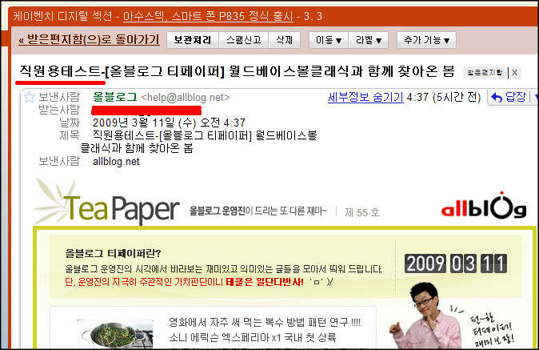

1. 러브콜

<!-- truncate -->

시간은 좀 지났지만 - 올블로그로부터 다음과 같은 메일이 슬쩍 삐져나온 것을 확인한 적이 있습니다.

제목이 무려 직원용테스트-로 시작된다능;

저도 모르는 사이에 제가 올블로그 서버를 해킹했나 하는 생각이 들더군요. 그러다 순간 아, 이게 혹시 러브콜인가 하는 생각도 했고요.

물론 농담입니다. -\_-

내용도 별 것 없었어요. 그냥 테스트 한 게 삐져 나온 게지요.

2. 목요일 워크샵

얼마 전 [홍커피님이 블로그래픽에 단 댓글](http://blographic.net/entry/1033#comment-570)이라든지 [최근들어 찾아진 올블로그의 장애](http://blog.blogcocktail.com/?s=장애) 등을 보면서 '누구하나 가릴 것 없이 참 힘들겠구나' 하는 생각이 들었는데, [유저스토리랩의 페차쿠차 글](http://userstorylab.com/story/22)을 읽고 나니 머리 속에는 한 가지 생각 밖에 들지 않더군요.

목.요.일.워.크.샵.

목.요.일.워.크.샵.

목.요.일.워.크.샵.

저는 ... 월차라도 내면서 살고 싶습니다. 블로그칵테일은 좋은 회사?

3. 이건 유머 아님 -\_-

올블로그가 꽤 오랫동안 정체된 것 같습니다. 비단 [디자인 뿐만 아니라](http://blographic.net/entry/1033) 그간의 여러 시도들이 큰 반응을 얻지 못해서 힘이 빠진 면도 있을 듯 합니다.

순전히 개인적인 생각이지만 2008 올블로그 어워드부터 해서 (이 행사는 분명히 정상적인 절차나 기획으로 치루지 못했다고 생각합니다. 누군가의 헌신(?)이 짐작된다고나 할까요.) 잦은 서버 장애 등 몇 년차 된 서비스치고는 아쉬운 점이 많았습니다. 내부적으로는 전혀 아는 바가 없기 때문에 뭔가 사정이 있나보다라고 짐작할 뿐이지만  그만큼 많이 아쉬웠던 게지요.

[에이스팀블로그 - 운영팀블로그가 블칵공식블로그로 이사합니다.](http://mindlog.kr/ace/?p=796)

[블로그래픽 - 2008 올블어워드 : 미스터리 혹은 아마추어리즘](http://blographic.net/entry/1006)

[ego + ing - 올블로그](http://egoing.net/1026)

올블로그 운영진님들, 심기일전 하셔서 앞으로 더 좋은 서비스 만들어 주세요. 예전과 같이 올블로그 한번 훓으면 대략의 이슈/사건/소식을 알 수 있다든지, 아니면 새로운 컨셉의 서비스로 깊이를 더 파주시든지 해서 많은 사용자들을 즐겁게 해주시면 감사하겠습니다.
