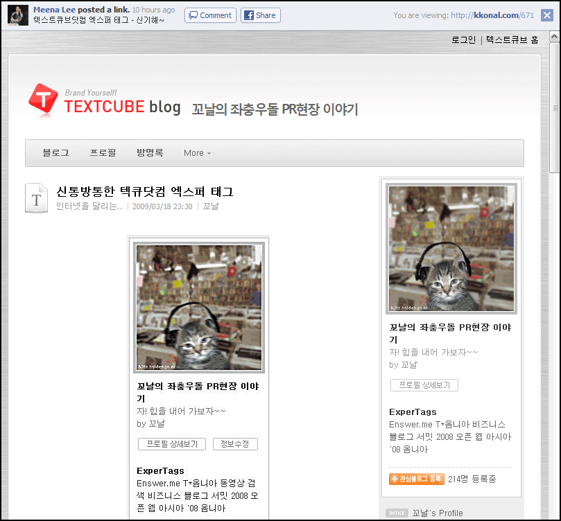
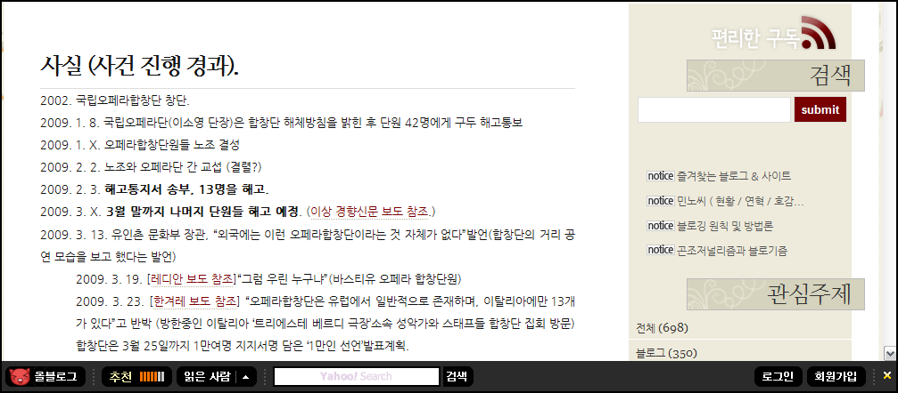
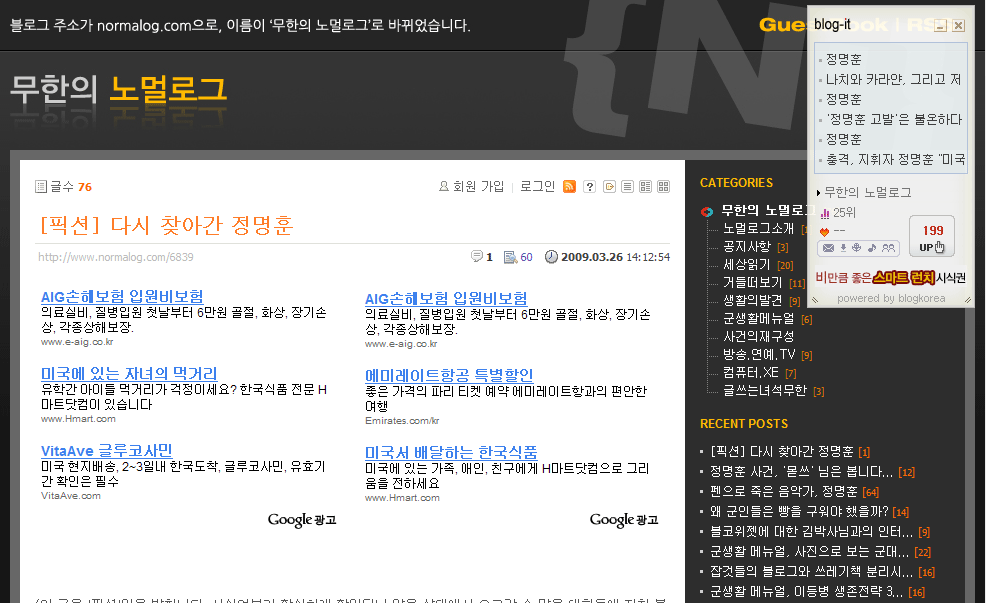
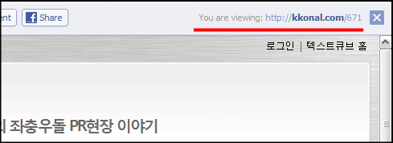
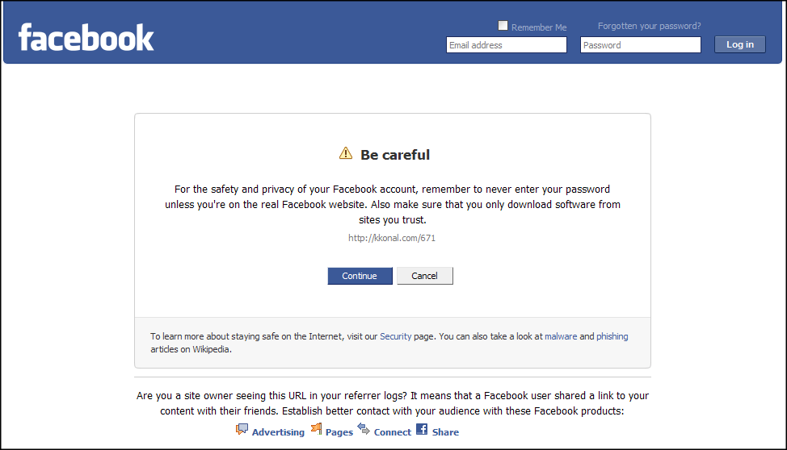
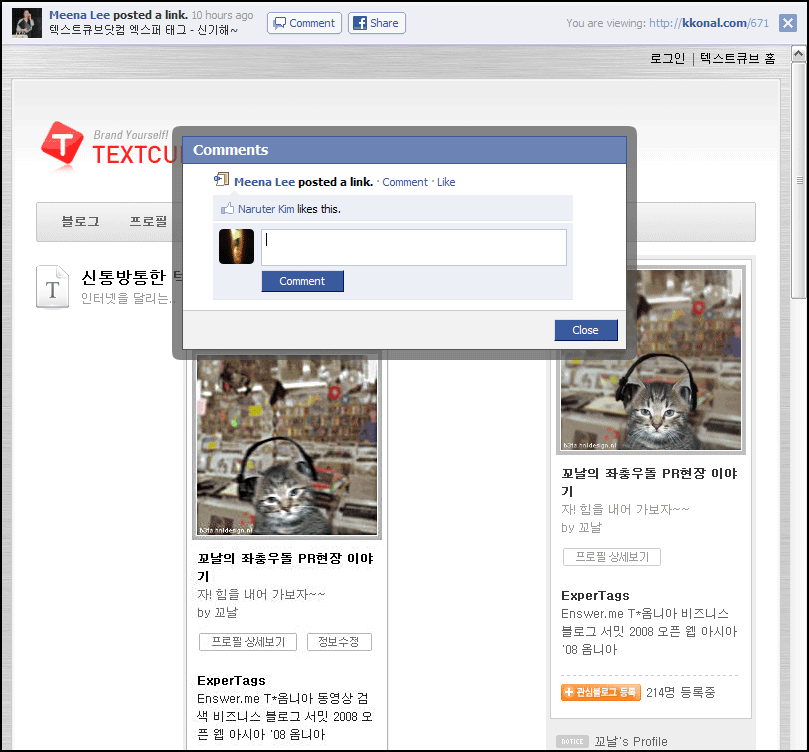
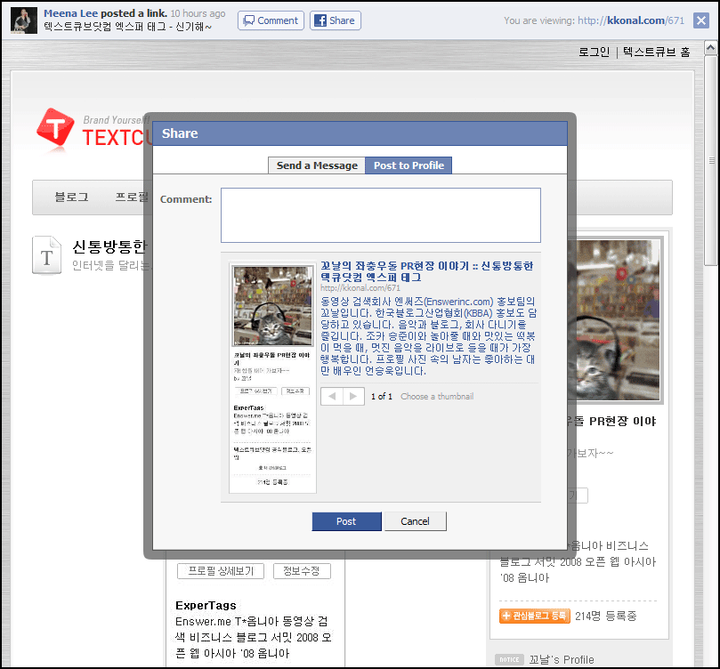

얼마 전에 페이스북이 UI를 변경했습니다. 조금 더 트위터스러워진 면이 있는데, 사용자들의 반응이 별로 좋지는 않더군요. 페이스북은 페이스북이고 트위터는 트위터 아니냐는 거겠죠. 예를 들어 싸이월드가 잘 나간다고 티스토리가 싸이월드를 흉내내는 건 아니다, 뭐 이런 거겠죠?  

<!-- truncate -->

각설하고,  
  
페이스북은 각종 기능을 추가해서 자신의 페이지에 사용할 수 있습니다. 어플리케이션이라고 하는데, 예를 들어 자신의 블로그에 쓴 글을 페이스북에 노출시킬 수도 있죠.  
  
페이스북에 노출된 링크를 클릭하면 다음과 같이 새 창 (새 탭)에서 해당 페이지가 표시됩니다.   
  

  
보시다시피 프레임으로 구성되어 있고, 상단에 페이스북의 UI가 얹혀져 있습니다. (페이스북마저!) 페이스북이 프레임을 사용한다는 사실에만 집중을 하면 국내 여느 메타블로그들과 별반 다를바가 없습니다. 예를 들어 올블로그나 블로그코리아가 대표적인 예입니다. 아래의 스크린샷을 통해 확인할 수 있습니다.  
  

올블로그는 하단에 올블바가 있고,

블로그코리아는 우측 상단에 존재합니다.

  
모두 자신들의 서비스를 위해 기능을 추가하다 보니 어쩔 수 없이(?) 프레임을 사용하게 되고 퍼머링크를 깨고 있습니다.  
  
각각의 주소는 아래와 같은 형식입니다.  
  

페이스북  
<http://www.facebook.com/ext/share.php?sid=56961569550&h=pM_do&u=fRf_A&ref=mf>  
  
올블로그  
<http://link.allblog.net/17682804/http://minoci.net/782>  
  
블로그코리아  
<http://blogit.blogkorea.net/14951649/http://www.normalog.com/6839>

  
  
하지만, 프레임을 쓰는 방식에 있어서 페이스북과 국내 메타블로그들이 차이가 있습니다. 조금 더 들어가 보도록 하죠. 크게 3가지로 요약될 수 있습니다.  
  

(1) 퍼머링크 표시  
  

  
페이스북은 우측 상단 자신들의 UI에 원본글의 퍼머링크를 표시해 주고 있습니다. 주소를 클릭하거나 우측의 X버튼을 클릭하면 프레임에서 벗어나 본래의 퍼머링크로 이동합니다. 반면 올블로그는 명시적으로 원본글의 퍼머링크를 표시하는 대신에 프레임을 씌운 자신들의 주소에 퍼머링크를 표기하는 방식을 사용합니다.  
  
어떤 방식이 더 효과적일까요? 일반 사용자들을 대상으로 테스트를 해보면 좋을 듯 합니다만 저는 읽을 수 있는 위치에 표기가 되어 있는 게 더 직관적으로 보입니다. 적어도 국내의 일반 사용자들은 어딘가 원하는 사이트에 접속하고 나면 주소창은 별로 신경을 쓰지 않는다고 생각하거든요.  
  
참고로 사실 올블로그에서 사용하는 주소 중 퍼머링크 부분은 삭제해도 잘 작동합니다.
<http://link.allblog.net/17682804/http://minoci.net/782> 과
[http://link.allblog.net/17682804/](http://link.allblog.net/17682804/http://minoci.net/782) 는 같은 주소라는 뜻입니다.  
  
블로그코리아 역시 같은 방식입니다. 원본글의 퍼머링크에 대한 명시적인 표시는 없고,  <http://blogit.blogkorea.net/14951649/http://www.normalog.com/6839> 나 [http://blogit.blogkorea.net/14951649/](http://blogit.blogkorea.net/14951649/http://www.normalog.com/6839) 은 같은 주소입니다.

  
  

(2) 비로그인시 접속 전 확인  
  
페이스북에 로그인하지 않은 상태에서 페이스북에서 제공하는 링크를 누르면 제일 위에서 언급했던 형식의 페이지가 뜨는 게 아니라 간단한 경고문과 함께 원본글의 퍼머링크를 표시하고 확인을 하게 합니다.  
  

  
그리고, 계속 진행하겠다는 의미로 continue 버튼을 클릭하면 원본글의 퍼머링크로 이동합니다.  
  
이런 방식은 페이스북이 올블로그나 블로그코리아처럼 메타블로그가 아니기 때문일 것입니다. 기본적으로 SNS이고, 그 안에서는 개인의 여러가지 정보가 돌아다니기 때문에 저런 주의사항을 표기하는 것이겠죠. 일종의 이런 메시지일 것입니다.  
  
> 당신이 방금 클릭한 링크는 페이스북 도메인이긴 하지만, 당신은 로그인을 하지 않은 상태이다. 따라서, (페이스북의 기능을 사용할 게 하나도 없으니) 우리는 당신을 원본글로 바로 연결해 줄 것이니, 다른 곳에 가서는 페이스북의 계정 정보를 입력하지도 말고, 보다 보안에 신경을 써라.

  
올블로그나 블로그코리아 같은 경우는 페이스북처럼 사용자의 정보를 많이 취급하지 않는 서비스들입니다. 하지만, 자신들의 서비스의 핵심 가능 중 하나인 글에 대한 점수를 보여주기 위해 비로그인 사용자들에게도 프레임을 유지하는 것이겠죠?  
  
만약 페이스북이 (페이스북 사용자를 포함한) 인터넷 사용자들 모두가 웹에 대한 지식이 어느 정도 있다고 여긴다면 굳이 저런 경고 화면을 보여주지 않는 선택을 했을 것입니다. 어차피 퍼머링크로 연결만 시켜주고 나면 자신들의 책임은 없다고 해도 되는 것일테니까요.  
  
혹은 로그인하지 않아 제대로 기능이 안될 지라도 자신들의 서비스를 자랑 (노출)하고 싶다면 아예 저런 경고 화면 대신에 계속해서 자신들의 프레임을 사용했을 것입니다.  
  
하지만, 그들은 굳이 '불편한 방식'을 채택했습니다. 누군가에게는 불편하지만, 누군가에게는 안전한 혹은 오해 살 필요없는 방식이겠지요.

  

(3) 적극적인 기능 구현  
  
페이스북에 로그인한 상태로 페이스북에서 제공하는 위의 링크를 클릭하면 페이스북 UI가 상단에 나온다고 설명했죠. 이 UI 에서는 크게 3가지를 할 수 있습니다.  
  
1. 이 글을 쓴 사용자의 Wall 로 이동한다. (Wall은 일종의 개인 페이지입니다.)  
2. 글에 대한 코멘트를 달 수 있다. (작성한 코멘트는 페이스북에 저장됩니다.)  
3. 글을 자신의 Wall 에 추가해서 다른 이들과 공유할 수 있다. (역시 페이스북에 저장됩니다.)  
  

페이스북 내에 코멘트를 남기거나

글을 페이스북 안에 유통시킬 수 있습니다.

  
이런 기능을 위해 '불가피하게' 프레임을 쓰는 것이겠지요. (물론 1번과 같이 퍼머링크를 명시하면서요) 올블로그나 블로그코리아도 마찬가지고요. 하지만, 페이스북이 서비스 활성화를 위해서 조금 더 적극적인 방법을 택하고 있는 듯 합니다.   
  
자, 그럼 여기서 조금 더 나아가보죠. 올블로그의 경우를 예로 들게요.  
  
올블로그의 경우 기왕 프레임을 사용하는 김에 그 안에 [이메일로 전송하기] 버튼이 있다면 유용하게 쓸 사용자들이 있을 것 같습니다. 혹은 [한RSS로 구독하기], [구글리더로 구독하기], [딜리셔스에 북마크하기] 등의 버튼이 있다면 유용하게 사용할 사용자들이 있을 것 같다는 거죠.  
  
어차피 올블 프레임 쪽에 버튼이나 입력창들의 구성들이 많지 않아 여백도 있잖아요. 메타블로그가 여러 블로그의 글들을 널리 알리는 게 목적이라고 한다면 굳이 특정 프레임 안에서만 서비스를 제공할 필요가 있을까요?  
  
※ 참고로 이 프레임에 한해서는 페이스북도 별다른 외부 기능을 제공하지 않지만, 사실 페이스북은 그 서비스 자체에 수많은 어플리케이션 (플러그인, 매시업)들이 달라붙어 있는 구조죠. 엄청난 차이라고 생각합니다.

  
페이스북의 외부 링크 표시 방법을 보고서는 '아니, 페이스북도 저렇게 퍼머링크를 깨버리나...' 싶은 생각이 들었지만, 가만히 살펴보니 자신들 내부의 핵심 기능 (혹은 핵심 가치)인 social network를 위해 '불가피하게 프레임을 썼다'는 게 느껴지더군요.  
  
최소한의 제한과 보다 친절한 설명은 당장은 사용자들을 너무 자유스럽게 풀어놓아 서비스의 구속력이 공고해지지 않을 것 같지만, 사실은 더 얻을 게 많을 수 있지 않을까요? 그게 개방과 자유를 표방하는 웹서비스에 부합하는 것 같기도 하고 말이죠.  
  
이상 페이스북의 외부 글 표시 방법을 보며 느낀 생각이었습니다.
