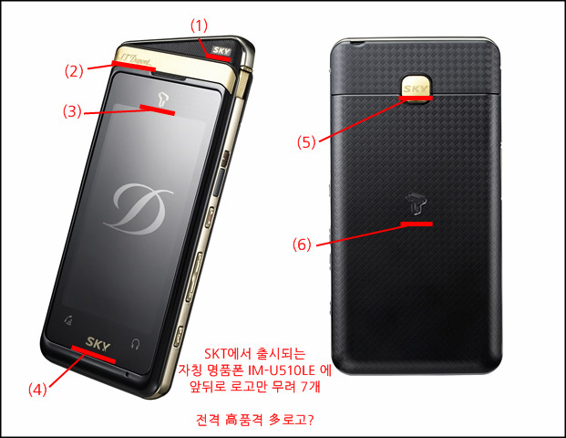
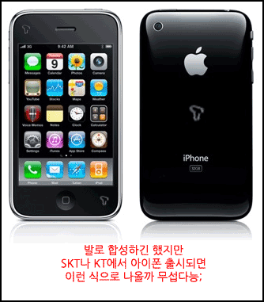

<!-- truncate -->

  

팬택의 핸드폰 브랜드 SKY를 타고 나온 '명품 휴대폰(!)' IM-U510LE (일명 듀퐁폰)의 보도자료를 보고 경악을 금치 못했는데, 그건 바로 핸드폰에 찍힌 로고의 개수!

**명품 폰 1개에 앞뒤로 무려 6개의 로고가!**

마치 제품에 박힌 로고가 많아야 명품이라고 소리치는 것과 같은 포스가 느껴졌다고나 할까요;

곰곰히 생각해 본 결과 **'야, 너 어디서 듀퐁 라이터 짝퉁 같은 핸드폰을 들고 다니냐?'** 라는 질문을 받아 고객이 난처하게 될 상황을 미연에 방지하기 위해 **'흥! 나 듀퐁 시그니처 모델이거든? 그리고, SKT거든? 게다가 SKY 모델군이거든?'** 이라는 말을 온몸으로 해주기 위해 박아 넣은 제조사와 이통사의 세심한 배려가 아닐까 하는 생각이 들었습니다.

이럴 바에야 이통사 뿐만 아니라 정부에서도 제조사에 **'이왕 그리된 김에 자발적으로 다이나믹 코리아 로고도 좀 넣어라'**하고 압력을 넣으면 훨씬 더 국가 브랜드 이미지가 좋아지지 않을까 하는 생각도 해봤습니다.

어쨌든 저걸 보고 나니 문득 KT나 SKT에서 아이폰이 나오면 그 매끄러운 앞뒷판에 T 로고, SHOW 로고를 덕지덕지 붙이고 나오는 건 아닐까 하는 생각이 들더군요.

KT라면 각인 시켰을 때의 소비자 불만 따위 무시하고 SHOW 마크 1개 쯤은 큼직하게 각인해서 나올 수도 있을 것 같고요, SKT 라면 스티커로 떼어낼 수 있게 살짝 꼼수를 써서 진열하고 홍보하지 않을까에 50원 걸어봅니다!

아, 물론 아이폰은 다음달에 나오지요;;;
