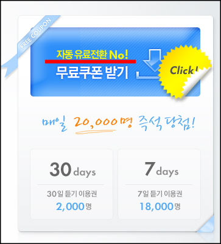
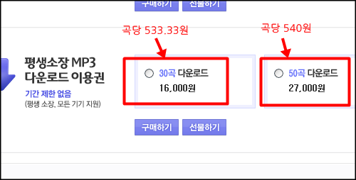

**# 적절한 이벤트 타이밍 - 그리고 자동 유료전환 NO!**

<!-- truncate -->

> 공정위는 27일 로엔엔터테인먼트(멜론), KT뮤직(도시락), LG텔레콤(뮤직온), Mnet(엠넷), 소리바다, 네오위즈벅스(벅스) 등 6개 온라인음원제공사업자의 서비스이용약관 중 '무료체험이벤트 참가시 유료서비스 가입을 강제하는 조항' 및 '유료서비스 중도해지 제한조항'을 수정 또는 삭제하도록 시정권고 조치했다고 밝혔다.
>
> 이들은 고객이 무료체험 이벤트에 참가만 하면 참여고객의 별도 동의절차 없이 이벤트 종료시에 자동결제 월정액 유료서비스로 전환했다. 물론 약관에 '무료체험 기간 종료 후 자동으로 유료전환돼 매월 0000원이 결제됩니다'고 명시했지만 무료체험 이벤트의 성격상 소비자가 예상하기 어려운 조항으로 불공정성이 인정된다는 것이다.
>
> 출처 : [아시아경제 - 1개월 무료체험 후 자동 유료회원 전환이라니](http://www.asiae.co.kr/news/view.htm?sec=eco99&idxno=2009092711122014103 "[http://www.asiae.co.kr/news/view.htm?sec=eco99&idxno=2009092711122014103]로 이동합니다.")

얼마 전 공정위가 각종 음악 사이트의 '자동 유료 가입' 행위에 대해 시정권고 조치를 했죠. 무료 이벤트에 응모하면 1주일 (혹은 1달) 후 나도 모르게 유료 결제가 이뤄지는 방식에 대해 시정 조치를 내린 것이죠. 저도 당한 적이 있습니다. 윽!

때맞춰 [다음 뮤직에서 무료 음악듣기 이벤트](http://music.daum.net/extraEvent/couponProm.html "[http://music.daum.net/extraEvent/couponProm.html]로 이동합니다.")를 하는군요. 7일, 30일 무료체험 이벤트인데, 자동으로 유료 서비스로 전환되지 않는다고 설명해서 이벤트 참여를 유도하는 듯 합니다. 다른 서비스들의 품질이 공개적으로 상처를 받았을 때를 노리는 거죠. 괜찮은 타이밍에 합리적인 이벤트인 것 같아요. ^^

즉석 추첨으로 7일인지 30일인지가 결정되는데, 저는 7일 이용권에 당첨되었네요. 요즘 노래는 많이 못들어봤는데 좀 들어봐야겠어요.

**# 이상한 가격정책 - 왜 대용량이 더 비싸지?**

문득 예전에 음악을 좀 다운로드 받고 싶어서 여러 음악 사이트를 돌아다녔던 기억이 났습니다. 대부분의 사이트들이 1곡씩은 다운로드 받기 힘들게 되어있더군요. 30곡에 만원... 대충이런 식으로 묶음 형태로만 팔고 있었는데요, 갑자기 생각나서 1-2곡 다운로드 받고 싶을 때는 영 쓸모가 없는 방식이더군요. 그래서, 그 때도 그냥 손가락만 빨고 나왔었죠.

오늘 살펴보니 다음 뮤직은 그런 것 같지 않네요. 곡당 600원씩 다운로드를 받을 수 있습니다. 오오- 괜찮아요. (혹시 다른 곳도 가능한가요? @.@)

물론 [다음 뮤직도 묶음 형태로 다운로드 이용권을 제공](http://music.daum.net/ticket/ticket.do#mp3download "[http://music.daum.net/ticket/ticket.do#mp3download]로 이동합니다.")하고 있었는데 가만히 살펴보니 가격이 좀 이상하더군요.

30곡 묶음 가격보다 50곡 묶음 가격이 더 비싼 거예요! 가끔 보면 마트에서도 이런 식으로 대용량 제품들이 소용량 제품보다 더 비싸게 책정되어 있던데, 왜 그런걸까요?

소비자들을 현혹시키기 위한 고도의 가격 정책인 걸까요 아니면 단순히 가격을 책정한 담당자의 실수일까요? 아니면 50곡을 한꺼번에 결제처리하는 게 30곡을 결제처리하는 것보다 더 노동이 많이 들어가는 걸까요?

알쏭달쏭한 가격정책입니다. 정말 잘 따져보고 사야하는 시대예요. 오프라인이든 온라인이든 말이죠.
