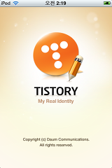

얼마 전 티스토리에서 아이폰 (아이팟 터치) 상에서 블로그 글을 작성할 수 있는 iTistory라는 어플을 내놨죠. 오늘 확인해 보니 네이버 블로그도 아이폰 어플을 내놨군요.  

<!-- truncate -->

둘 다 블로깅툴인데 사용자 입장에서 보면 느낌이 사뭇 다른 어플이더군요. 간단하게 비교하면 다음과 같습니다.  
  

**# 네이버 블로그 (모바일 어플) [(다운받기)](http://itunes.apple.com/WebObjects/MZStore.woa/wa/viewSoftware?id=328813873&mt=8 "[http://itunes.apple.com/WebObjects/MZStore.woa/wa/viewSoftware?id=328813873&mt=8]로 이동합니다.")**  
  

온라인 블로그 서비스의 기본적인 기능을 대부분 어플리케이션으로 구현했습니다 - 포스팅 관련 기능 (쓰기, 수정, 삭제), 댓글 기능, 각종 최신글 관련 기능 (최신 댓글 확인, 이웃글 확인 등)  
  
단점 - 어플을 실행시킬 때마다 사용자 인증을 반드시 해야합니다. 따라서 아이폰이 아직 출시되지 않은 상황인 현재, 네트웍이 잡히지 않는 곳에서는 아예 어플 자체를 사용할 수 없습니다.  
  
추가 한마디 - 네이버 블로그의 경우 자바스크립트와 프레임이 워낙 많고, 모바일 디바이스용 스킨을 제공하지도 않기 때문에 아예 어플을 새로 만드는 전략을 쓰는 게 현명한(?) 판단인 것 같아요.

  

**# iTistory (티스토리용 어플) [(다운받기)](http://itunes.apple.com/WebObjects/MZStore.woa/wa/viewSoftware?id=329446743&mt=8 "[http://itunes.apple.com/WebObjects/MZStore.woa/wa/viewSoftware?id=329446743&mt=8]로 이동합니다.")**  
  

한번의 사용자 인증을 하는 것으로 기본적인 세팅이 완료 됩니다. 자신 블로그의 글, 댓글, 방명록글 등 정보 확인은 티스토리의 모바일 스킨 형태를 그대로 사용합니다.  
  
사용자가 작성 중인 글은 오프라인 상에 저장을 할 수 있기 때문에 인터넷이 연결되지 않은 상태에서도 계속해서 글을 쓰거나 수정했다가 인터넷이 연결되었을 때 전송할 수 있습니다.  
  
단점 - 글 작성을 완료하여 한번 블로그로 전송해 버린 글은 다시 수정할 수도 없고 (인터넷에 연결되지 않은 상태라면) 확인해 볼 수도 없습니다. 살짝 불편한 면이라 할 수 있죠.  
  
추가 한마디 - 티스토리의 경우 블로그 자체가 모바일 디바이스에 맞는 뷰를 지원하기 때문에 어플을 만드는 것도 상대적으로 쉬웠을 거예요 (이미 구현이 다 되어 있으니까요). 개인적으로는 오프라인 기능을 보다 강화하면 좋겠습니다. 아, 멀티 계정을 지원하는 건 좋더군요.

  

**# 간단 정리**  
  
기능상으로 두 어플이 큰 차이는 없지만 (둘 다 왠만한 건 다 되니까) 포지셔닝이 미묘하게 다른 것 같아요. 네이버 블로그는 '모바일블로그 자체'라고 한다면 iTistory는 티스토리용 포스트 작성기를 기본 기능으로 하고 (내장 브라우저를 통한) 블로그 브라우징은 보너스 기능으로 탑재했다고 할까요?  
  
개인적으로는 앞으로 아이폰이 출시된다고 하더라도 아이팟 터치 유저들도 여전히 함께 늘어날 것이기 때문에 오프라인 기능은 반드시 필요하다고 생각해요.   
  
그런 의미에서 iTistory의 컨셉이 조금 더 맘에 들었습니다. 생각날 때마다 글을 작성해 둘 수 있기 때문에 보다 유용한 것도 사실이고요.

  
 iPod 에서 작성된 글입니다. / 후에 레이아웃 수정했습니다.

**추가 2009.10.27**

[ghostsbs님이 달아준 댓글](http://blog.summerz.pe.kr/1457#comment2939877 "[http://blog.summerz.pe.kr/1457#comment2939877]로 이동합니다.")처럼 사실은 네이버가 제일 먼저 모바일 디바이스에 맞는 페이지를 제공했었습니다. 제가 그 사실을 빼먹고 적었네요.

네이버 블로그의 경우는 그냥 내부적으로 기존의 모바일용 페이지를 아이폰으로 포팅하자는 결정이 있어서 그리 개발하게 된 듯 합니다.

한 가지 궁금한 점이 생기는데, 글이 길어질 것 같아서 아래 글에서 궁금증을 풀어놓겠습니다.

**[질문) 네이버 블로그에서 독립 도메인을 사용할 때 모바일 페이지 접속 방법은?](http://blog.summerz.pe.kr/1464 "[http://blog.summerz.pe.kr/1464]로 이동합니다.")**
