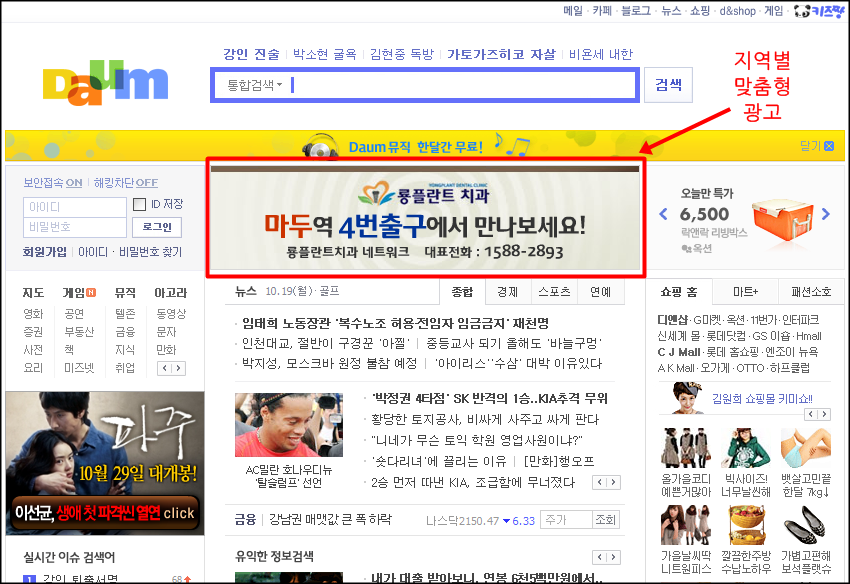

<!-- truncate -->

  

[다음(DAUM)](http://www.daum.net/ "[http://www.daum.net/]로 이동합니다.")의 메인 광고 영역에서 지역 타겟팅 광고를 본 건 처음이군요. 아니 다음(DAUM) 뿐만 아니라 국내 대형 포털에서 본 게 처음이예요.

왼쪽 하단 영역의 영화 <파주> 광고의 경우는 지역 타겟팅 광고는 아닌 것 같은데, 영화 제목이 비슷한 지역을 가리키고 있어서 재밌군요.

한가지 흥미로운 사실은 아이팟 터치에서 내 지역정보를 읽어갈 때는 현재 위치를 잘 찾지 못하는데, 제 데스크탑 PC로부터는 위치를 잘 찾아낸다는 겁니다. 분명 같은 공유기를 사용하는데 말이죠. 왜일까요? @.@
