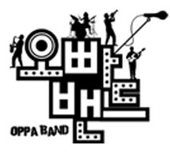

<!-- truncate -->

모든 회를 다 본 것도 아니고, 가끔씩 보이면 보는 프로그램이었지만 볼 때마다 마음 속에 있는 무언가가 움직이는 느낌을 주는 프로그램이 끝나니 뭔가 간단하게 적어보고 싶었습니다.

* * *

요즘 유행하는 수많은 리얼 버라이어티 중에 **성장 리얼 버라이어티**라는 분류가 있죠. '성장'이라는 컨셉도 일종의 유행이라면 유행이죠.

예를 들어 [아메리칸 아이돌](http://www.americanidol.com/ "[http://www.americanidol.com/]로 이동합니다.")이나 [프로젝트 런어웨이](http://www.bravotv.com/project-runway "[http://www.bravotv.com/project-runway]로 이동합니다."), [슈퍼스타K](http://superstark.mnet.com/ "[http://superstark.mnet.com/]로 이동합니다.") 등의 서바이벌형 리얼리티 프로그램도 사실은 성장을 모티브로 하고 있죠. 매회 더 잘하는 사람들이 살아남고, 살아남은 사람들은 다음회에 더 잘하는 모습을 보여주는 메카니즘으로 진행이 되죠.

리얼리티 프로그램에 약간의 설정 (대본, 전문연기자, 편집 등)을 더하면 리얼 버라이어티가 됩니다. 여기에도 성장형 프로그램들이 있죠. [천하무적 야구단](http://www.kbs.co.kr/2tv/enter/saturday/corner01/menu01/index.html "[http://www.kbs.co.kr/2tv/enter/saturday/corner01/menu01/index.html]로 이동합니다.")과 [오빠밴드](http://www.imbc.com/broad/tv/ent/sundaynight/program/ "[http://www.imbc.com/broad/tv/ent/sundaynight/program/]로 이동합니다.")가 그 대표적인 예라 할 수 있겠죠. 오합지졸들이 모여서 매회 진행되감에 따라 의미있는 무언가를 만들어내가는 거죠. 과정은 코믹터치, 결과는 감동... 뭐 대부분 이런 수순을 따르고요.

* * *

'오빠밴드'는 예전 (대학 다닐 때) 통기타를 치거나 밴드 만들어서 해본 사람들이라면 다들 한번쯤 생각해 볼만한 일들, 겪어봤을 일들, 꿈꿔봤던 일들을 차근차근 보여주는 그런 프로그램이었습니다. 밴드에 대해서는 실전 경험이 없는 사람들이 모여서 엉망진창의 수준을 보여주지만 점점 나아지고 무언가 목표에 도전하게 되는 그런 여정을 보여줬죠. 저도 그런 경험이 있었기에 보면서 조금 더 몰입을 할 수 있었겠죠.

신입생, 신입회원을 받고 열심히 연습을 하고, 공연장을 잡고, 관객을 모아 선후배가 함께 공연장에 올라 공연을 해본 경험이 있는 사람들에게는 오빠밴드라는 프로그램은 로망을 불러일으키는 프로그램이었을 거예요.

게다가 그들은 제대로 된 자작곡 하나 만들지 못하고 (마지막회 보니까 뭐 하나 있었던 것 같긴 하더군요), 예전 곡들을 카피 혹은 리메이크만 하다가 프로그램이 끝나버립니다. 이게 오빠밴드를 보면서 아쉬웠던 면이기도 했고, 그렇기 때문에 좋아보이는 면이기도 했어요. 물론 그 이유는 그렇기 때문에 정말 아마추어처럼 보여서죠.

* * *

정말 음악을 전업으로 삼는 사람들이나 실력은 있으나 언더그라운드에 있는 수많은 밴드들이 보기에는 불편할 수도 있었을 것 같아요. 밴드로서의 자질은 없는 사람들이 무언가 다른 유명세 (개그맨, MC, 댄스가수, 아이돌 등) 덕분에, 그리고 결정적으로 공중파 방송의 제작지원 덕분에 무대를 만들고, 관객을 모아 공연을 할 수 있었으니까요.

하지만 이건 리얼리티 프로그램이 아니라 리얼 버라이어티니까 그렇게 오해까지 하며 진지하게 볼 필요는 없을 듯 합니다. 많은 사람들이 갖고 있던 이루지 못한 꿈을 대신 이뤄주는 가상의 프로그램이잖아요.

* * *

마지막회를 보면서 문득 기타천재라는 캐릭터의 정모는 이제 이 방송이 끝나면 또 뭘 하려나 하는 생각이 들었습니다. 다른 멤버들은 다 한 때 잘나갔던 혹은 지금 잘 나가는 사람들이라 이게 끝나도 큰 지장은 없을 듯 한데, 그 기타리스트는 좀 걱정이 되더군요.

하긴, 이런 식으로 유명세를 얻어 새로운 그룹 혹은 밴드로 나와서 성공할 수도 있겠죠. 그게 그 친구가 취해야 할 전략이기도 하겠고요. 어쨌든 처음부터 마지막까지 저는 그 친구가 마음에 걸렸습니다. 그 친구는 리얼과 버라이어티가 충돌하는 지점에 서 있는 인물이잖아요. 그게 적어도 제게는 오빠밴드를 보면서 긴장을 하게 만드는 요소이기도 했습니다.

* * *

방송이 끝나고 난 후 문득 오빠밴드 시즌 2가 만들어지면 어떨까 하는 생각이 들었습니다. 그런데, 그냥 시즌 2가 아니라 리얼리티 프로그램으로 포맷까지 변하면 어떨까 싶은 공상 말이죠. 물론 그렇게 되면 일밤 같은 프로그램 안에서는 방송될 수 없겠죠.

자작곡도 만들고, 클럽 스케줄도 잡고 (써줘야 잡겠지만), 앨범도 내고 하는 겁니다. 그리고, 그런 모습을 그대로 방송으로 보여주고요. 그러다가! 정말 곡이 괜찮아서 성공을 하는 걸 보고 싶어요. 기왕 꿈을 보여주는 김에 진짜로 꿈을 실현해 보는 건 어떨까 하는 거죠.

뭐, 김구라나 탁재훈이나 성민 등 대부분의 캐릭터들이 이런 걸 계속 할 만한 사람들이 아니라는 건 알고 있으니 가능성은 전혀 없겠지만 개인적으로는 워낙 우리나라에 밴드 음악이 힘을 못쓰고 있어서 이렇게라도 밴드 음악이 좀 유명해지는 걸 보고 싶은 생각이 좀 있어요.

* * *

사실은 시즌 2부터 급격하게 리얼리티로 가지 않더라도 폐지만 되지 않으면 좋겠다는 생각이 들었습니다. 수많은 버라이어티 프로그램들이 있는데 음악을 중심으로 하는 프로그램 하나 따위 있어도 되잖아요. 볼 때마다 재미도 있던데... 하지만 뭐, 시청률 앞에서는 장사가 없나봐요. (제가 아무리 본방을 봐야 시청률에는 반영이 안되고...)

p.s.

그러고 보니 아메리칸 아이돌이나 [브리튼스 갓 탤런트](http://talent.itv.com/ "[http://talent.itv.com/]로 이동합니다."), 슈퍼스타K 같은 음악 서바이벌 프로그램들이 조금 더 특화되서 밴드만을 대상으로 하는 서바이벌 프로그램이 나오면 어떨까 싶은 생각이 들었습니다.

물론 우리나라에서는 시청률 자체가 안나오니 제작 가능성이 0%일테고, 영국 쪽에서 만들어주면 좋을 것 같아요. 비틀즈 데뷔 50주년 기념으로 2013년에 하나 만들면 어떨까요?

**관련링크**

- [위키피디아 - 오빠밴드](http://ko.wikipedia.org/wiki/%EC%98%A4%EB%B9%A0%EB%B0%B4%EB%93%9C "[http://ko.wikipedia.org/wiki/%EC%98%A4%EB%B9%A0%EB%B0%B4%EB%93%9C]로 이동합니다.")
- [디시인사이드 오빠밴드 갤러리](http://gall.dcinside.com/list.php?id=oppaband "[http://gall.dcinside.com/list.php?id=oppaband]로 이동합니다.")
- [스타뉴스 - '오빠밴드' 폐지, '무모한 도전'처럼 될 순 없었나](http://star.mt.co.kr/view/stview.php?no=2009102013401689843&outlink=2&SVEC "[http://star.mt.co.kr/view/stview.php?no=2009102013401689843&outlink=2&SVEC]로 이동합니다.")
