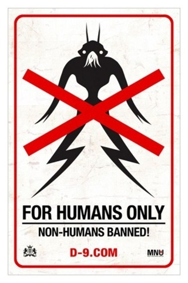

Alive in Joburg (directed by Neill Blomkamp)

<!-- truncate -->

이미 관심있는 분들은 다 알고 있는 사실 & 뒷북이겠지만 몇 가지를 적어둔다면,

- <District 9> 은 피터 잭슨이 제작을 맡았다. 피터 잭슨이 원래 제작하기로 되어 있던 영화 Halo 가 엎어지고 나서 닐 블로캄프에게 3,000만 달러를 주고 아무거나 만들어 보라고 했다나?

- <District 9> 의 이야기는 반드시 남아공을 배경으로 할 수 밖에 없었는데, 학교다녔을 때 배웠던 남아공의 District 6 이야기를 떠올려 보면 알 수 있을 듯.

- 잘 기억이 안난다면 **[양파님의 District 9 / 디스트릭트 9 리뷰](http://theonion.egloos.com/5062252 "[http://theonion.egloos.com/5062252]로 이동합니다.")**를 읽어보면 확실할 것이고.

- 엔딩을 6가지 버전으로 찍어두었다고 하는데, 지금보다 더 어울리는 엔딩이 있을지 의문.

- 이미 <District 9> 의 속편이 만들어질 거라는 소문이 퍼지고 있다.

- 왠지 모르게 Shane Acker의 <9> 과 비슷한 느낌이다. 영화 내용이 비슷하다는 건 아니고 9 역시 비슷한 시기에 만들어진 **[단편](http://www.youtube.com/watch?v=-hzCfOvsq64 "[http://www.youtube.com/watch?v=-hzCfOvsq64]로 이동합니다.")**으로부터 시작해서 투자를 받아 장편이 개봉됐기 때문.

- 우리 동네에서는 [**이런 식**](http://extmovie.com/zbxe/1906876 "[http://extmovie.com/zbxe/1906876]로 이동합니다.")으로 (미국에서 한 것처럼) 지역에 맞춘 광고를 했던데, 다른 동네에서는 한번도 못봤다.

- 그 외 정보는 **[위키피디아의 District 9 글](http://en.wikipedia.org/wiki/District_9 "[http://en.wikipedia.org/wiki/District_9]로 이동합니다.")**을 읽으면 되나 영어가 부담스러우면 **[golgo님이 간단하게 정리한 글](http://extmovie.com/zbxe/1881410 "[http://extmovie.com/zbxe/1881410]로 이동합니다.")**을 봐도 됨.

개인적으로 인상적인 것 한 가지 - 단순 비교는 무의미하나 <디워>의 제작비가 300억 정도된다고 하는데, <District 9> 역시 제작비가 그 정도 (3천만 달러) 된다는 것. 참고로 <트랜스포머 2> 제작비는 2억 달러.
