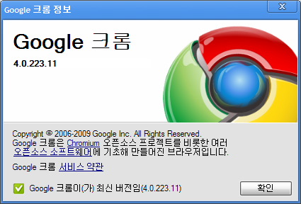

저는 인터넷 브라우저로 [크롬 (Chrome)](http://www.google.com/chrome?hl=ko "[http://www.google.com/chrome?hl=ko]로 이동합니다.") 버전 3 을 사용하고 있는데 이번에 [버전 4 베타](http://www.google.com/chrome/eula.html?extra=betachannel "[http://www.google.com/chrome/eula.html?extra=betachannel]로 이동합니다.")가 나왔다는 이야기를 듣고 설치를 했습니다.

<!-- truncate -->

베타라면서 버전이 4.0.223.11 로 나오네요.

버전이 4대로 올라가면서 북마크 싱크 기능이 생겼습니다. 좋네요. 자세한 내용은 아래 소개 동영상을 확인하시면 됩니다.

[유튜브 - Bookmark sync for Google Chrome (BETA)](http://www.youtube.com/watch?v=l2cR30Q7WVk "[http://www.youtube.com/watch?v=l2cR30Q7WVk]로 이동합니다.")

**2009-12-10 추가**

구글 크롬 4 베타버전에서 익스텐션 (추가 확장기능)을 사용할 수 있게 되었습니다. 자세한 설명은 **[구글 크롬 브라우저 익스텐션 기능 (베타) 오픈](http://blog.summerz.pe.kr/1485 "[http://blog.summerz.pe.kr/1485]로 이동합니다.")** 에서 확인하실 수 있습니다.
