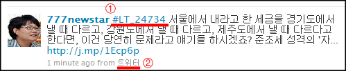

**[트위터 (twitter.com)](http://twitter.com/ "[http://twitter.com/]로 이동합니다.")** 를 쓰는 사용자들 중에서 접속 클라이언트로 **[한글트위터 (twitterkr.com)](http://twitterkr.com/ "[http://twitterkr.com/]로 이동합니다.")**을 쓰시는 분들이 꽤 있는 것 같습니다. (트위터는 서비스의 핵심 기능들을 모두 오픈해서 여러 접속 클라이언트 - 웹서비스 혹은 어플리케이션이 존재하죠.)

<!-- truncate -->

 트위터에서 작성한 트윗의 예입니다.

## ① 이기적인 해쉬태그가 불편해

제가 팔로우 하는 분들 중에서도 한글트위터를 사용해서 트위터를 접속하는 분들이 계신데 그 분들의 트윗을 볼 때 불편한 점이 있습니다. 한글트위터에서 작성된 트윗들은 앞에 별 의미없어 보이는 LT\_ 로 시작하는 해쉬태그가 붙어있습니다. #LT\_21345, LT\_12345 등등

트위터웹 사용자 혹은 다른 클라이언트 사용자들에게는 전혀 의미가 없으니 차라리 저게 제일 뒤에 붙으면 괜찮을텐데, 제일 앞에 항상 붙어있으니 여러 트윗들과 함께 있으면 신경도 분산되고 저 해쉬태그 때문에 내용도 적게 보이고 이모저모 싫더군요. 트윗 읽기 전에 신경도 분산되서 거추장스럽달까요?

이 해쉬태그가 항상 붙어있는 건 아닙니다. 트위터의 140자 한계와는 다르게 한글트위터에서는 140자 이상을 적을 수 있는데, 한글트위터에서 140자 이상을 적을 때 저 해쉬태그가 나오더군요.

재미있게도(?) 한글트위터를 사용하는 사용자들에게는 저 해쉬태그가 안보인다는 겁니다. 아마 저 해쉬태그가 한글트위터 안에서 140자 이상의 트윗을 한번에 보여주는 로직을 구현하는데 사용되는 것 같은데, 다른 트위터 사용자들에게는 전혀 의미없는 해쉬태그거든요. 뭐랄까... 이기적이죠.

## ② 명칭이 참 헷갈려

이건 딱히 제가 불편하거나 하는 건 아닙니다만,

트위터는 외부 클라이언트에서 접속해서 트윗을 날리면 클라이언트 이름이 표시가 되는데, 한글트위터에서 날리면 **트위터**라고 표시되더군요. 이건 **한글트위터**라고 표기하는 게 더 맞는 것 아닌가요?

잘 모르는 사람들이 보면 오해의 소지가 있을 수 있으니까요. ①번을 설명하는 바로 위의 박스의 글을 읽어보세요. 잘 모르는 사람이 저 글을 읽으면 도대체 트위터나 한글트위터나 뭐가 다른 거야... 뭐 이러지 않을까요? @.@

실제로 twitterkr.com 에 가도 표기가 페이지마다, 설명마다 다릅니다. 트위터kr, twitterkr, 한글트위터, 한글 트위터, 트위터 등... 도대체 뭐가 맞는 건지...

예를 들어서 분명히 트위터 (twitterkr.com)에 접속했는데, [트위터에서 로그인] 버튼을 클릭하면 twitter.com 의 팝업이 뜨고, [트위터 회원가입] 버튼을 클릭하면  twitter 라는 게 뭔지 설명한 다음에 twitter.com 의 회원가입 창으로 보냅니다. 아... 어려워...

농담 섞어 이야기하자면 뭐, 어차피 웹클라이언트 (서비스)의 디자인도 트위터의 그것을 완전히 흉내냈으니 사람들에게 twitter.com 이 아닌 '트위터'로 잘 알려지면 나중에 트위터가 한글화 되거나 할 때 한자리 차지할 수 있으려나요? :p
