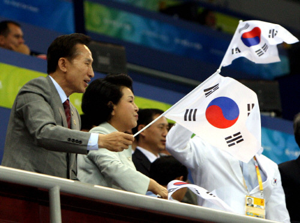

> 이 대통령은 이날 오전 강원도를 방문, 평창 동계올림픽 유치 관련시설을 시찰한 자리에서 "내년 2월 벤쿠버 대회에서 금메달을 따면 평창동계 오륜 깃발을 들고 경기장을 한 번 돌면 큰 홍보가 될 것"이라면서 이같이 밝혔다.
>
> 출처 : [아시아경제 - 李대통령 "평창 동계올림픽 유치, 피겨스타 김연아 활용해야"](http://www.asiae.co.kr/news/view.htm?idxno=2009112017102077360 "[http://www.asiae.co.kr/news/view.htm?idxno=2009112017102077360]로 이동합니다.")

<!-- truncate -->

국가의 수장이 국민을 돌보지 않다가 어떤 국민이 스스로 두각을 나타내면 '너, 이 새X 국가에 헌신 좀 하자.' 하는 식의 저런 짓을 대놓고 하는 건 정말 웃기지 않나요?

막말로 (그냥 동계 스포츠로 한정한다고 치고) 차라리 요즘 영화로도 이슈가 되었으니 차라리 스키점프 선수단이나 찾아가서 고생한다 하면 '그래, 그런 가보다'라고 해주지... 국가 지원 없이 혼자서 고생하는 사람 옆에 붙어서 과실이나 따먹으려 하는 게 일국의 대통령이라니... 에효...

국가대표 영화에도 나오잖아요. 어쨌거나 스포츠를 육성하고 배려하지 않고 단지 '유치 = 성공' 이라 생각하는 그런 후진 생각을 하는 사람들에 대한 비유 말이죠... 그게 단순 영화가 아니라 현실에 존재하는데, mb는 스스로 그 주인공이라 자랑하고 다니는군요.

어이- ㅈㄹ을 하더라도 태극기나 똑바로 들고 ㅈㄹ을 해라.

