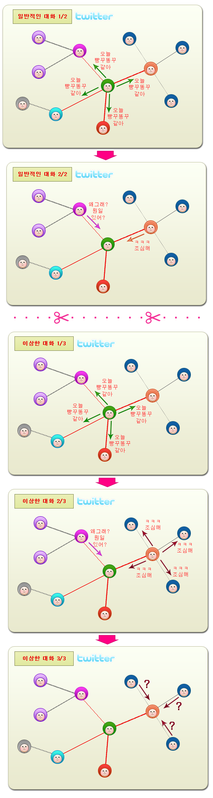

트위터 상에서 개인적인, 아주 사소한 대화를 끊임없이 RT를 사용해서 나누는 분들이 계십니다. 연극으로 따지면 인물들간의 속닥거리는 대사인데 그걸 확성기 켜고 방백으로 읇조리는 경우죠.

<!-- truncate -->

궁금해요. 그분들의 심리는 뭘까요? 저에게 떠오르는 건 크게 셋 중의 하나 입니다.

**노출증**

- 내가 하는 대화는 ㅋㅋㅋ 거리는 것까지 모두 가치있어. 그러니 너도 들어봐. 몰라도 그냥 들어.
- 나 유명한 사람이야. 그리고, 어차피 내가 답변(reply)으로 날려도 너는 다 찾아볼 거잖아. 그러니 네 수고를 덜어주는 거야. 그냥 들어.

**나하나 쯤이야**

- 알긴 아는데, 그냥 귀찮다. 그냥 계속 RT로 날려도 니들이 이해해라.
- 내가 툴 쓰는 걸 이렇게 배워서 그래. 다시 배우기 싫으니 그냥 네가 참아라.

**난 그런 거 몰라**

- 그게 무슨 차이인데? 아이고, 몰라... 그런 거 복잡해. 그냥 나만 편하면 됐지, 뭘.
- 내가 그냥 트위터 하는 것도 대단한 건데, 뭘 또 배우라고 그래... 그냥 좀 둬라.

