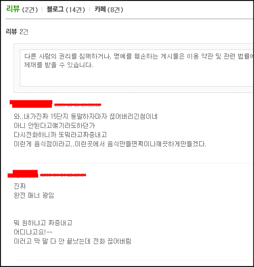

한 보름 전쯤에 웹서핑을 하다가 음식 사진에 테러를 당해서 통닭을 배달시키지 않으면 견딜 수 없는 상황에 처한 적이 있습니다.

<!-- truncate -->

최근 들어 통닭을 거의 배달시켜 먹어본 적이 없는 저는 현금이 있나 잘 확인하고 네이버와 다음, 구글에서 **XX동 통닭**이라는 키워드로 검색을 날리고는 그나마 괜찮아 보이는 닭집을 찾기 시작했습니다.

평상시 누군가 괜찮다고 얘기했던 **OO치킨**이 떠올라 찾아보니 집 근처에 있더군요. 옳다구나 하면서 전화를 하려는 순간 다음과 같은 짧은 리뷰를 볼 수 있었습니다.

단지 2개의 리뷰였는데 저는 다른 곳으로 배달을 시키게 되었습니다. 머리 속으로 다음과 같은 생각이 들었기 때문이죠.

- 이 사이트는 리뷰가 별로 없는 사이트인데 리뷰가 2개나 달렸네?

- 정말 열 받은 사람들이 쓴 글 같은데?

- 어라, 열 받은 이유가 똑같네?

- 게다가 두 개 모두 올해 작성된 거잖아!

과연 저 통닭집은 이 사실을 알고 있을까요?

\*                                     \*                                     \*

어제 모 커뮤니티 사이트에 링크된 쌍용차 클레임 관련 글을 읽고는 너무 황당했습니다. 자동차 사이트로 유명한 보배드림에 올라온 글이었는데, 제목은 **["쌍용차 소비자한테 욕하고 반말하다"](http://www.bobaedream.co.kr/board/data/data_view.php?code=national&No=155610 "[http://www.bobaedream.co.kr/board/data/data_view.php?code=national&No=155610]로 이동합니다.")** 이었죠. 간단하게 요약하면 이렇습니다.

> 어느 쌍용차를 구입한 분이 자동차 수리를 부탁하려고 쌍용차 고객센터에 상담을 했는데 고객센터에서는 한 달씩이나 이리 돌리고 저리 돌리고 하면서 고객 약을 올려가며 수리를 해주지 않았다는 것입니다. 그 결함은 국가에서도 전부 무상으로 수리해달라는 결론이 것이었답니다.  
>   
> 그래서 고객이 직접 자신을 뺑뺑이 돌린 고객센터에 찾아가서 화를 냈습니다.

영상은 찾아가서 화를 낸 부분부터 찍혀있습니다.

링크된 글에 있는 동영상을 보면 고객센터 실장쯤 되는 분이 고객과 쌍욕을 하면서 싸우시더군요. 동영상 만으로는 전후 사정을 정확히 알 수 없지만 저걸 녹화한 고객은 정말 화가 많이 났던 모양입니다.

처음 저 글과 동영상을 볼 때까지만 해도 '**쌍용차 본사에서는 모르는 사실일 수 있으니 쌍용차의 잘못이라고 하면 안되겠네...'** 라는 생각을 했었는데, [고객센터 담당자의 이름을 넣고 검색을 하니](http://search.naver.com/search.naver?where=nexearch&query=%EC%8C%8D%EC%9A%A9+%EC%A0%84%EC%9D%B5%ED%98%84&frm=t1&sm=top_hty "[http://search.naver.com/search.naver?where=nexearch&query=%EC%8C%8D%EC%9A%A9+%EC%A0%84%EC%9D%B5%ED%98%84&frm=t1&sm=top_hty]로 이동합니다.") 적지 않은 글이 튀어나옵니다. 오래 전부터 유명한 사람이었나 봐요.

이쯤 되니 쌍용차의 잘못이라고 이야기하는 게 당연하다는 생각이 들었습니다. 오래 전부터 고객들의 원성이 자자한데, 저 분이 계속해서 같은 업무를 보는 걸 보면 말이죠. 게다가 고객 AS 를 담당하는 자리에요!

\*                                     \*                                     \*

[타이거 우즈가 집 앞에서 작지 않은 사고를 내놓고](http://www.hani.co.kr/arti/sports/sports_general/390299.html "[http://www.hani.co.kr/arti/sports/sports_general/390299.html]로 이동합니다.")는 경찰조사까지 거부해 가며 그 이유에 대해 오랫동안 입을 열지 않았습니다. 사람들은 궁금해 했죠. 각종 루머가 도는 와중에 가장 유력한 것은 [바람을 폈다](http://www.ytn.co.kr/_ln/0104_200911300406082453 "[http://www.ytn.co.kr/_ln/0104_200911300406082453]로 이동합니다.")는 것이었습니다.

그의 침묵이 길어지자 한 기자는 **[직접 할 수 없다면 대신 말해 줄 사람을 구하라 ("If he's not able to do it, find someone to do it for him")](http://www.google.com/hostednews/ap/article/ALeqM5jkGHKttP4sHLwXQrBvcyn9G4U6WAD9C8RRAG0 "[http://www.google.com/hostednews/ap/article/ALeqM5jkGHKttP4sHLwXQrBvcyn9G4U6WAD9C8RRAG0]로 이동합니다.")**는 조언까지 했죠.

결국 그는 자초지종을 [자기 홈페이지에 밝혔지만](http://web.tigerwoods.com/news/article/200911297726222/news/ "[http://web.tigerwoods.com/news/article/200911297726222/news/]로 이동합니다.") 조금 늦은 감이 있습니다. 이미 나쁜 소식은 확산되었고, 코미디언들은 좋은 먹잇감을 발견했으며, 대중의 머리 속에는 그가 뭔가 숨기고 있다는 아주 작은 의심이 들어갔기 때문이죠.

\*                                     \*                                     \*

위의 세 사례는 각각 다른 형태입니다.

통닭집은 아마 지금도 자신의 집에 대해 저런 악평이 달려있는지 모를 겁니다. 저 같은 고객을 잃고 있다는 걸 모르겠죠. 이건 조금은 억울한 케이스일 수 있습니다. 정보의 유통에서 소외된다는 건 참 무서운 일입니다. 아예 방법이 없으니까요. 나를, 우리 조직을 내가 모르는 곳에서 리뷰하고 있을 때는 과연 어떻게 해야 할까요? 방법이 있을까요?

쌍용차는 왜 문제를 일으키고 있는 직원을 가만히 둘까요? 개인의 잘못된 행동이 조직 전체의 분위기를 상징하는 형국이 되어가고 있습니다. 여러 고객들이 여러 통로를 통해 불만을 표시한 걸로 보아 쌍용차에서 '우리는 모르는 일'이라고 하기에는 무리가 있으니 말이죠. 이미 다 알고 있으면서 가만히 두는 거라면 정말 막장이겠죠. 하긴, **'모르쇠'**는 우리나라 정치권이나 대기업 등 힘있는 사람들이 주로 쓰는 방법이죠. 제일 나쁜 방법이고요.

타이거 우즈의 대처는 확실히 아쉬운 구석이 있습니다. 뭔가 빨리 말했다면 저런 식의 이야기를 하지 않아도 됐을 것이고, 루머 또한 없었겠죠. 늦은 해명을 보고 든 생각은 **'뭔가 불법적인 요소는 없어서 당당하나 밝히고 싶지 않은 일이 있었던 것 같아'** 입니다. 만약 그의 옆에 탁월한 능력의 대리인이 있었다면 뭐라고 이번 사건에 대해 어떻게 대처했을까요? 새삼 궁금해지는군요.
